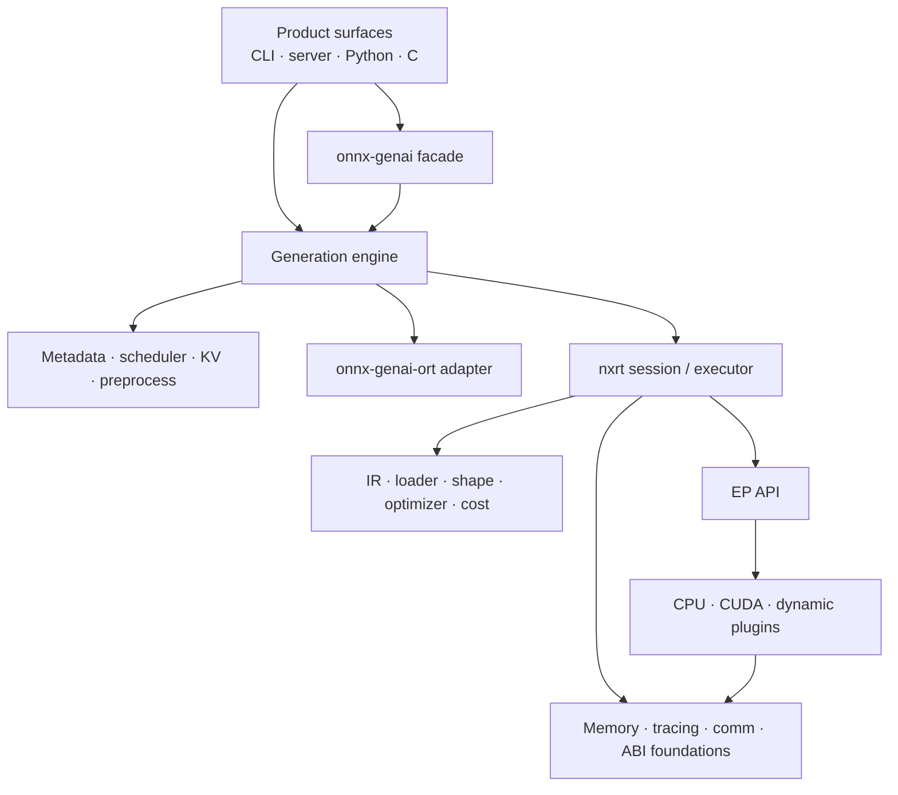

# Crate Architecture

> [!summary] Question answered
> How are the workspace crates grouped, and which dependency direction should new code follow?

The workspace has many crates because it separates product policy from runtime
mechanism and isolates optional platform/ABI surfaces. The exact Cargo dependency
graph is authoritative; this note provides a conceptual map.

## Layer map

## GenAI layer

### Facade and public surfaces

| Crate | Role |
|---|---|
| `onnx-genai` | Small public facade; re-exports engine, KV, metadata, ORT and preprocessing APIs |
| `onnx-genai-cli` | Unified CLI and interactive REPL |
| `onnx-genai-server` | OpenAI-compatible HTTP/SSE server, sessions, metrics and admin/debug routes |
| `onnx-genai-python` | Python-facing GenAI API |
| `onnx-genai-capi` | C-facing GenAI API |
| `onnx-genai-router` | Routing/model-selection support |

### Generation policy and state

| Crate | Role |
|---|---|
| `onnx-genai-engine` | Main orchestrator: load, generate, decode loop, sampling, speculative decoding, pipelines, backend selection |
| `onnx-genai-scheduler` | Admission, priorities, batching, byte budgets, pressure and preemption decisions |
| `onnx-genai-kv` | KV pages, page tables, prefix cache, fork/rewind, tiered backing and telemetry |
| `onnx-genai-metadata` | Inference metadata standard structures and validation |
| `onnx-genai-runtime-config` | Runtime configuration model |
| `onnx-genai-genai-config` | GenAI configuration compatibility |
| `onnx-genai-preprocess` | Image/audio and model-declared preprocessing |
| `onnx-genai-ort` | ONNX Runtime integration used by the generation engine |

The generation engine is intentionally the joining layer: it understands
generation semantics and can consume either ORT sessions or native nxrt sessions.

## Native runtime layer

### Graph and model representation

| Crate | Role |
|---|---|
| `onnx-runtime-ir` | Typed graph, nodes, values, shapes, layouts and device annotations |
| `onnx-runtime-loader` | ONNX/model loading and external-data handling |
| `onnx-model-package` | Model-package format and package operations |
| `onnx-runtime-shape-inference` | Shape inference |
| `onnx-runtime-optimizer` | Graph optimization passes |
| `onnx-runtime-quantization` | Runtime quantization contracts and support |
| `onnx-runtime-cost-model` | Explicit cost inputs for placement/selection |
| `onnx-runtime-operator-selection` | Operator/kernel selection support |

### Execution

| Crate | Role |
|---|---|
| `onnx-runtime-session` | Native session construction, planning, executor, tensor ownership and heterogeneous execution |
| `onnx-runtime-eager` | Eager execution surface |
| `onnx-runtime-ep-api` | Native execution-provider and kernel contracts |
| `onnx-runtime-ep-cpu` | CPU EP and kernels |
| `onnx-runtime-ep-cuda` | CUDA EP, kernels, graph capture and device execution |
| `onnx-runtime-ep-plugin` | Export/bridge support for ORT-style plugin EPs |
| `onnx-runtime-ep-nxrt-abi` | Native nxrt dynamic EP ABI definitions |
| `onnx-runtime-ep-nxrt-host` | Host side of the native EP ABI |

### Foundations and interoperability

| Crate family | Role |
|---|---|
| `onnx-runtime-memory*` | Memory planning, virtual memory, CUDA memory and governance |
| `onnx-runtime-tracer` | Runtime tracing and Perfetto-compatible events |
| `onnx-runtime-comm` | Distributed communication and buffer ownership |
| `onnx-runtime-capi` / `python` / `dlpack` | Native runtime language and tensor interoperability |
| `onnx-runtime-protocol-trace` | Protocol conformance traces |
| `onnx-runtime-cpuinfo` | CPU capability discovery |
| `mlas-sys` | Vendored MLAS bindings used by CPU paths |

## Dependency rules of thumb

> [!important] Prefer downward dependencies
> A mechanism crate should not depend on a product-policy crate. For example,
> allocator primitives should not depend on the generation engine, and graph IR
> should not know about HTTP requests.

1. Public surfaces may depend on engine APIs, not engine internals.
2. The engine may join GenAI policy and backend mechanisms.
3. Scheduler and KV crates should remain independently testable.
4. EP APIs should not depend on a concrete CPU/CUDA provider.
5. Foundational memory/ABI types should not depend on session or engine policy.
6. Optional platform/plugin crates should not force their dependencies into the
   default portable path.

## Why both `onnx-genai-*` and `onnx-runtime-*` exist

The native runtime is useful beyond autoregressive generation: it loads and
executes ONNX graphs. The GenAI layer adds stateful token-generation semantics,
KV lifecycle, scheduling, prompt processing and serving.

Keeping the boundary explicit allows:

- GenAI policy to compare ORT and native execution;
- nxrt to evolve as a general runtime;
- EPs and kernels to be reused without depending on prompt/session policy;
- memory and ABI contracts to be tested below the product layer.

## Related notes

- [[start/Repository Map]]
- [[architecture/Inference Request Lifecycle]]
- [[execution/Execution Backends]]
- [[memory/Memory Management for Beginners]]
