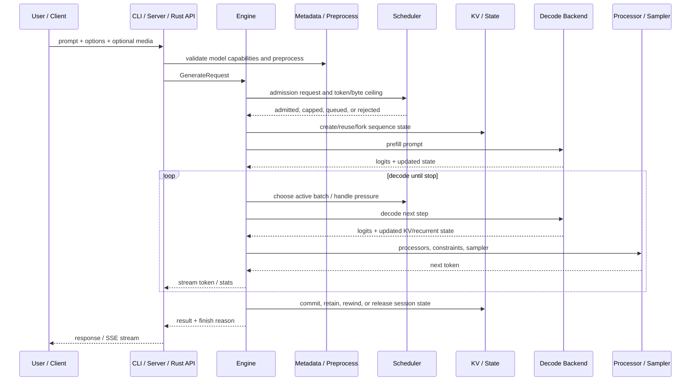

# Inference Request Lifecycle

> [!summary] Question answered
> What happens between receiving a prompt and returning generated tokens?

This is a conceptual trace. Exact functions differ by CLI/server mode, model
pipeline and selected backend.

## End-to-end flow

## 1. Request construction

Entry points include:

- `onnx-genai-cli` commands and REPL;
- `onnx-genai-server` OpenAI-compatible routes;
- the `onnx-genai` Rust facade;
- Python and C bindings.

They normalize user input into engine-facing requests. Server routes also handle
chat templates, tool schemas, response formats, SSE, persistent session IDs, and
multimodal request parsing.

## 2. Metadata and preprocessing

The model package and inference metadata determine:

- model components and pipeline stages;
- supported modalities;
- tokenization/chat-template behavior;
- KV shape and cache declarations;
- runtime capabilities and defaults;
- structured-output and generation options.

Image/audio inputs are transformed by `onnx-genai-preprocess` according to the
declared contract rather than model-name conditionals.

## 3. Admission and scheduling

The engine asks the scheduler whether a request can safely run. Admission considers:

- maximum active batch size;
- prompt length and requested generation ceiling;
- KV bytes per token and available byte budget;
- request priority;
- whether a smaller generation cap still guarantees progress.

A request may be admitted, capped, queued, or rejected with an actionable capacity
error. During execution, the scheduler decides which sequences prefill, decode,
preempt, or swap back in.

> [!important] Admission is about completion feasibility
> Accepting work that cannot reach its next release/completion point can deadlock
> capacity. Waiting work should not retain scarce partial state.

## 4. Session and KV state

The engine creates, restores, forks or reuses sequence state. Depending on the
model/backend this may include:

- KV tensors or pages;
- recurrent/conv state;
- sampler/search state;
- request progress and checkpoint information;
- prefix-cache references.

`onnx-genai-kv` provides page/prefix/tiering mechanisms, while the engine bridges
those semantics to the concrete ORT or native decode representation.

## 5. Prefill

Prefill processes the prompt and produces the first next-token logits while
constructing persistent model state.

The execution backend may be:

- an ONNX Runtime session;
- a native nxrt session using CPU/CUDA/plugin EPs;
- a multi-component pipeline in which different models/stages run in order.

See [[execution/Execution Backends]].

## 6. Decode loop

For every generated step:

1. Build the next backend inputs: token, position, masks and state views.
2. Execute one or more graph components.
3. Update KV/recurrent state transactionally.
4. Apply logit processors such as repetition/frequency/presence penalties.
5. Apply structured constraints if configured.
6. Sample or choose the next token.
7. Check EOS, stop sequences, cancellation and context limits.
8. Stream the token and update telemetry.

Speculative decoding inserts a proposer and target verification step. Rejected
tokens require state rewind; accepted runs advance by more than one token.

## 7. Completion and retention

The finish reason may be EOS, stop sequence, length/context limit, cancellation
or error. After completion, state may be:

- retained for a persistent conversation;
- inserted into/referenced by a prefix cache;
- checkpointed or forked;
- rewound after speculation;
- released or moved to a colder tier.

## Where to debug

| Symptom | Start with |
|---|---|
| Request rejected before running | scheduler admission and memory-plan diagnostics |
| Wrong prompt/tool formatting | server routes, chat templates, metadata |
| Wrong token choices | processors, constraints, sampler and tokenizer |
| State diverges after several tokens | decode backend, KV bridge, recurrent state |
| Poor throughput | batching decisions, backend profiler, kernel/profile docs |
| Memory growth | [[memory/Memory Management for Beginners]] and memory telemetry |
| Native differs from ORT | [[execution/Execution Backends]] and parity tests |

## Formal sources

- [`README.md`](../../README.md)
- [`onnx-genai-engine`](../../crates/onnx-genai-engine/src/lib.rs)
- [`onnx-genai-scheduler`](../../crates/onnx-genai-scheduler/src/lib.rs)
- [`onnx-genai-kv`](../../crates/onnx-genai-kv/src/lib.rs)
- [`docs/genai/SCHEDULING.md`](../../docs/genai/SCHEDULING.md)
- [`docs/genai/PIPELINE.md`](../../docs/genai/PIPELINE.md)
