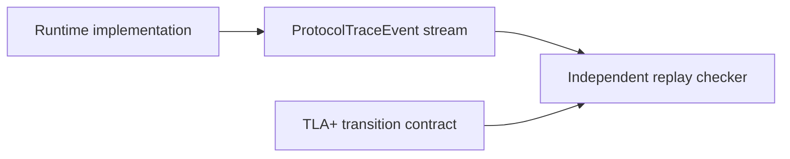

# Formal Verification with TLA+

> [!summary] Question answered
> Which runtime invariants are model-checked in this repository, and what must
> still be tested in the implementation?

Most tests execute one concrete sequence. A TLA+ model explores every state
transition within a deliberately small abstract system. This is useful for
protocols where rare interleavings—not arithmetic—cause the hardest bugs.

The models live under [`specs/tla/`](../../specs/tla/). They complement the
type, conformance and runtime checks described in [[contracts/Runtime Contracts]].

## What is modeled

| Model | Main question |
|---|---|
| `PressureProtocol.tla` | Can capacity be granted, claimed, cancelled or timed out without leaks or double ownership? |
| `KvAdmission.tla` | Does KV admission respect capacity while preserving a state from which progress is possible? |
| `BufferOwnership.tla` | Can readers alias safely while writers remain exclusive and leases stay registry-rooted? |
| `CoResidency.tla` | Can model/KV residency avoid evicting a model before the request that needs it retires? |
| `NodeFailure.tla` | Does a failed node stop while survivor-only work drains and every operation settles? |
| `CollectiveOrdering.tla` | Do participants observe compatible collective-operation ordering? |

These models reduce real objects to the state needed for one contract. A KV
page may become an identifier plus ownership state; CUDA streams and tensor
contents may disappear entirely if they are irrelevant to admission.

## Invariants and progress

An **invariant** says something bad never becomes true:

```text
granted capacity never exceeds the pool
one writable buffer never has two owners
cancelled work does not retain an allocation
```

A **progress property** asks whether the protocol can keep moving. Capacity
conservation alone is insufficient if every participant can wait forever.
`KvAdmission.tla`, for example, checks both bounded capacity and
`ProgressPossible`.

> [!important] Safety and progress are different
> A system can leak nothing and still deadlock. Conversely, a system can always
> move by incorrectly granting the same bytes twice. Important protocols need
> both kinds of property.

## Why negative models are part of the test

The suite includes deliberately broken configurations such as
`KvAdmissionUnguarded.cfg` and `CoResidencyUnguarded.cfg`.

The check is expected to find a counterexample:

```text
guarded model      → invariant holds
unguarded control  → invariant fails
```

This proves that the invariant and model are capable of detecting the bug they
claim to prevent. If both guarded and unguarded variants pass, the verification
may be vacuous or no longer exercise the important transition.

This is the formal-methods version of a non-vacuous regression test.

## TLC proves the model, not the Rust code

TLC explores the `.tla` specification. It cannot prove that production code:

- emits the same transitions;
- uses the same identity and capacity rules;
- records every relevant event;
- preserves the model's atomic boundaries.

The refinement bridge is a versioned `ProtocolTraceEvent` stream. Runtime
events include contract/topology revisions and enough identity/state data for
an independent replay checker to compare an execution with the model-level
protocol.



This bridge matters because a green TLC run plus an unwired trace emitter says
nothing about production behavior. See [[observability/Tracing and Profiling]]
for the broader observability architecture.

## Reading a model responsibly

Start with the model README and ask:

1. What state has been abstracted away?
2. Which transitions are atomic in the model?
3. Which invariants and progress properties are checked?
4. Is there a negative control that must fail?
5. What fairness assumptions are enabled?
6. How does implementation evidence reach the replay checker?

Every model also has explicit non-goals. For example, an admission model may
prove capacity and progress without proving scheduler priority fairness.
`NodeFailure.tla` does not automatically prove failure-detection latency.

> [!warning] Do not silently expand the claim
> “No capacity leak in the checked state space” does not mean “the distributed
> runtime is correct.” Report the abstraction, configuration and omitted
> properties with the result.

## When to add or change a model

TLA+ is a good fit when a change introduces:

- ownership transfer across components;
- reserve/commit/cancel/timeout transactions;
- concurrent teardown and retry;
- failure recovery with epochs or generations;
- lock-free or asynchronous protocol ordering.

A model update should normally include:

1. the new state/transition;
2. the invariant or progress property it affects;
3. a negative variant that exposes the missing guard when practical;
4. refinement trace/replay updates;
5. implementation conformance tests.

## Related notes

- [[contracts/Runtime Contracts]]
- [[memory/Memory Management for Beginners]]
- [[architecture/Inference Request Lifecycle]]
- [[observability/Tracing and Profiling]]
- [[performance/Performance Engineering Playbook]]

## Formal sources

- [TLA+ model index](../../specs/tla/README.md)
- [Refinement contract](../../specs/tla/REFINEMENT.md)
- [TLA+ specifications](../../specs/tla/)
