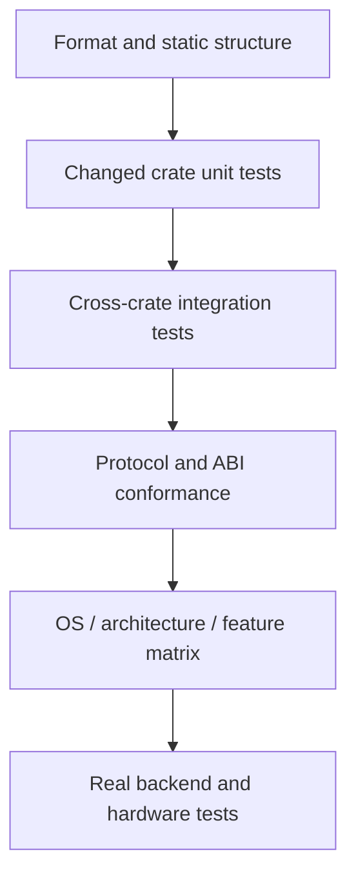

# Testing and Verification

> [!summary] Question answered
> What is the smallest trustworthy validation path for a change in this
> repository?

The repository combines portable Rust code, native ONNX Runtime integration,
CUDA code loaded at runtime, plugins, Python bindings and concurrency
protocols. No single `cargo test` invocation proves all of them.

Use a validation ladder: start with the narrowest command that can falsify your
change, then expand to the affected integration and platform boundaries.

## The validation ladder



| Layer | Typical evidence |
|---|---|
| Syntax and style | `cargo fmt` (see the Windows caveat below), Python syntax, generated-file checks |
| Type surface | targeted `cargo check --locked -p ...` |
| Behavior | targeted `cargo test --locked -p ...` |
| Lints | targeted `cargo clippy --locked -p ... --all-targets -- -D warnings` |
| Unsafe boundaries | Miri, ABI tests, ownership/lifetime conformance |
| Protocols | TLC plus independent trace replay |
| Platforms | Linux, Windows, macOS and architecture-specific CI lanes |
| Backends | real ORT/plugin/CUDA execution and hardware-required tests |

Do not jump directly to the slowest layer. A focused unit test gives a faster
and clearer failure than a workspace build. Do not stop at a fast layer when
the changed contract crosses a boundary.

## Start from the changed contract

Choose validation by behavior, not only by edited filename.

Examples:

- Changing a public trait requires its crate tests, implementors, consumers,
  rustdoc and compatibility adapters.
- Changing CUDA allocation requires memory accounting, EP dispatch and
  hardware-gated release tests—not merely CUDA feature compilation.
- Changing metadata parsing requires parser tests and the runtime path that
  consumes the parsed decision.
- Changing a plugin ABI requires host, plugin, short-struct/version and unload
  tests.
- Changing a concurrency transition requires its TLA+ model, negative control,
  trace schema and replay checker.

[[contracts/Runtime Contracts]] describes the contract families. This note
focuses on how to gather evidence.

## Rust workspace commands

Use the lockfile in validation:

```bash
cargo check --locked -p <changed-crate>
cargo test --locked -p <changed-crate>
cargo clippy --locked -p <changed-crate> --all-targets -- -D warnings
```

Add all tightly coupled crates to one invocation when the runner supports it:

```bash
cargo test --locked \
  -p onnx-runtime-memory \
  -p onnx-runtime-memory-governor
```

> [!warning] The workspace is not one portable test set
> Do not casually replace CI's explicit package selection with bare
> `cargo test --workspace`. Some members, including `onnx-genai-ort-sys`, fetch
> or build native dependencies. The authoritative offline package set is
> produced by `.github/scripts/workspace_test_packages.py`.

Bare `cargo build` and `cargo test` use the workspace `default-members`. That is
still broader than most code changes need. Prefer targeted packages first.

The CPU EP enables vendored MLAS by default. On a machine without the required
C++/assembly toolchain, `--no-default-features` can exercise the pure-Rust
fallback, but it is not a substitute for the shipped MLAS build.

## Formatting (and the Windows caveat)

CI runs `cargo fmt --all -- --check` on Linux, where it works. **That command
cannot work on Windows in this workspace.** `cargo fmt --all` passes every file
in the workspace to a single `rustfmt` invocation; with 54 members and around
970 tracked `.rs` files, the argument list exceeds the roughly 32 KB Windows
command-line limit and the command fails:

```
The filename or extension is too long. (os error 206)
```

Linux CI escapes this only because its `ARG_MAX` is far larger, around 2 MB.

On Windows, check formatting **per package** instead. `cargo fmt -p <pkg>`
invokes `rustfmt` once per package using the edition that package declares —
which matters, because this workspace is mixed-edition: most members are
edition 2024 and a few are 2021. Do **not** substitute a bare
`rustfmt --edition <E>` loop: with the wrong edition `rustfmt` misparses
2024-only syntax such as `let` chains and fails (`error: let chains are only
allowed in Rust 2024 or later`). Only cargo knows each package's declared
edition, so driving the check per package is the only correct approach.

<!-- code-parity: allow-divergence -->
```bash
# Check only the packages you changed (Windows-safe):
cargo fmt -p onnx-runtime-memory -- --check
# Apply fixes to the same set:
cargo fmt -p onnx-runtime-memory
```

The local pre-commit gate automates exactly this. Install it once:

```bash
bash scripts/install-hooks.sh
```

`install-hooks.sh` resolves the hooks directory through
`git rev-parse --git-common-dir`, so it works from the main checkout or from any
linked worktree (hooks are shared across all worktrees of a repository). The
installed `pre-commit` maps staged `.rs` files to their owning packages and runs
`cargo fmt -p <pkg> -- --check` on **only** those packages, which is both
Windows-safe and free of blocking on pre-existing formatting drift elsewhere in
the tree. It mirrors CI's scope precisely: files belonging to crates that are
not workspace members (such as the root `bench-*` crates, which CI's
`cargo fmt --all` likewise does not cover) are skipped with a warning rather
than blocked, and if `cargo metadata` cannot run at all the hook warns and lets
the commit through rather than locking you out of the repository.

## Feature-gated code

A green default-feature test does not compile every feature combination.
Validate the actual feature edge:

```bash
cargo check --locked \
  -p onnx-runtime-ep-cuda \
  -p onnx-runtime-python \
  --features onnx-runtime-python/cuda
```

The repository's CUDA crates use dynamic loading. Linux and Windows CI can
compile CUDA integration without a CUDA toolkit or GPU. That proves feature
wiring and type correctness; it does not execute device behavior.

Real CUDA integration tests remain gated behind hardware-aware features or
runners. Report compile-only and runtime evidence separately.

## Test-honesty checks

An ignored test is not executed evidence. CUDA CI runs
`.github/scripts/verify_cuda_test_honesty.py` to audit the GPU test inventory
and skip conditions.

When adding a hardware-dependent test:

1. make the hardware requirement explicit;
2. keep compile coverage in a portable lane where possible;
3. ensure a real hardware lane selects it;
4. do not label an ignored or early-returning test as passing runtime evidence.

Static source audits can legitimately run without hardware when the property is
syntactic. For example, the CUDA capture-sync contract checks kernel sources
for capture-unsafe synchronization and is executed separately from GPU tests.

## Unsafe Rust and foreign interfaces

Normal tests cannot explore every invalid alias or pointer lifetime. The Miri
workflow runs selected tractable crates and pure-Rust ABI surfaces under
nightly Miri.

Miri is valuable for:

- ownership and aliasing assumptions;
- raw-pointer lifetime;
- use-after-free in pure Rust paths;
- ABI wrapper behavior that does not require native `dlopen`.

Miri cannot execute every C/CUDA/native loader path. Keep native smoke tests and
platform integration tests for those boundaries.

For a new unsafe surface, state why it is covered by Miri, a native integration
test, a documented external invariant—or more than one.

## Formal protocol checks

Concurrency protocols under `specs/tla/` use bounded TLC model checking. Their
negative configurations must fail with the intended counterexample; this
guards against vacuous models.

TLC proves the abstract model, not the Rust implementation. Protocol-changing
PRs must also emit lossless versioned traces and pass the independent replay
checker described in [[contracts/Formal Verification with TLA+]].

## CI lanes are evidence with different meanings

The main CI workflow separates concerns:

- fast formatting, build, test and Clippy lanes;
- explicit offline package sets;
- coverage lanes;
- native ORT and plugin integration;
- Linux and Windows CUDA feature compilation;
- CUDA test-inventory honesty.

Additional workflows cover:

- Miri for selected unsafe crates;
- RustSec advisory auditing;
- benchmark regression reporting;
- weight-cache and diff guards;
- package/wheel build and publication paths.

A failure in one lane should be attributed to the exact failed contract.
“CUDA CI failed” is too broad if CUDA compilation passed and a later
test-inventory audit failed.

## When local and hosted evidence differ

First classify the difference:

| Difference | Example |
|---|---|
| Platform | Windows path/loader behavior |
| Architecture | ARM64 assembly or target-feature selection |
| Native dependency | ORT, MLAS or plugin loader |
| Feature set | default build versus `cuda`/`native-backend` |
| Hardware | compile succeeds but device execution fails |
| Environment | downloaded artifact, cache or runner capacity |

Do not “fix” a real platform failure by weakening or skipping the test. If a
lane is blocked by infrastructure, preserve the successful sub-step evidence
and rerun on an equivalent runner; do not report the whole lane as passing.

## Evidence to put in a PR

Prefer exact, reproducible statements:

```text
cargo test --locked -p onnx-runtime-memory-governor
64 passed; 0 failed

cargo check --locked -p onnx-runtime-ep-cuda --features cuda
compile-only; no GPU runtime exercised
```

Include:

1. commands and relevant features;
2. pass/fail/ignored counts;
3. platform and hardware;
4. whether native dependencies were real, mocked or absent;
5. known coverage boundaries;
6. a link to the hosted lane when it adds distinct evidence.

Avoid “all tests pass” when only a targeted subset ran.

## A practical change checklist

1. Run `git diff --check`.
2. Format changed Rust.
3. Check and test the changed crate.
4. Test direct consumers when a public contract changed.
5. Run Clippy with warnings denied on affected targets.
6. Exercise changed feature combinations.
7. Run contract-specific validators, replay, ABI or generated-output checks.
8. Let hosted OS/architecture/native/hardware lanes add evidence unavailable
   locally.
9. Record limitations honestly.

## Related notes

- [[contracts/Runtime Contracts]]
- [[contracts/Formal Verification with TLA+]]
- [[performance/Performance Engineering Playbook]]
- [[observability/Tracing and Profiling]]
- [[execution/Plugin Execution Providers]]

## Formal sources

- [Main CI workflow](../../.github/workflows/ci.yml)
- [Miri workflow](../../.github/workflows/miri.yml)
- [Rust security audit](../../.github/workflows/audit.yml)
- [Workspace manifest](../../Cargo.toml)
- [TLA+ model index](../../specs/tla/README.md)
