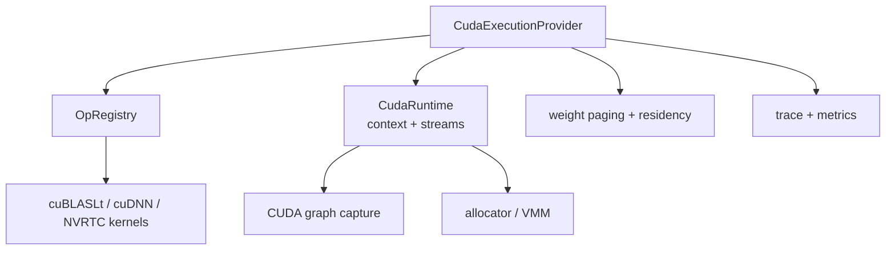

# CUDA Execution Provider

> [!summary] Question answered
> What does the native CUDA EP own, and how do kernels, streams, graph capture, VMM and weight residency fit together?

The CUDA EP implements the native EP contract on CUDA driver APIs, cuBLASLt,
cuDNN where applicable, and runtime-compiled kernels.

## Main components

## Kernel strategy

The EP prefers proven libraries where they fit and writes custom kernels for
measured gaps or fusion opportunities:

- GEMM family through cuBLASLt, including supported epilogues;
- selected cuDNN operations;
- NVRTC elementwise and attention kernels;
- custom quantized, indexing, reduction and fused decode paths.

There is no build-time `nvcc` requirement for the core EP path: CUDA libraries
are dynamically loaded and NVRTC compiles relevant source at runtime.

Kernels remain model-agnostic. Head counts, dimensions, causal behavior and
scales come from graph structure/attributes/runtime data.

## Streams and fences

CUDA operations are asynchronous. The EP manages:

- compute stream ordering;
- copy-stream overlap;
- host-to-device/device-to-host/device-to-device transfer;
- compute/copy fences;
- synchronization before unsafe reuse or unmapping.

This is why raw allocator access cannot replace the EP execution context. A
pointer may be valid while the GPU still has pending users.

## CUDA graph capture

Capture reduces repeated launch overhead by recording a stable execution region
and replaying it. Eligibility depends on:

- stable addresses and shapes;
- capture-safe kernels and allocations;
- no unsupported host decision in the captured region;
- explicit rejection reasons for seams;
- correct invalidation when state capacity or bindings change.

A performance result must report `captures` and `fallbacks`; a “speedup” that
silently disables capture is not the same configuration.

## Memory and VMM

The EP can use ordinary CUDA allocation or an installed VMM arena. VMM separates
stable virtual address capacity from mapped physical bytes and enables
incremental KV growth and shared backing.

The mechanism is separated into `onnx-runtime-cuda-memory` and re-exported for
compatibility. Governance, mapping and EP stream ordering remain distinct
responsibilities. See [[memory/Memory Management for Beginners]].

## Weight residency

Large models may keep, stream or map weights according to a residency policy.
The EP exposes:

- lazy/resident weight capability negotiation;
- paging and prefetch;
- pinned staging reuse;
- byte-aware residency metrics;
- explicit policy and fallback reporting.

The Governor approves capacity; the residency holder chooses victims. The
allocator does not decide which tensor is hot.

## Error and portability discipline

- Unsupported op/dtype/rank/device conditions return actionable errors.
- NVRTC failures preserve compiler logs.
- Exactly one supported CUDA binding version is selected at build time.
- Runtime kernels target the actual device rather than one datacenter GPU.
- Consumer WDDM behavior must not be inferred from Linux/TCC measurements.

## Formal sources

- [`onnx-runtime-ep-cuda`](../../crates/onnx-runtime-ep-cuda/src/lib.rs)
- [`CUDA_COVERAGE.md`](../../docs/execution/CUDA_COVERAGE.md)
- [`CUDA_EP_STATUS.md`](../../docs/execution/CUDA_EP_STATUS.md)
- [`CUDA_GRAPH_CAPTURE.md`](../../docs/execution/CUDA_GRAPH_CAPTURE.md)
- [`CUDA_STRATEGY.md`](../../docs/execution/CUDA_STRATEGY.md)
- [`NATIVE_CUDA_DECODE.md`](../../docs/execution/NATIVE_CUDA_DECODE.md)

## Related notes

- [[execution/Execution Provider Contract]]
- [[performance/Performance Engineering Playbook]]
- [[observability/Tracing and Profiling]]
- [[memory/Memory Management for Beginners]]
