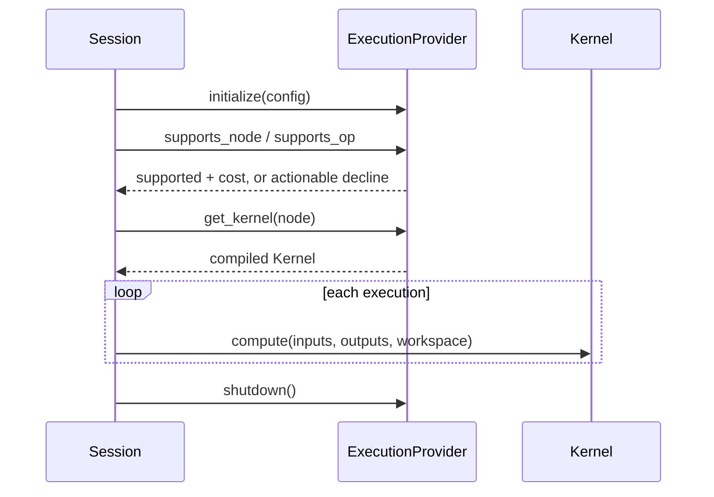

# Execution Provider Contract

> [!summary] Question answered
> What must an execution provider promise to the native runtime, and which responsibilities stay outside the EP?

An execution provider turns graph nodes into executable kernels for one device
class. The shared contract lives in `onnx-runtime-ep-api`; CPU, CUDA and dynamic
providers differ in implementation, not in the session's conceptual model.

## Core lifecycle

The runtime relies on claim honesty: an EP must not claim a node and then discover
ordinary unsupported shape/dtype conditions only after execution begins.

## Contract surfaces

| Surface | Purpose |
|---|---|
| Identity | Stable name, `DeviceType`, and `DeviceId` |
| Capability | Explain whether a node/opset/shape/dtype/layout is supported |
| Compilation | Produce a session-lifetime kernel or compiled partition |
| Tensor views | Borrow device memory without pretending host dereference is valid |
| Allocation | Create/release buffers and optional mapped backing |
| Transfer | Synchronous/asynchronous copy and fence ordering |
| Capture | Declare, begin, end, abort and replay device graph capture |
| Weights | Negotiate resident, lazy or paged weight delivery |
| Optimization | Supply EP-specific graph passes |
| Diagnostics | Record why a fast path or claim was rejected |

## Claim discipline

An unsupported result should name:

- node/op/domain/opset;
- rejected dtype, shape, layout or attribute;
- selected device/EP;
- what the EP accepts;
- a useful remediation where possible.

Returning `Unsupported` is normal. Claiming and later failing is a contract bug
unless the failure depends on truly runtime-only state.

> [!important] Capability is a proof
> Hot execution paths should consume a resolved capability or compiled kernel,
> not repeat broad discovery and rediscover late failure.

## Ownership

Current `DeviceBuffer` ownership is explicit:

- an owned buffer is created by one EP/mechanism;
- it must be released exactly once through the matching path;
- cross-device or cross-EP free is invalid;
- borrowed views do not own backing memory;
- raw pointers never extend the lifetime of their owner.

The current buffer has no automatic `Drop` because GPU release can require
context and stream synchronization. The proposed evolution is explained in
[[memory/Memory Management for Beginners]].

## Kernel boundary

The kernel sees typed tensor views, output/workspace views and execution context.
Important invariants include:

- shapes, dtypes and layouts match the compiled claim;
- mutable outputs do not alias illegally;
- device pointers are opaque on the host;
- workspace lifetime matches its declaration;
- asynchronous work is ordered through fences/streams;
- kernel errors do not panic across FFI boundaries.

## What the EP does not own

The EP should not decide:

- request priority or batch admission;
- which user's KV should be preempted;
- global model residency policy;
- prompt, sampling or stop semantics;
- model-family-specific behavior.

Those belong to the scheduler, holders, generation engine or metadata contracts.

## Conformance

Conformance is layered:

1. Focused kernel tests for shape/dtype/attribute behavior.
2. End-to-end loader → optimizer → session → EP comparisons with ONNX reference.
3. Per-EP expected support/decline profiles.
4. Plugin trait/C-ABI parity tests.
5. Real-model parity and backend comparisons.

Coverage counts are not full ONNX conformance. A passing operator name at one
dtype/opset/shape does not prove its entire schema.

## Formal sources

- [`onnx-runtime-ep-api`](../../crates/onnx-runtime-ep-api/src/lib.rs)
- [`ExecutionProvider`](../../crates/onnx-runtime-ep-api/src/provider.rs)
- [`Kernel`](../../crates/onnx-runtime-ep-api/src/kernel.rs)
- [`EP_CONFORMANCE.md`](../../docs/execution/EP_CONFORMANCE.md)
- [`NXRT_ABI.md`](../../docs/architecture/NXRT_ABI.md)

## Related notes

- [[execution/CPU Execution Provider]]
- [[execution/CUDA Execution Provider]]
- [[execution/Plugin Execution Providers]]
- [[contracts/Runtime Contracts]]
