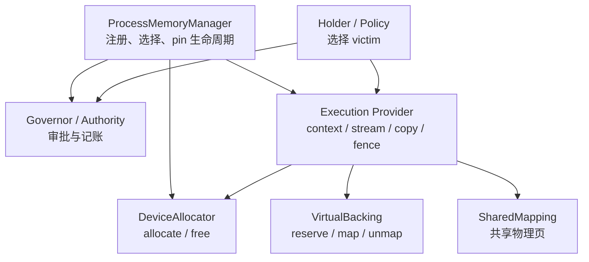
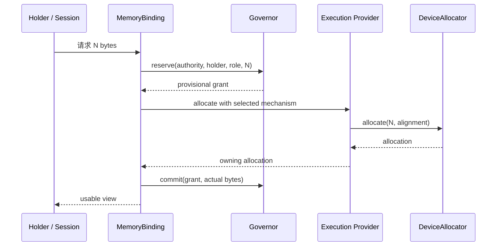
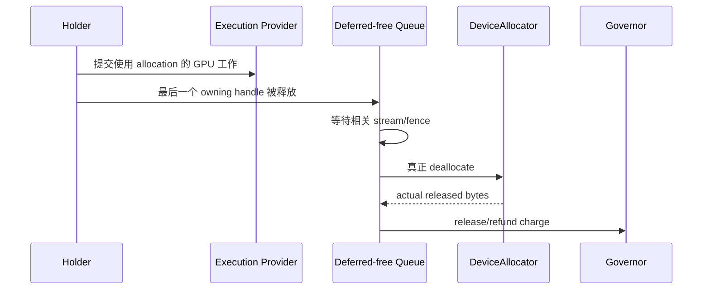

# Memory Management for Beginners

> [!summary] In one sentence
> `Allocator` answers "how to obtain ordinary memory", `VirtualBacking` answers "when to install real memory behind an address", and `SharedMapping` answers "how multiple addresses share physical memory"; the Governor keeps the accounts, the Holder chooses what to evict, the EP keeps device operations correctly ordered, and the ProcessMemoryManager wires these roles together safely.

## Why several roles are needed

"Memory management" sounds like one component, but it actually covers four distinct questions:

1. **How is memory obtained and returned?**
2. **Is there capacity right now? How much budget should each requester get?**
3. **Under pressure, which data should be evicted?**
4. **Has the GPU finished with this memory, so it can be freed safely?**

If a single super-allocator had to answer all of these at once, it would need to
understand CUDA address mapping, KV, model weights and request priority, and also
manage budgets and stream synchronization. Such an interface is hard to replace,
and it easily lets the ledger drift out of sync with real memory state.

The recommended division of responsibility is:

| Role | Responsible for | Not responsible for |
|---|---|---|
| `ProcessMemoryManager` | Registration, mechanism selection, authority, provider/context lifetime | Deciding which weight or KV page to evict |
| Governor / Authority | Capacity approval, reservation, lease, pressure ticket | Deleting a holder's data directly |
| Holder / Policy | Understanding what the data means and choosing a safe victim | Consuming capacity without a budget |
| Execution Provider (EP) | device context, stream, copy, kernel, fence, release ordering | Global capacity policy |
| `DeviceAllocator` | Ordinary allocate/free mechanism | Budget and hot/cold data policy |
| `VirtualBacking` | reserve/map/unmap of physical backing | Deciding which application data should be mapped |
| `SharedMapping` | Sharing one physical backing across multiple virtual addresses | General allocation or eviction policy |



## Starting from ordinary memory

The simplest CPU or GPU allocation can be understood as:

```text
申请 100 MB
    ↓
系统找到可用物理内存
    ↓
返回一个地址
    ↓
使用完成后释放
```

The corresponding minimal interface is roughly:

```rust
trait DeviceAllocator: Send + Sync {
    fn device(&self) -> DeviceKey;
    fn allocate(&self, request: AllocationRequest)
        -> Result<DeviceAllocation>;
}
```

Here `DeviceAllocation` is an owning handle. It must remember, or indirectly
reference:

- the allocator that created it;
- the corresponding device and provider context;
- the queue/fence needed for safe release;
- the associated charge or lease identity.

An ordinary eager allocator takes the full physical capacity when the allocation
is created:

```text
申请 10 GB ≈ 立即需要 10 GB 物理容量
```

The "≈" is because the OS and driver may have demand paging, overcommit or shared
memory. The committed bytes in the ledger cannot by themselves prove where the
data currently physically resides.

## What problem VirtualBacking solves

A VMM can separate the "virtual address" from the "physical backing".

For example, a KV cache may eventually need 10 GB but currently uses only 100 MB:

```text
10 GB 连续虚拟地址
├── 0..100 MB      → 已映射真实显存
└── 100 MB..10 GB  → 暂时只有地址
```

As more tokens are generated, backing is installed segment by segment:

```text
100 MB → 120 MB → 160 MB → …
```

The pointer stays the same, so tensor bindings or graph captures that depend on a
stable address do not have to be rebuilt as the KV grows.

This requires a set of operations different from ordinary allocate/free:

```rust
trait VirtualBacking: Send + Sync {
    fn reserve(&self, request: ReserveRequest)
        -> Result<VirtualAllocation>;
    fn commit_range(
        &self,
        allocation: &VirtualAllocation,
        range: Range<u64>,
    ) -> Result<CommitResult>;
    fn decommit_range(
        &self,
        allocation: &VirtualAllocation,
        range: Range<u64>,
    ) -> Result<DecommitResult>;
    fn committed_bytes(
        &self,
        allocation: &VirtualAllocation,
    ) -> Result<u64>;
}
```

| Operation | Meaning |
|---|---|
| `reserve` | Reserve a virtual address, but not necessarily obtain physical memory |
| `commit/map` | Install physical backing for a range of addresses |
| `decommit/unmap` | Remove backing but keep the address |
| `committed_bytes` | Query the physical bytes currently installed for the allocation |

## What "splitting capabilities" means

The current `DeviceAllocator` combines ordinary allocation, lazy commit/decommit,
committed-byte queries, mapped-capacity cooperation and shared-prefix methods all
at once.

Most ordinary allocators do not support the advanced features and can only rely on
default implementations. For example:

```rust
fn commit_allocation_range(...) -> Result<()> {
    Ok(())
}
```

Here `Ok(())` can have two completely different meanings:

1. a lazy allocator just successfully installed backing;
2. an eager allocator already allocated all the memory at allocate time and did nothing here.

> [!warning] A successful no-op can hide accounting errors
> If the upper layer wrongly assumes the allocator is lazy, it may request only 100 MB from the Governor while actually taking the full 10 GB at allocation time.

"Splitting capabilities" means:

- every mechanism only needs to implement the minimal `DeviceAllocator`;
- only implementations that truly support address/backing separation provide `VirtualBacking`;
- only implementations that truly support physical-page sharing provide `SharedMapping`;
- when a capability is unsupported, return an explicit absence or error rather than a successful no-op.

A conceptual interface might be:

```rust
trait DeviceMemoryMechanism {
    fn allocator(&self) -> &dyn DeviceAllocator;
    fn virtual_backing(&self) -> Option<&dyn VirtualBacking>;
    fn shared_mapping(&self) -> Option<&dyn SharedMapping>;
}
```

The caller must handle the fallback explicitly:

```rust
let Some(backing) = mechanism.virtual_backing() else {
    return use_eager_allocation_path();
};
```

This is not an accepted final API; it only illustrates that capabilities should be
negotiated explicitly.

## Why SharedMapping should be separate again

Multiple requests may share the same prompt:

```text
请求 A: [共享 system prompt][A 的后续 token]
请求 B: [共享 system prompt][B 的后续 token]
```

Their KV can let two virtual addresses share the same batch of prefix physical pages:

```text
A 的虚拟地址 ─┐
               ├── 同一批 prefix physical pages
B 的虚拟地址 ─┘
```

This requires a physical handle, multi-address mapping, reference counting,
read-only protection, and possibly Copy-on-Write. Supporting ordinary VMM
reserve/map does not imply supporting these features, so it should be a separate,
optional capability.

## How the Governor and Holder work together

The Governor is like a budget department:

```text
总容量：24 GB
已批准：22 GB
请求：500 MB
结果：可以批准
```

It maintains charges, reservations and leases. When memory is tight, all it can
send is:

```text
pressure ticket:
  请尝试释放 1 GB
  priority = ...
  deadline = ...
```

Only the holder knows what can be released:

```text
ModelResidency:
  两个冷权重可释放 700 MB

KvPageStore:
  当前 page 都被 in-flight kernel 使用，只能释放 0
```

> [!important] Authority never takes bytes directly
> The Governor must not unmap a holder's data directly. A holder may legitimately release 0 bytes.

## Why releasing GPU memory needs the EP

The CPU no longer referencing a buffer does not mean the GPU has finished with it:

```text
CPU 提交 kernel
CPU 最后一个 owning handle 被 Drop
GPU 仍在读取 buffer
```

Freeing immediately would cause a device use-after-free. The safe flow is:

```text
owning handle Drop
    ↓
进入 EP/context 的 deferred-free queue
    ↓
等待相关 stream/fence 完成
    ↓
allocator 真正释放
    ↓
更新 mapped-zone refund 和 Governor charge
```

RAII is therefore workable, but `Drop` should be responsible for enqueuing, not
for synchronizing the whole GPU on an arbitrary thread or freeing immediately.

## Why not add `ExecutionProvider::allocator()`

### An EP may have several memory domains

For example device, pinned host, unified memory, workspace arena, weight backing
and KV backing. A singular getter cannot say which one the caller receives.

### The effective allocator may change

A CUDA EP may first use ordinary `cuMemAlloc` and later install a VMM arena. If
something caches the old allocator and then uses it to free a pointer created by
the new allocator, that causes a cross-allocator free.

### A raw allocator makes it easy to bypass the Governor

If the upper layer can call directly:

```rust
allocator.allocate(10_GB)
```

it can skip reservation and lease, letting the ledger diverge from real usage.

A safer direction is for the manager to hand out a controlled binding:

```rust
struct MemoryBinding {
    mechanism: Arc<dyn DeviceMemoryMechanism>,
    provider_context: Arc<dyn DeviceContext>,
    authority: AuthorityId,
}
```

The binding ties together the correct device, mechanism, context, authority,
capabilities and lifetime. It can be responsible for allocator selection, but
copy, commit, decommit and release ordering should still go through the EP/context.

## The full lifecycle of an ordinary allocation



If the allocation fails, the provisional grant must be returned. When the actual
footprint differs from the plan, act on the real allocated bytes; do not silently
keep incorrect accounts.

The release flow:



## The transaction for growing KV on demand

Suppose the maximum context needs 10 GB and 100 MB is currently in use:

1. `VirtualBacking.reserve(10 GB)`, reserving a stable address;
2. the Holder computes the physical bytes needed for the next growth;
3. the Governor provides a provisional grant for the growth amount;
4. the EP/backing runs `commit_range`;
5. the Holder updates the KV view and logical state;
6. on success, commit the charge.

If step 4 or 5 fails:

- roll back the provisional mapping;
- return the grant;
- keep the old KV view and request state;
- do not expose a partially committed new state.

## Recommended target structure

```text
ProcessMemoryManager
├── device / allocator registry
├── authority / Governor
├── provider/context pinning
└── scoped MemoryBinding
        │
        ▼
Execution Provider
├── kernel / copy / stream / fence
└── deferred-free queue
        │
        ▼
Memory mechanisms
├── DeviceAllocator       必需：普通分配
├── VirtualBacking        可选：按需映射
└── SharedMapping         可选：共享物理页
        ▲
        │
Holders / Policies
├── ModelResidency
├── StateBundle / KvPageStore
├── kernel caches
└── workspace arenas
```

The low-level contract fits well in a low-dependency `onnx-runtime-memory-api`:

```text
onnx-runtime-memory-api
        ▲
        ├── memory-governor
        ├── ep-api
        ├── ep-cpu / ep-cuda
        └── session / ProcessMemoryManager
```

`memory-api` only defines the shared contract; it does not own policy or concrete
implementations.

## Recommended migration order

1. **Extract `onnx-runtime-memory-api`**: a pure move of interfaces and types, with no behavior change.
2. **Split capabilities**: a minimal allocator, optional backing, optional shared mapping.
3. **Establish provider/context pinning**: the context is not destroyed while an allocation is still alive.
4. **Implement a deferred-free queue**: real release happens only after device work completes.
5. **Introduce owning allocations**: `Drop` enqueues, and `DeviceBuffer` gradually becomes a borrowed view.
6. **Introduce ProcessMemoryManager / MemoryBinding**: unify selection and authority.
7. **Stabilize the plugin C ABI last**: a versioned C vtable, with Rust traits used only inside the process.

Each stage should be a PR that can be verified and rolled back independently. Do
not cram the whole migration into
[issue #513](https://github.com/justinchuby/onnx-genai/issues/513); that issue's
core goal—injecting an allocator without rewriting the entire EP—is already
achieved through `with_memory(...)`.

## Design invariants

> [!important] Must hold
> - an allocation may only be released by the mechanism/context that created it;
> - a charge must be obtained before physical commit;
> - a capability query must not return a stale allocator snapshot;
> - GPU release must obey stream/fence ordering;
> - unsupported must not masquerade as a successful no-op;
> - the Governor does not choose a holder's victim;
> - the manager selects the allocator but does not duplicate the EP's stream/context responsibilities.

## Glossary

| Term | Meaning |
|---|---|
| Virtual Address | An address seen by a program or device, with no guarantee of existing physical backing |
| Physical Backing | The RAM or device memory that actually provides storage behind an address |
| Allocation | A memory resource with well-defined ownership and release rules |
| Eager Allocation | Taking the full physical capacity when the allocation is created |
| Commit / Map | Installing physical backing for an address range |
| Charge | The capacity responsibility a holder carries in the ledger |
| Lease | A record of capacity ownership already committed to a holder |
| Authority | The unique accounting identity of a physical pool within an accounting scope |
| Holder | The component that understands the data's meaning and is responsible for choosing a victim |
| Fence | A synchronization object indicating whether prior asynchronous device work has completed |
| Deferred Free | A mechanism that waits for device work to complete before releasing |
| Capability | An optional ability a mechanism explicitly provides |

## Formal sources

- [Memory Architecture](../../docs/memory/MEMORY_ARCHITECTURE.md)
- [Memory Management Model Design](../../docs/memory/MEMORY_MANAGEMENT_MODEL_DESIGN.md)
- [Weight Offload](../../docs/memory/WEIGHT_OFFLOAD.md)
- [`DeviceAllocator` implementation](../../crates/onnx-runtime-memory-governor/src/allocator.rs)
- [`ExecutionProvider` and `DeviceBuffer`](../../crates/onnx-runtime-ep-api/src/provider.rs)
