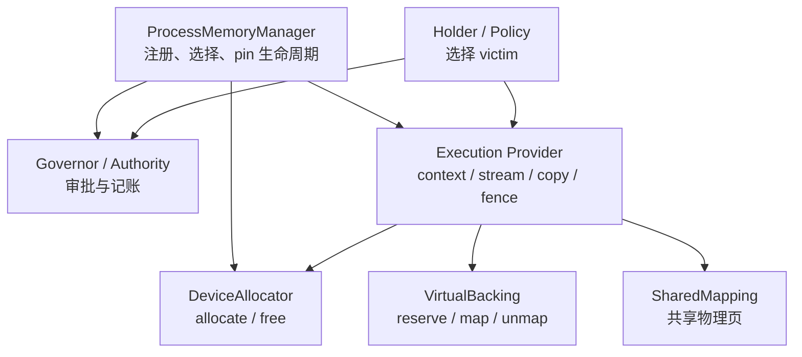
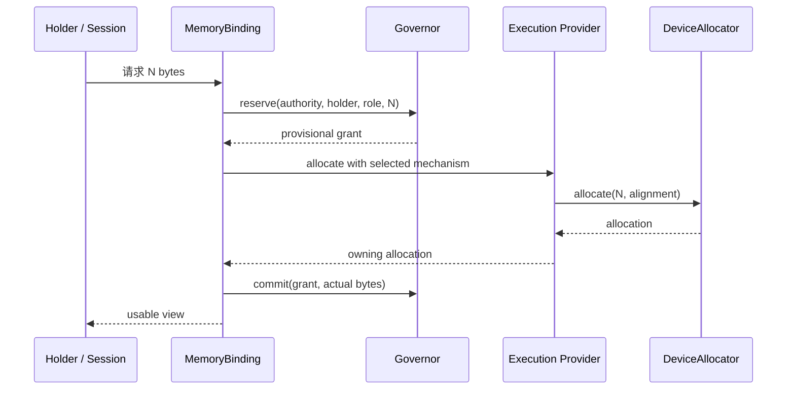
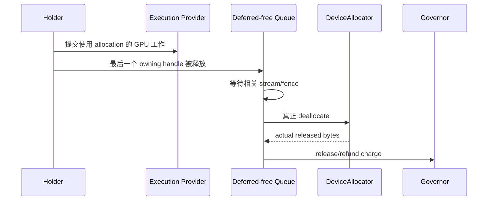

# Memory Management for Beginners

> [!summary] In one sentence
> `Allocator` answers "how to obtain ordinary memory", `VirtualBacking` answers "when to install real memory behind an address", and `SharedMapping` answers "how multiple addresses share physical memory"; the Governor keeps the accounts, the Holder chooses what to evict, the EP keeps device operations correctly ordered, and the ProcessMemoryManager wires these roles together safely.

## Why several roles are needed

"Memory management" sounds like one component, but it actually covers four distinct questions:

1. **How is memory obtained and returned?**
2. **Is there capacity right now? How much budget should each requester get?**
3. **Under pressure, which data should be evicted?**
4. **Has the GPU finished with this memory, so it can be freed safely?**

If a single super-allocator had to answer all of these at once, it would need to
understand CUDA address mapping, KV, model weights and request priority, and also
manage budgets and stream synchronization. Such an interface is hard to replace,
and it easily lets the ledger drift out of sync with real memory state.

The recommended division of responsibility is:

| Role | Responsible for | Not responsible for |
|---|---|---|
| `ProcessMemoryManager` | Registration, mechanism selection, authority, provider/context lifetime | Deciding which weight or KV page to evict |
| Governor / Authority | Capacity approval, reservation, lease, pressure ticket | Deleting a holder's data directly |
| Holder / Policy | Understanding what the data means and choosing a safe victim | Consuming capacity without a budget |
| Execution Provider (EP) | device context, stream, copy, kernel, fence, release ordering | Global capacity policy |
| `DeviceAllocator` | Ordinary allocate/free mechanism | Budget and hot/cold data policy |
| `VirtualBacking` | reserve/map/unmap of physical backing | Deciding which application data should be mapped |
| `SharedMapping` | Sharing one physical backing across multiple virtual addresses | General allocation or eviction policy |



## Starting from ordinary memory

The simplest CPU or GPU allocation can be understood as:

```text
申请 100 MB
    ↓
系统找到可用物理内存
    ↓
返回一个地址
    ↓
使用完成后释放
```

The corresponding minimal interface is roughly:

```rust
trait DeviceAllocator: Send + Sync {
    fn device(&self) -> DeviceKey;
    fn allocate(&self, request: AllocationRequest)
        -> Result<DeviceAllocation>;
}
```

Here `DeviceAllocation` is an owning handle. It must remember, or indirectly
reference:

- the allocator that created it;
- the corresponding device and provider context;
- the queue/fence needed for safe release;
- the associated charge or lease identity.

An ordinary eager allocator takes the full physical capacity when the allocation
is created:

```text
申请 10 GB ≈ 立即需要 10 GB 物理容量
```

The "≈" is because the OS and driver may have demand paging, overcommit or shared
memory. The committed bytes in the ledger cannot by themselves prove where the
data currently physically resides.

## What problem VirtualBacking solves

A VMM can separate the "virtual address" from the "physical backing".

For example, a KV cache may eventually need 10 GB but currently uses only 100 MB:

```text
10 GB 连续虚拟地址
├── 0..100 MB      → 已映射真实显存
└── 100 MB..10 GB  → 暂时只有地址
```

生成更多 token 后，再逐段安装 backing：

```text
100 MB → 120 MB → 160 MB → …
```

指针保持不变，因此依赖稳定地址的 tensor binding 或 graph capture
不需要因为 KV 增长而重建。

这需要一组与普通 allocate/free 不同的操作：

```rust
trait VirtualBacking: Send + Sync {
    fn reserve(&self, request: ReserveRequest)
        -> Result<VirtualAllocation>;
    fn commit_range(
        &self,
        allocation: &VirtualAllocation,
        range: Range<u64>,
    ) -> Result<CommitResult>;
    fn decommit_range(
        &self,
        allocation: &VirtualAllocation,
        range: Range<u64>,
    ) -> Result<DecommitResult>;
    fn committed_bytes(
        &self,
        allocation: &VirtualAllocation,
    ) -> Result<u64>;
}
```

| 操作 | 含义 |
|---|---|
| `reserve` | 保留虚拟地址，但不一定取得物理内存 |
| `commit/map` | 给一段地址安装物理 backing |
| `decommit/unmap` | 移除 backing，但保留地址 |
| `committed_bytes` | 查询该 allocation 当前安装的物理字节 |

## “拆分 capabilities”是什么意思

当前 `DeviceAllocator` 同时包含普通分配、lazy commit/decommit、
committed-byte 查询、mapped-capacity 协作和 shared-prefix 等方法。

大多数普通 allocator 不支持高级功能，只能依赖默认实现。例如：

```rust
fn commit_allocation_range(...) -> Result<()> {
    Ok(())
}
```

这里的 `Ok(())` 可能有两种完全不同的解释：

1. lazy allocator 刚刚成功安装了 backing；
2. eager allocator 在 allocate 时已经分配全部内存，这里什么也没做。

> [!warning] Successful no-op 会隐藏记账错误
> 如果上层误以为 allocator 是 lazy 的，可能只向 Governor 申请 100 MB，实际却在 allocation 时占用了完整 10 GB。

“拆分 capabilities”就是：

- 所有机制只需要实现最小 `DeviceAllocator`；
- 真正支持地址/backing 分离的实现才提供 `VirtualBacking`；
- 真正支持物理页共享的实现才提供 `SharedMapping`；
- 不支持某项能力时明确返回 absence 或 error，而不是成功 no-op。

概念接口可以是：

```rust
trait DeviceMemoryMechanism {
    fn allocator(&self) -> &dyn DeviceAllocator;
    fn virtual_backing(&self) -> Option<&dyn VirtualBacking>;
    fn shared_mapping(&self) -> Option<&dyn SharedMapping>;
}
```

调用方必须显式处理 fallback：

```rust
let Some(backing) = mechanism.virtual_backing() else {
    return use_eager_allocation_path();
};
```

这不是已经接受的最终 API，只用于说明能力应显式协商。

## 为什么 SharedMapping 应再次独立

多个请求可能具有相同 prompt：

```text
请求 A: [共享 system prompt][A 的后续 token]
请求 B: [共享 system prompt][B 的后续 token]
```

对应的 KV 可以让两个虚拟地址共享同一批 prefix 物理页：

```text
A 的虚拟地址 ─┐
               ├── 同一批 prefix physical pages
B 的虚拟地址 ─┘
```

这需要物理 handle、多地址映射、引用计数、只读保护，可能还需要
Copy-on-Write。支持普通 VMM reserve/map 不代表一定支持这些能力，所以
它应是独立的可选 capability。

## Governor 和 Holder 如何配合

Governor 类似预算部门：

```text
总容量：24 GB
已批准：22 GB
请求：500 MB
结果：可以批准
```

它维护 charge、reservation 和 lease。内存紧张时，它只能发送：

```text
pressure ticket:
  请尝试释放 1 GB
  priority = ...
  deadline = ...
```

只有 holder 知道哪些内容可以释放：

```text
ModelResidency:
  两个冷权重可释放 700 MB

KvPageStore:
  当前 page 都被 in-flight kernel 使用，只能释放 0
```

> [!important] Authority never takes bytes directly
> Governor 不得直接 unmap holder 的数据。Holder 可以合法地释放 0 bytes。

## 为什么释放 GPU 内存需要 EP

CPU 不再引用 buffer，不代表 GPU 已经使用完：

```text
CPU 提交 kernel
CPU 最后一个 owning handle 被 Drop
GPU 仍在读取 buffer
```

立即 free 会造成 device use-after-free。安全流程是：

```text
owning handle Drop
    ↓
进入 EP/context 的 deferred-free queue
    ↓
等待相关 stream/fence 完成
    ↓
allocator 真正释放
    ↓
更新 mapped-zone refund 和 Governor charge
```

因此 RAII 是可行的，但 `Drop` 应负责排队，而不是在任意线程上直接
同步整个 GPU 或立即 free。

## 为什么不添加 `ExecutionProvider::allocator()`

### 一个 EP 可能有多个内存域

例如 device、pinned host、unified memory、workspace arena、weight backing
和 KV backing。单数 getter 无法说明调用方拿到的是哪一种。

### 有效 allocator 可能切换

CUDA EP 可能先使用普通 `cuMemAlloc`，之后安装 VMM arena。外部缓存旧
allocator，再用它释放新 allocator 创建的 pointer，会造成
cross-allocator free。

### 裸 allocator 容易绕过 Governor

上层如果能直接调用：

```rust
allocator.allocate(10_GB)
```

就可能跳过 reservation 和 lease，使账本与真实占用分离。

更安全的方向是由 manager 发放受控 binding：

```rust
struct MemoryBinding {
    mechanism: Arc<dyn DeviceMemoryMechanism>,
    provider_context: Arc<dyn DeviceContext>,
    authority: AuthorityId,
}
```

Binding 将正确的 device、mechanism、context、authority、capabilities
和生命周期绑在一起。它可以负责 allocator 的选择，但 copy、commit、
decommit 和 release ordering 仍应通过 EP/context 执行。

## 一次普通分配的完整生命周期



如果 allocation 失败，provisional grant 必须归还。实际 footprint 与计划
不同时，应根据真实分配字节处理，不能静默保留错误账目。

释放流程：



## KV 按需增长的事务

假设最大上下文需要 10 GB，当前使用 100 MB：

1. `VirtualBacking.reserve(10 GB)`，保留稳定地址；
2. Holder 计算下一次增长需要的物理字节；
3. Governor 为增长量提供 provisional grant；
4. EP/backing 执行 `commit_range`；
5. Holder 更新 KV view 和逻辑状态；
6. 成功后提交 charge。

如果步骤 4 或 5 失败：

- 回滚 provisional mapping；
- 归还 grant；
- 保持旧 KV view 和请求状态；
- 不暴露部分提交的新状态。

## 推荐的目标结构

```text
ProcessMemoryManager
├── device / allocator registry
├── authority / Governor
├── provider/context pinning
└── scoped MemoryBinding
        │
        ▼
Execution Provider
├── kernel / copy / stream / fence
└── deferred-free queue
        │
        ▼
Memory mechanisms
├── DeviceAllocator       必需：普通分配
├── VirtualBacking        可选：按需映射
└── SharedMapping         可选：共享物理页
        ▲
        │
Holders / Policies
├── ModelResidency
├── StateBundle / KvPageStore
├── kernel caches
└── workspace arenas
```

底层契约适合放入低依赖的 `onnx-runtime-memory-api`：

```text
onnx-runtime-memory-api
        ▲
        ├── memory-governor
        ├── ep-api
        ├── ep-cpu / ep-cuda
        └── session / ProcessMemoryManager
```

`memory-api` 只定义共同契约，不拥有 policy 或具体实现。

## 推荐迁移顺序

1. **提取 `onnx-runtime-memory-api`**：纯接口和类型移动，不改变行为。
2. **拆分 capabilities**：最小 allocator、可选 backing、可选 shared mapping。
3. **建立 provider/context pinning**：allocation 存活时 context 不会先销毁。
4. **实现 deferred-free queue**：设备工作完成后才真正释放。
5. **引入 owning allocation**：`Drop` 排队，`DeviceBuffer` 逐步成为 borrowed view。
6. **引入 ProcessMemoryManager / MemoryBinding**：统一选择和 authority。
7. **最后稳定插件 C ABI**：版本化 C vtable，Rust trait 仅用于进程内部。

每个阶段应是可独立验证、可独立回滚的 PR。不要把整套迁移压进
[issue #513](https://github.com/justinchuby/onnx-genai/issues/513)；该 issue
的核心目标——无需重写整个 EP 即可注入 allocator——已经通过
`with_memory(...)` 实现。

## 设计不变量

> [!important] 必须保持
> - allocation 只能由创建它的 mechanism/context 释放；
> - charge 必须在物理 commit 之前获得；
> - capability 查询不能返回过期 allocator 快照；
> - GPU release 必须遵守 stream/fence ordering；
> - unsupported 不能伪装成 successful no-op；
> - Governor 不选择 holder 的 victim；
> - manager 选择 allocator，但不复制 EP 的 stream/context 职责。

## Glossary

| 术语 | 含义 |
|---|---|
| Virtual Address | 程序或设备看到的地址，不保证已有物理 backing |
| Physical Backing | 地址背后实际提供存储的 RAM 或显存 |
| Allocation | 具有明确 ownership 和释放规则的内存资源 |
| Eager Allocation | 创建 allocation 时取得完整物理容量 |
| Commit / Map | 为地址范围安装物理 backing |
| Charge | 账本中某个 holder 承担的容量责任 |
| Lease | 已提交给 holder 的容量所有权记录 |
| Authority | 一个物理池在 accounting scope 内的唯一记账身份 |
| Holder | 理解数据含义并负责选择 victim 的组件 |
| Fence | 表示此前异步设备工作是否完成的同步对象 |
| Deferred Free | 等待设备工作完成后再释放的机制 |
| Capability | 某 mechanism 明确提供的可选能力 |

## Formal sources

- [Memory Architecture](../../docs/memory/MEMORY_ARCHITECTURE.md)
- [Memory Management Model Design](../../docs/memory/MEMORY_MANAGEMENT_MODEL_DESIGN.md)
- [Weight Offload](../../docs/memory/WEIGHT_OFFLOAD.md)
- [`DeviceAllocator` implementation](../../crates/onnx-runtime-memory-governor/src/allocator.rs)
- [`ExecutionProvider` and `DeviceBuffer`](../../crates/onnx-runtime-ep-api/src/provider.rs)
