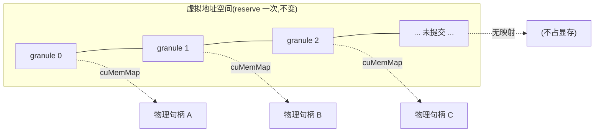
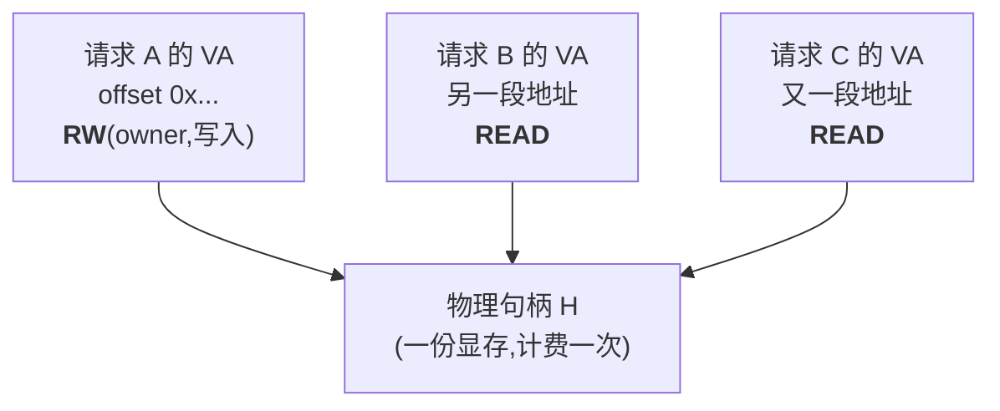
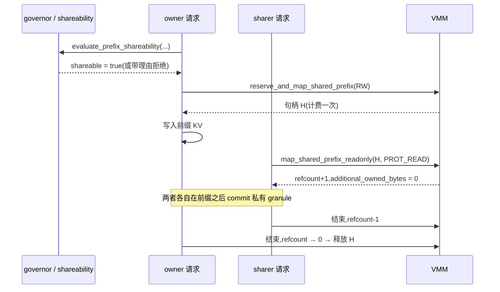
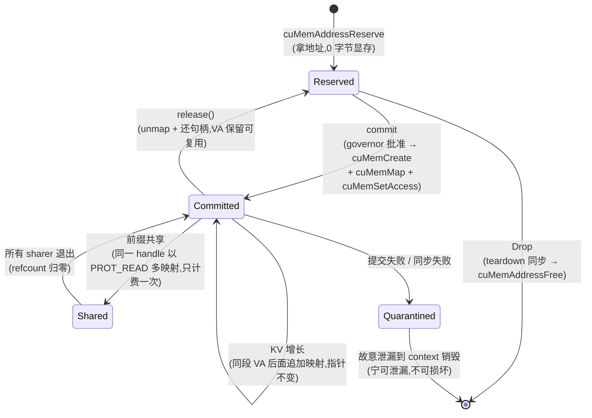

# Virtual Memory for KV Cache

> [!summary] Question answered
> How does the device-memory virtual memory manager work in each of these cases: KV cache growth, prefix sharing, one physical allocation mapped at several virtual addresses, and release and failure rollback?

> [!important] This describes behavior implemented on `main`
> Where unmerged design is involved it is called out explicitly. Where this disagrees with the code, the code wins.

## Why the KV cache needs virtual memory

First, get the shape of the problem clear.

The KV cache for a generation request has two awkward properties:

1. **It grows.** For every token generated, each layer appends one K and one V.
2. **Its final length is unknown in advance.** When the user stops, or when the model emits `eot`, is only known at runtime.

What happens with the naive `cudaMalloc`? You have only two bad options:

- **Preallocate for the maximum context.** A request with a 128K context occupies all of device memory even if it actually generates only 200 tokens. Concurrency is crushed down to the worst case.
- **Reallocate and copy when it runs out.** Every growth needs a `cudaMalloc` of a new large block + a `cudaMemcpy` to move the data + a free of the old one. **And the pointer changes** — every kernel argument, descriptor and external handle holding that address is invalidated.

Virtual memory management (VMM) offers a third option, and its core is one sentence:

> **Separate the "address" from the "memory."**

- **Reserve** a large range of **virtual addresses**. Virtual addresses are free; a range is just an interval in the address space, with not a single byte of physical device memory.
- **Commit** only when needed: request a physical device-memory handle and **map** it at some position within that virtual-address range.

So: **the address is the final address from the start and never changes, while physical device memory grows on demand.** Growth needs no copy and no pointer swap.

These are the corresponding calls in the CUDA driver API, which this repository uses directly in `crates/onnx-runtime-cuda-memory/src/virtual_memory.rs`:

| Stage | Driver call | What it does |
|---|---|---|
| Reserve | `cuMemAddressReserve` | Take a contiguous virtual-address range, zero physical memory |
| Allocate physical | `cuMemCreate` | Request a physical device-memory handle |
| Map | `cuMemMap` | Attach the handle at some offset of the virtual address |
| Grant access | `cuMemSetAccess` | Declare which device can read/write |
| Unmap | `cuMemUnmap` | Detach the mapping (the address remains) |
| Release physical | `cuMemRelease` | Return the physical handle |
| Free address | `cuMemAddressFree` | Return the virtual-address range |

Since #755, VMM is the default path for the native CUDA EP.



## The first key constraint: granularity

VMM does not map by the byte. `cuMemMap` **can only map an integer number of granules**.

> [!warning] granularity must be queried from the driver, not hard-coded
> This repository queries the device property with `cuMemGetAllocationGranularity`
> (see "granularity must be queried as a device property" in
> `docs/memory/MEMORY_ARCHITECTURE.md`). On the development machine
> `min == recommended == 2 MiB` was measured, but **it varies by up to 500× across platforms**.
> Hard-coding 2 MiB into the code is a bug that only blows up on another machine.

This yields a core formula that runs through the whole document:

```text
已提交字节数 = granule × (至少含 1 个活字节的窗口数)
```

**Note this counts "windows," not "live bytes."** Even if only 1 byte in a granule window is live, the whole granule must be committed. That is why **layout directly determines the memory lower bound**.

### How layout affects the commit lower bound

How the KV cache is physically laid out determines "how contiguous in address the data for a given span of tokens is":

| Layout | Description | Effect on commit |
|---|---|---|
| **head-major BNSH** (current default) | Split by head first, so the data for one span of tokens is scattered across each head's slices | One small fragment per head → many windows involved → coarse lower bound |
| **seq-major BSNH** (#782) | Contiguous along the sequence dimension | Data for a span of tokens is dense → lower bound of about `layers × 2` windows |
| **token-major** | A single token contiguous across all layers | Only measured, **not implemented** |

This difference is not theoretical fastidiousness. It also determines whether the prefix sharing of the next section **can be done at all**.

## Case one: when the KV cache grows

This is the most common path. The steps are:

1. **Reserve a large enough virtual-address range once.** Reserving for the maximum
   possible context is fine, because virtual addresses consume no physical device
   memory. After this step the KV buffer's address is **permanently fixed**.
2. **Initially commit only what is needed.** During prefill, map as many granule
   windows as there are tokens.
3. **As decode advances past the currently committed range, commit more.**
   Note: this **continues mapping new handles after the same virtual-address range**,
   not allocating a new buffer.
   - The pointer does not change.
   - No `cudaMemcpy`.
   - Not one byte of existing data moves.
4. **Request a budget from the governor first.** Committing is not unconditional; a
   grant (`MappedGrowthGrant`) must be obtained first. No grant, no commit.

### An important implementation detail: commit is a "transaction"

A commit can fail partway (for example, running out of device memory while requesting the 3rd handle). At that point it **must not leave a half-committed state**. That is what `rollback_pooled_maps` does in the code: it `cuMemUnmap`s the blocks mapped this time one by one **in reverse order** and returns the handles to the pool; if the unmap itself fails, it **records the block back into the reservation** (rather than treating it as freed), because it is in fact still mapped.

On the budget side there is likewise `MappedGrowthGrant::rollback()` to return the quota already deducted.

> [!note] Why `Err` does not mean "nothing happened"
> Remember this; it is the key to understanding the design of the later stages: VMM
> operations are **multi-step**, any intermediate step can fail, so returning `Err`
> **does not mean the state is unchanged**. Who guarantees exactly-once and who
> isolates the residue of a failure is what Phase 4 of issue #1186 is addressing.

### When capacity really is insufficient

The server does not crash with an OOM, nor does it return a 500. When queue/capacity admission rejects, it returns **HTTP 429 + `Retry-After`** (see `crates/onnx-genai-server/`). This is an explicit design choice: device-memory pressure is a form of **backpressure** and should make the caller retry rather than kill the process.

There is also a platform difference on Windows: when over budget, WDDM **falls back to OS shared memory by default** (#864/#874), which Linux does not do. So the same code "does not crash but is absurdly slow" on Windows and fails outright on Linux — be aware of this when diagnosing performance problems.

## Case two: one physical allocation mapped at several virtual addresses

This is VMM's most valuable capability relative to `cudaMalloc`, and also the easiest to get wrong when explaining.

### Why it is possible

The `handle` in `cuMemMap(addr, size, offset, handle, flags)` is a **physical** handle. No rule says a handle can be mapped only once. **The same handle can be mapped at multiple virtual addresses**, and each mapping can even be given **different access permissions**.

### How this repository uses it: read-only prefix sharing

Scenario: multiple requests share the same system prompt / the same conversation prefix. Their KV content for that span is byte-for-byte identical, and there is no reason to store a copy each.

- The **owner** uses `reserve_and_map_shared_prefix` to map **read-write** and write the data.
- The **sharer** uses `map_shared_prefix_readonly` to map **the same handle**, with access flag `CU_MEM_ACCESS_FLAGS_PROT_READ` — **read-only**.
- `PoolState.shared` maintains the reference count for this handle (`note_shared_map` / the corresponding release).



### Three semantics that must be made clear

**1. Billed only once.** This is the point. The sharer's `additional_owned_bytes` is always 0 — it adds no physical bytes. What is duplicated is only **each one's own virtual addresses, page-table entries and ledger records**, which are accounting overhead, not device-memory overhead.

**2. Physical lifetime is the "union."** This physical memory lives until the owner and **all** sharers no longer need it. Even if the owner finishes first, as long as a sharer is still reading, the handle cannot be released. The reference count exists for exactly this.

**3. Failure must unwind cleanly.** In `map_shared_prefix_readonly`, if `cuMemMap` succeeds but `cuMemSetAccess` fails, the code immediately `cuMemUnmap`s to withdraw this mapping and calls `note_unmapped()`, **but the handle still belongs to the shared prefix** (one mapping's failure must not release the physical memory everyone shares). This is the concrete embodiment of the previous section's "`Err` does not mean the state is unchanged."

### Whether it can be shared is an arithmetic question

This is a distinctive design in this repository: **shareability is not guessed, it is computed**. `crates/onnx-runtime-memory-governor/src/shareability.rs`:

```text
fragment_bytes                  = prefix_len × (该布局下每个片段的连续字节数)
shareable                       = fragment_bytes ≥ granule
shareable_granules_per_fragment = floor(fragment_bytes / granule)
multi_map_ops                   = fragments × shareable_granules_per_fragment
```

Intuitively: **sharing is only possible when at least one whole granule window falls entirely inside the prefix.** If every contiguous fragment is smaller than one granule, then any window contains both "prefix" and "non-prefix" bytes, and mapping is by whole windows — sharing it would mean sharing data that should not be shared.

Layout's role here is to determine `fragment_bytes` and the **cost** (how many multi-map operations to do), **but not the possibility**. The only two real hard conditions are: (a) the KV buffer must be VMM-backed; (b) `fragment_bytes ≥ granule` under the current layout.

When these are not met, the system **explicitly refuses and gives a reason** (`PrefixShareability::refusal_reason()`) rather than silently degrading to copying:

> "prefix not shareable: each contiguous KV fragment is smaller than one mapping
> granule (fragment_bytes < granule), so no whole granule falls entirely inside …"

> [!tip] This is an API posture worth learning from
> Turn "cannot do it" into a **return value with a reason** rather than a silent
> performance collapse. The caller can decide accordingly to change the layout,
> change the granule assumption, or simply give up on sharing.

## Case three: handling the prefix cache

First, a point that is easily misunderstood.

> [!warning] This repository currently has **no** automatic hash prefix-hit detection
> Today's sharing is an API that the **caller declares explicitly**: it is the caller
> that says "these two requests share this prefix," not the system hash-matching on
> its own. And the engine's generation loop cannot yet reach it —
> `persistent_state_shapes` in `native_decode/cuda.rs` currently hard-codes the BNSH
> physical shape. This is a **capability that is built but a pipeline that is not yet wired up**.

With that premise, the full flow of a prefix share is:

1. **Decide.** Call `evaluate_prefix_shareability(geometry, layout, prefix_len, granule)`.
   If not shareable, return with a reason and take the normal path.
2. **Owner establishes.** `reserve_and_map_shared_prefix`: reserve the virtual
   address, create the physical handle, map it RW, and write this prefix's KV.
   Billing happens here, **only this once**.
3. **Sharers join.** Each sharer: reserves its own virtual-address range (the
   addresses are its own, and cheap), maps the same handle at the corresponding
   offset with `map_shared_prefix_readonly`, and the reference count goes +1.
   `additional_owned_bytes = 0`.
4. **Each grows on its own.** Only the **prefix part** is shared. Each request
   continues committing its own private granules after the prefix, on its own
   virtual-address range, without affecting the others.
5. **Exit.** The physical handle is returned only when the reference count drops to 0.



### There is no CoW on the GPU side, and this is intentional

A natural follow-up: what if a sharer's conversation forks and needs to write into the shared region?

**The answer is: it cannot write, and this is a design contract, not an omission.** `SharedDevicePrefix` explicitly states that it does **not** include hashing detection, nor does it include divergence-triggered copy-on-write; the shared prefix is **read-only** for the entire union lifetime. This is also why the sharer's mapping permission is `PROT_READ` — the contract is guaranteed at the hardware level.

The way forking is handled: the part after the fork is each request's own private granules to begin with, and the shared prefix part never changes. A prefix is a "prefix" precisely because it is the same for all sharers.

### CoW does exist, but on the host side

> [!important] The repository has **two distinct** subsystems; do not confuse them
>
> | | **A: device VMM** | **B: host paged KV** |
> |---|---|---|
> | Location | `onnx-runtime-cuda-memory/{virtual_memory,vmm_allocator}.rs` | `onnx-genai-kv/{page_table,paged_cache}.rs` |
> | Memory | GPU device memory | Host RAM (`HostPageStore`) |
> | Mechanism | Real CUDA driver VMM calls | **Logical** paging + reference-count abstraction |
> | Serves | The native CUDA EP | The CPU EP's Tier B paged GQA decode |
> | CoW | **None** | **Yes** |

The host-side `PagedKvCache::fork()` and `ensure_page_for_write()` are true copy-on-write: when `ref_count > 1`, a write first copies the page. This is a capability of subsystem B, and a different thing from the GPU's VMM shared prefix.

One more common misunderstanding to clear up: **the "page" in B is not a kernel-visible block table.** It is a logical reference-count abstraction. **The paged attention / block table architecture is an alternative that was evaluated but not adopted in this repository** — the engine takes the flat-VA + VMM path.

## Case four: release and reclamation

On the matter of release, VMM has something counterintuitive.

### `release()` does not free the virtual address

`VirtualMemory::release()` does the following:

1. `cuMemUnmap` to detach the mappings (if the blocks to free are contiguous in
   address, they are **merged into a single** unmap — weight pages often span
   several 2 MiB handles, and merging saves one driver round-trip per granule).
2. Return the physical handles to the pool (`return_after_unmap`) or `cuMemRelease`.
3. **The virtual address is kept as-is.**

This is deliberate: a stable address means this VA can be directly reused by a later commit, needs no re-reserve, and does not invalidate anything holding that address.

### The real VA free happens only in `CudaReservation::Drop`

And the implementation of this Drop hides a decision worth reading:

```rust
if !self.blocks.is_empty()
    && let Some(synchronize) = &self.teardown_synchronizer
    && let Err(error) = synchronize()
{
    eprintln!("cuda_ep: WARNING: reservation teardown synchronization failed; \
               retaining {} mapped block(s) until CUDA context teardown: {error}", ...);
    self.blocks.clear();
    self.len = 0;
    return;   // ← 故意什么都不释放
}
```

That is: **the GPU's work must finish before releasing** (teardown synchronization). If synchronization fails, it means we **cannot confirm whether this memory is still in use** — and at that point the code chooses to **deliberately leak**: no unmap, no handle release, no `cuMemAddressFree`, "forgetting" this VA and its handles, leaving them for the driver to reclaim wholesale when the CUDA context is destroyed.

> [!tip] Why leaking is the right choice
> The alternative is "release first and see." But if a kernel is still reading this
> memory, releasing causes a **use-after-free or double free** — that is a segfault,
> silent data corruption, or worse, another request reusing the device memory and
> reading someone else's data.
>
> **A certain leak is better than uncertain corruption.** The comment's line
> "rather than making either reusable or advertising their physical bytes as free"
> says it clearly: neither reuse them nor advertise these bytes as free — the
> accounting also stays honest.

Only when synchronization succeeds does it take the normal path: bind the context → `cuMemUnmap` block by block → return/release the handles → finally `cuMemAddressFree` to free the entire VA.

## All four cases in one diagram



## Key points recap

1. **Separating address from memory** is the fundamental means of solving "length unknown and growing"; the cost is that you must manage the mappings yourself.
2. **Query granularity from the driver**, do not hard-code it; `已提交字节 = granule × 含活字节的窗口数`.
3. **Layout determines the commit lower bound and the sharing cost**, but not the possibility of sharing; the possibility is the arithmetic question `fragment_bytes ≥ granule`.
4. **One physical allocation mapped in multiple places is billed only once**; only the addresses and ledgers are duplicated; the lifetime is the union of all users.
5. **GPU shared prefixes are read-only, with no CoW**; CoW exists only in the host-side `PagedKvCache`.
6. **`Err` does not mean the state is unchanged.** A mid-way failure of a multi-step operation must be explicitly rolled back or isolated.
7. **`release()` keeps the address**; the real VA free happens only in Drop, and on synchronization failure it **deliberately leaks**.
8. **Capacity exhaustion returns 429**, expressing device-memory pressure as backpressure rather than killing the process.

## Not yet implemented

Listed honestly, so readers do not assume these already work:

- **Automatic hash prefix-cache hit detection** — currently a caller-declared API.
- **Wiring the engine's generation loop to shared prefixes** — `persistent_state_shapes` still hard-codes the BNSH physical shape.
- **GPU-side copy-on-write / forking** — explicitly not done by design.
- **token-major layout** — only measured, not implemented.
- **Kernel-visible block table / paged attention** — evaluated, not adopted.

In addition, the seven-phase memory-architecture rework of issue #1186 (`ProcessMemoryManager`, `MemoryBinding`, stream-ordered deferred free, etc.) is currently still on an **unmerged branch** and is not behavior of `main`.

## Related notes

- [[memory/Memory Management for Beginners]] — explains the responsibility boundaries
  of allocator / governor / holder / EP from first principles; this note can be seen
  as an in-depth expansion of its KV cache part
- [[prompting/Chat Templates]] — the full conversation is re-rendered every turn,
  which is exactly where the value of prefix sharing comes from
- [[execution/CUDA Execution Provider]] — the relationship between context, stream and memory
- [[performance/Performance Engineering Playbook]] — measurement discipline

## Evidence sources

- `crates/onnx-runtime-cuda-memory/src/virtual_memory.rs`
  (`reserve` / `commit` / `release` / `CudaReservation::Drop` /
  `reserve_and_map_shared_prefix` / `map_shared_prefix_readonly` / `rollback_pooled_maps`)
- `crates/onnx-runtime-memory-governor/src/shareability.rs` (shareability arithmetic and refusal reasons)
- `crates/onnx-genai-kv/src/{page_table,paged_cache}.rs` (host paged KV and true CoW)
- `docs/memory/MEMORY_ARCHITECTURE.md` (granularity as a device property, layout and residency, shareability derivation)
- Related issues: #755 (VMM becomes default), #782 (seq-major BSNH), #864 and #874 (WDDM fallback), #731 (HIP), #1186 (memory-architecture rework epic)
