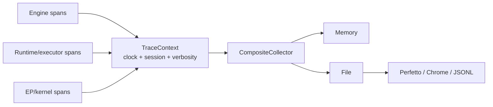

# Tracing and Profiling

> [!summary] Question answered
> How does the repository create one timeline across engine, native runtime and execution providers without imposing tracing cost when disabled?

## Collector architecture

Code emits through a shared `TraceContext`; output choice is a collector:

Instrumentation is written once. `MemoryCollector`, `FileCollector`,
`CompositeCollector` and optional platform collectors determine where events go.

## One clock

Host/runtime/plugin events must share a meaningful monotonic time basis. Separate
process-local epochs make cross-layer traces look ordered while being shifted.
The tracer uses operating-system monotonic readings that independently loaded
modules can compare.

Each trace also carries a session identity and thread/process lane information.

## Disabled-path cost

A disabled/no-op context checks one relaxed atomic flag and returns before:

- reading the clock;
- allocating argument structures;
- locking a collector;
- converting expensive metadata.

> [!important] Check before formatting
> A disabled span that still builds shape strings or vectors is not disabled in
> the hot-path sense.

## Events and verbosity

Typical layers include:

- request and generation-loop spans;
- native session and executor phases;
- operator/kernel worker spans;
- selected kernel variant and rejection reason;
- graph-capture decisions;
- memory/paging events;
- optional GPU activity through CUPTI.

Verbosity lets operators choose decisions-only, operator-level or full detail.
High-detail tracing can perturb performance, so every benchmark must record
whether it was enabled.

## Tracing versus timing

A timing counter is only meaningful when its interval is explicit. In asynchronous
GPU code, timing an enqueue call measures CPU submission latency, not transfer or
kernel completion.

For every timer, document:

- start and stop locations;
- whether the host blocks;
- stream/fence relationship;
- bytes/work represented;
- whether nested time is included.

Sanity-check derived bandwidth against physical limits.

## Logging is separate

Operational logging uses `tracing` events/spans with structured fields. The
timeline collector is a runtime-performance facility. Both should avoid prompts,
credentials, token streams and raw tensor contents.

Errors should retain actionable context rather than relying on a trace to explain
ordinary failure.

## Outputs

- Chrome Trace Event JSON;
- JSONL;
- Perfetto protobuf/export;
- in-memory events for APIs/tests;
- optional ITT and CUPTI collectors.

The server can expose debug trace/profile endpoints when explicitly enabled.

## Formal sources

- [`onnx-runtime-tracer`](../../crates/onnx-runtime-tracer/src/lib.rs)
- [`runtime_trace.rs`](../../crates/onnx-genai-engine/src/runtime_trace.rs)
- [`ERROR_AND_LOGGING_CONVENTIONS.md`](../../docs/architecture/ERROR_AND_LOGGING_CONVENTIONS.md)
- [`README.md` profiling section](../../README.md)

## Related notes

- [[performance/Performance Engineering Playbook]]
- [[execution/CUDA Execution Provider]]
- [[api/API Design Principles]]
