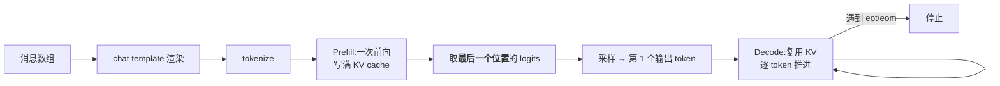
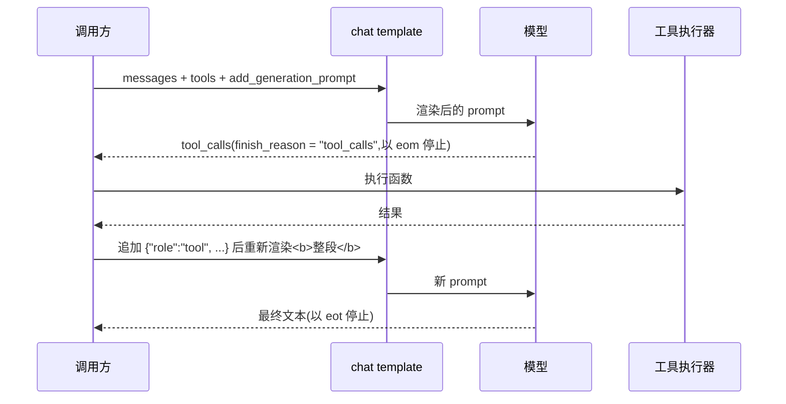

# Chat Templates

> [!summary] Question answered
> How does a structured conversation become the exact string of tokens the model actually sees?
> What happens after the template? And where do multimodality and tool calling fit into this
> machinery?

## 1. Framing the problem correctly: the model doesn't actually know "conversations"

A causal language model (causal LM) does exactly one thing: given a string of tokens, predict
the next token. It has no notion of a "message", no notion of "who is speaking", and no idea
which span is a system instruction and which is a user question.

But when we write code we use a structure like this:

```json
[
  {"role": "system",    "content": "You are a helpful assistant."},
  {"role": "user",      "content": "帮我看看这段代码"},
  {"role": "assistant", "content": "好的,你贴一下。"}
]
```

**A chat template is the translation layer between these two worlds**: it renders a message
array into one continuous string of plain text (and hence a string of tokens), in the format
this model was trained with.

What it renders looks roughly like this (using ChatML style as an example):

```text
<|im_start|>system
You are a helpful assistant.<|im_end|>
<|im_start|>user
帮我看看这段代码<|im_end|>
<|im_start|>assistant
```

Note the last line: there is **no content** after `<|im_start|>assistant`. This is deliberate;
the next section explains why.

> [!important] The template is not a matter of style, it is a matter of correctness
> The template must be **byte-for-byte identical** to the format the model was instruction-tuned
> (SFT) with. Hugging Face's official documentation states plainly that mismatched control tokens
> make quality "drastically worse". This is not "slightly off"; it means the model has entered a
> state outside its training distribution. So the template is **data shipped with the model
> package**, not configuration the runtime is free to improvise.

### The corresponding implementation in this repository

`crates/onnx-genai-ort/src/chat_template.rs` is this translation layer:

- `ChatTemplate::from_model_dir()` loads the template from the model directory, with priority:
  a standalone `chat_template.jinja` > the `chat_template` field in `tokenizer_config.json` >
  a built-in default template (matching ORT-GenAI's priority order).
- `ChatMessage` / `ChatRole` are the Rust form of that message array, with the role enum
  `System` / `User` / `Assistant` / `Tool` / `Other(String)` — `Other` is kept because some
  models really do define a fifth role (for example Llama 3.1's `ipython`).
- The template itself is Jinja2. These templates are written for Jinja2 on Python and casually
  call Python string methods (`startswith`, `split`, `title`, …), so rendering hooks up the
  `minijinja_contrib::pycompat` callback; otherwise real templates like qwen3's fail to render
  outright.

## 2. Template structure and its conventional forms

Although every vendor's special tokens differ, they converge strongly in structure, essentially
doing three things:

### 1. Separate "role" and "content" with a pair of markers

| Family | Start | Content separator | End |
|---|---|---|---|
| ChatML (Qwen, etc.) | `<\|im_start\|>{role}\n` | newline | `<\|im_end\|>\n` |
| Llama 3.x | `<\|start_header_id\|>{role}<\|end_header_id\|>\n\n` | blank line | `<\|eot_id\|>` |
| Gemma 3 | `<start_of_turn>{role}\n` | newline | `<end_of_turn>\n` |
| Mistral | `[INST] ` | —— | ` [/INST]` |
| Muse Glimmer | `<\|start\|>{role}<\|message\|>` | —— | `<\|eot\|>` or `<\|eom\|>` |

An easily overlooked detail: **Gemma renders the role name `assistant` as the literal `model`**
(`` in the template). So a "role name" is an abstraction at the API
layer; what string it renders to is entirely decided by the template.

### 2. The BOS at the start

BOS tokens like `<|begin_of_text|>` (Llama) are **written in by the template itself** (both
Llama 3.2 Vision's and Gemma 3's templates have a literal `{{- bos_token }}` at the top), not
"generated" by the model. So this repository injects `bos_token` / `eos_token` into the template
context as variables when rendering.

Corollary: if you let the template render a BOS and also let the tokenizer's
`add_special_tokens=True` add another, you get a **double BOS** — a very common, very subtle
quality bug.

### 3. Two kinds of "end", not to be conflated

Taking Llama 3 as an example:

- `<|end_of_text|>` (128001): the stop token of the **base model**.
- `<|eot_id|>` (128009): end **of turn**, the actual stop token of the instruct model.
- `<|eom_id|>`: end of **message** — "this message is finished, but this turn is not",
  typically used when the model issues a tool call and pauses to wait for the result.

Muse Glimmer uses `<|eot|>` / `<|eom|>` to express exactly the same pair of semantics. So when
the inference stack configures `eos_token_id`, it needs to count both "end of turn" and "end of
message" as stop conditions, and treat them differently: hitting `eot` ends the turn and hands
back to the user, while hitting `eom` usually means **it is time to run a tool**.

## 3. "Does the model start predicting the first character right after the template?"

**Yes, and we can be more precise.** Your intuition is entirely right in direction; below is the
exact mechanism, plus an important correction concerning Chinese.

### Step 1: `add_generation_prompt`

If you pass `add_generation_prompt=True` when rendering, the template appends **the opening
marker of the assistant turn but with no content**:

```jinja

    {{- '<|start|>assistant' -}}

```

(The snippet above is the last three lines of the Muse Glimmer template, unchanged.)

The point of this step is to stop the sequence at a position where "it is the assistant's turn to
speak, but not a single character has been said yet". Use `True` for inference; use `False` when
you are rendering a **complete conversation history** for logging or training replay, because
there the last assistant message already has content and does not need an empty opener appended.

### Step 2: Prefill, one forward pass

The entire rendered string (system + all history + that empty assistant opener) is tokenized and
sent into the model **all at once** for a single forward pass. Under the causal mask each position
attends to itself and all previous positions, and the model computes Key/Value tensors for every
layer and every position and caches them — this is the KV cache.

### Step 3: Take only the last position's logits

The key point is here: although prefill computes logits for **every** prompt position, at
inference time **only the last position's logits are used**. That is the position "having just
written `<|start|>assistant`, what should come next". It is projected by the LM head into a
vocabulary-sized vector, then sampled with softmax (or greedy argmax) to get the first output
token.

The logits of the other positions are discarded at inference time (they are only useful for
computing the loss during training).

### Step 4: Decode, advancing token by token

After that, each step computes only the new token's Query, reuses the K/V of all historical
positions in the KV cache, and appends the new K/V. This turns what would be O(n²) recomputation
into O(n) per step.



### One thing that must be clarified: it is a "token", not a "character"

What you called "predicting the first character" is strictly **predicting the first token**. For
Chinese the difference is large:

Modern tokenizers (the BPE / SentencePiece / tiktoken family) are trained mostly on UTF-8
**byte sequences**, and a Chinese character **is often split into 2–3 sub-character tokens**,
rather than the intuitive "1 Chinese character = 1 token".

Two direct consequences:

1. The token output at the last position **may be only part of a Chinese character**, requiring
   another decode step or two before a complete Chinese character is assembled.
2. A streaming UI **must buffer incomplete multi-byte UTF-8 sequences** and display them only once
   the character boundary is complete, otherwise it renders garbled text. This is an engineering
   detail every Chinese streaming service has to handle.

> [!note] There is no single authoritative citation for this point
> This property of tokenization for CJK is general tokenizer engineering common knowledge (a
> direct result of the byte-level design of BPE/tiktoken), not the special behavior of any
> particular model.

## 4. Multimodality: the template places "placeholders", not pixels

The first change in a multimodal template is that `content` goes from a string to a **segmented
array**:

```json
{"role": "user", "content": [
  {"type": "image"},
  {"type": "text", "text": "这张图里有什么?"}
]}
```

The second, and more fundamental, change is a **split of responsibilities**:

> [!important] The tokenizer only writes placeholders; the processor produces visual features
> All the template does (at the tokenizer layer) is render `{"type": "image"}` into a placeholder
> string. What actually turns an image into vectors and substitutes those vectors into the model's
> input embedding is a different class (`AutoProcessor`, such as `Gemma3Processor`,
> `Qwen2_5_VLProcessor`), which works at a lower level than plain-text tokenization.

Placeholder conventions for three real models (all taken from online `chat_template.json` /
`tokenizer_config.json`):

| Model | Image placeholder | Video placeholder | Notes |
|---|---|---|---|
| Llama 3.2 Vision | `<\|image\|>` (id 128256) | —— | See the hard restriction below |
| Qwen2.5-VL | `<\|vision_start\|><\|image_pad\|><\|vision_end\|>` | `<\|vision_start\|><\|video_pad\|><\|vision_end\|>` | Supports `add_vision_id`, auto-adds "Picture 1: " numbering |
| Gemma 3 / PaliGemma | `<start_of_image>` | —— | Also `<image_soft_token>`, expanded by the processor into a fixed-length patch sequence |
| Muse Glimmer | `<\|patch\|>` | `<\|video\|>` | Handled uniformly inside the template by the `render_content` macro |

### Where the real differences between variants lie

1. **Whether the placeholder is 1 token or a sequence.** Llama 3.2 uses a single `<|image|>`;
   Gemma uses `<start_of_image>` and lets the processor expand it into a fixed-length soft-token
   sequence. This directly affects how you estimate how much KV cache one image occupies.
2. **Whether it can interleave.** Qwen2.5-VL explicitly supports interleaving multiple
   images/video/text and disambiguates with numbered labels; some models only support "all images
   at the start".
3. **Whether there are hard restrictions.** Llama 3.2 Vision's template contains:

   ```jinja
   
       {{- raise_exception("Prompting with images is incompatible with system messages.") }}
   ```

   That is, **the official template outright forbids "system message + image" appearing together**.
   Constraints like this are written into the template and enforced by throwing an exception at
   render time — so this repository's renderer specifically registers a `raise_exception` function
   so these constraints actually take effect instead of being silently ignored.

## 5. Case study: Muse Glimmer's channel (recipient) design

You mentioned "seeing channels like ToSelf, ToUser in a model's template". Let me clarify two
things first, then discuss the design.

> [!warning] Clarifying the names
> This model is **Muse Glimmer** (Meta Superintelligence Labs, August 2026, 30B, Apache 2.0,
> open weights), not "Llama 3-V". Incidentally, `Llama3-V` was a 2024 Stanford student project
> later shown to have extensively plagiarized MiniCPM-Llama3-V 2.5; it has nothing to do with
> Meta, so do not confuse them.
>
> Also, the actual form in the template is **not** camelCase names like `ToSelf`/`ToUser`, but a
> `to=` recipient syntax: `to=self`, `to=user`, `to=<tool name>`. All the code below is quoted
> verbatim from `meta-models/Muse-Glimmer-30B`'s `chat_template.jinja`.

### The core idea: every assistant message has a "recipient"

In an ordinary template, `assistant` is just `assistant`, one role for one kind of output. Muse
Glimmer separates the **role** from the **recipient**: it is still the assistant speaking, but it
can speak to three different audiences.

The system block even explicitly lists the set of valid recipients:

```jinja
{{- '# Valid recipients: ' + rns.recipients | join(', ') + '.' -}}
```

This renders to a line like `# Valid recipients: "self", "web.*", "user".` — effectively
declaring to the model, inside the prompt, a type signature of "which channels you may write to".

### The three channels

**(a) `to=self` — internal reasoning, not shown to the user**

```jinja

    {{- '<|start|>assistant to=self<|message|>' + message['reasoning_content'] + '<|eom|>' -}}

```

Note it ends with `<|eom|>`: done thinking, but the turn is not over. The content in this channel
is the model's thinking process and the runtime **must never return it to the user as the final
answer**.

**(b) `to=<tool name>` — tool call**

```jinja

    {{- '<|start|>assistant to=' + tc.function.name + '<|message|>' -}}
    {{- render_atem(tc) -}}
    {{- end_token -}}{{- '<|eom|>' -}}

```

**Each tool is its own channel**, not "stuffing a function name into one generic tool channel".
And because it uses a `for` loop chained with `<|eom|>`, it **natively supports issuing multiple
tool calls in one turn** (by contrast, Llama 3.2's template throws an exception outright when
`tool_calls` has more than one).

**(c) `to=user` — the user-visible reply**

```jinja



    

```

This logic is worth reading: **the recipient defaults to `user`**; and "whether this turn ends"
is by default derived from the recipient — for the user it uses `<|eot|>` (end), for anyone else
it uses `<|eom|>` (more to come). The semantics are coupled cleanly.

```mermaid
flowchart TD
    S["system<br/>(工具定义 + Valid recipients)"] --> U["user"]
    U --> A1["assistant <b>to=self</b><br/>规划/推理 · &lt;&#124;eom&#124;&gt;"]
    A1 --> A2["assistant <b>to=web.search</b><br/>ATEM 调用 · &lt;&#124;eom&#124;&gt;"]
    A2 --> T["tool web.search<br/>&lt;tool_output&gt; · &lt;&#124;eot&#124;&gt;"]
    T --> A3["assistant <b>to=self</b><br/>解读结果 · &lt;&#124;eom&#124;&gt;"]
    A3 --> A4["assistant <b>to=user</b><br/>最终回答 · &lt;&#124;eot&#124;&gt;"]
```



### Why this design is worth learning from

Putting "thinking", "action" and "answer" into **different channels of the same autoregressive
sequence**, rather than three separate mechanisms, brings several benefits:

1. **The model itself decides who to speak to next.** Whether to keep thinking, call a tool, or
   answer directly becomes an ordinary token prediction, rather than a judgment made by an
   external scheduler.
2. **The runtime's routing rules are explicit and parseable.** Given `to=` you know how to handle
   it: `self` folds into "thinking", `tool name` goes to execution, and only `user` is streamed
   out to the user.
3. **Reasoning content is naturally prunable.** Because it is a separate channel, dropping
   historical `to=self` segments across turns is a structured operation rather than a regex guess.

> [!note] This is not an isolated case
> OpenAI's Harmony format (the `gpt-oss` family) uses an almost isomorphic idea, only with
> different keywords: `<|start|>assistant<|channel|>analysis<|message|>...`, where the three
> channels are `analysis` (hidden chain of thought), `commentary` (tool-call preamble), and
> `final` (user-visible answer). One can view "hidden reasoning channel vs user-visible channel"
> as becoming a general paradigm for agentic models.

### How this repository handles "hidden reasoning"

`crates/onnx-genai/src/reasoning.rs` already implements general reasoning-segment detection, and
holds to an important principle:

> The delimiters are **never guessed from the model name or vendor name**, only detected from the
> chat template shipped with the model package. If the template contains `<think>`, that is this
> model telling the runtime what marker it uses for reasoning.

It also makes the multi-turn policy explicit: reasoning segments **must not be back-filled into
later turns** — these models were trained with the thinking of historical turns removed, so
replaying it degrades quality and also lets the context be blown up by the model's own thoughts.

Note that `reasoning.rs` currently recognizes **paired delimiters** like `<think>`, whereas Muse
Glimmer uses the `to=self` **recipient** mechanism; the two are different forms of expression, and
supporting the latter would require recognizing the recipient after `<|start|>` at the parsing
layer. This is a real gap between the current implementation and that template, not a completed
capability.

## 6. How tool calling is handled in the template

Tool calling in the template is really **three independent pieces of rendering logic**, often
conflated:

### Part 1: Inject the tool definitions into the prompt (usually in the system block)

The caller passes `tools=[...]` (JSON Schema), and the template is responsible for rendering it
into a form the model recognizes:

```json
{"type": "function", "function": {
  "name": "multiply", "description": "...",
  "parameters": {"type": "object", "properties": {...}, "required": ["a","b"]}}}
```

This repository's `render()` exposes it to the template as the `tools` variable and **requires it
to be valid JSON** (a parse failure reports `invalid tools JSON for chat template` outright), with
no silent degradation.

Rendering approaches differ widely across vendors: Muse Glimmer writes a large block of
natural-language explanation + a namespace list + all function schemas + one example call;
Llama 3.1 relies on a single `Environment: ipython` line switch in the system block.

### Part 2: The syntax the assistant uses to issue a call

| Model | Syntax |
|---|---|
| Llama 3.1/3.2 | `<\|python_tag\|>{"type":"function","name":...,"parameters":{...}}<\|eom_id\|>` |
| Qwen / Hermes family | `<tool_call>\n{"name": ..., "arguments": {...}}\n</tool_call>` |
| Muse Glimmer | `<atem:function_calls><atem:invoke name="..."><atem:parameter name="...">…` |

Muse Glimmer's XML-style ATEM syntax has an interesting engineering detail: the template
explicitly rejects string-form arguments:

```jinja

    {{- raise_exception('Muse Glimmer ATEM chat template requires tool_call.function.arguments
        to be a dict (mapping); a JSON string cannot be parsed in the HF jinja sandbox.') -}}
```

The reason is stated plainly: HF's Jinja sandbox has no JSON parser, so the caller **must** pass a
dict. This is exactly a classic difference between the HF convention and the OpenAI wire format —
OpenAI's `function.arguments` is a JSON **string**, whereas the HF template expects a **dict**. If
an adapter layer does not perform this conversion, it will hit this exception.

### Part 3: How tool results are fed back

Once the tool has run, the result is appended as a new message with `role` `tool` (Llama 3.1 calls
it `ipython`, with the same semantics; its documentation says verbatim *"Semantically, this role
means 'tool'"*).

There is a real pitfall here: **how does the result message know which call it answers?** Muse
Glimmer's template writes out a complete three-level fallback:

```jinja


    
    ... 遍历历史 messages,按 tc.id == tcid 反查 tc.function.name ...

{{- '<|start|>tool ' + tname + '<|message|><tool_output name="' + tname + '">\n' -}}
```

That is: look at `name` first, and if absent use `tool_call_id` to trace back through the
`tool_calls` in historical messages to find the function name. This repository's
`ChatMessage::with_tool_result(name, tool_call_id)` exists precisely so the caller can provide both
fields at once — the comment on the struct says so directly.

### The complete runtime loop



The key point: every turn **re-renders the complete conversation** before sending it into the
model, not "appending a segment after the previous prompt". This is exactly why a prefix cache is
valuable — most of each turn's prefix is repeated. See [[memory/Virtual Memory for KV Cache]].

### There is no unified convention for parallel calls

The HF documentation warns explicitly: most models issue only one call at a time; models that
support parallelism need to disambiguate by tool call ID, and **this is model-specific, not a
general rule**. The reality is indeed fragmented:

- Llama 3.1 documentation, verbatim: *"Only single tool calls are supported as of now."*
  Llama 3.2's template calls `raise_exception` outright when `tool_calls` has more than one.
- Muse Glimmer uses a `for` loop chained with `<|eom|>` and natively supports multiple.

So when writing an adapter layer, "whether parallelism is allowed" must be looked up per model and
never assumed.

## 7. A checklist for implementers

1. **Do not assemble prompt strings yourself.** Render with the model's own template.
2. **No double BOS.** When the template already renders a BOS, do not let the tokenizer add another.
3. **Distinguish `eot` and `eom` as stop tokens.** The former hands back to the user; the latter
   usually means it is time to run a tool.
4. **The dict / JSON-string dispute over `arguments`.** The OpenAI wire format is a string; HF
   templates want a dict.
5. **Do not back-fill reasoning segments into later turns.** It degrades quality and blows up the
   context.
6. **Chinese streaming must buffer to UTF-8 character boundaries.** Otherwise the output is garbled.
7. **Take exceptions the template throws seriously.** Those `raise_exception` calls are the model
   declaring its hard constraints.
8. **For multimodality, the template only gives placeholders.** Visual tensors are produced by the
   processor, and the two paths must be aligned.

## References and sources

- Hugging Face official documentation: `huggingface/transformers:docs/source/en/chat_templating.md`,
  `huggingface.co/docs/transformers/en/chat_extras` (tool calling)
- Muse Glimmer template and model card: `meta-models/Muse-Glimmer-30B`
  (`chat_template.jinja`; all Muse Glimmer code blocks in this note are quoted verbatim from that
  file)
- Llama 3.1 prompt format: `meta-llama/llama-models:models/llama3_1/prompt_format.md`
- Per-model templates/special tokens: the online `tokenizer_config.json` / `chat_template.json` of
  Llama 3.2 Vision, Qwen2.5-VL, and Gemma 3
- OpenAI Harmony format: `github.com/openai/harmony/blob/main/docs/format.md`
- This repository's implementation: `crates/onnx-genai-ort/src/chat_template.rs`,
  `crates/onnx-genai/src/reasoning.rs`

## Related notes

- [[memory/Virtual Memory for KV Cache]] — how this rendered string of tokens is laid out in device
  memory
- [[memory/Memory Management for Beginners]] — a first-principles introduction to memory management
- [[architecture/Inference Request Lifecycle]] — the complete path of a request from entry to output
