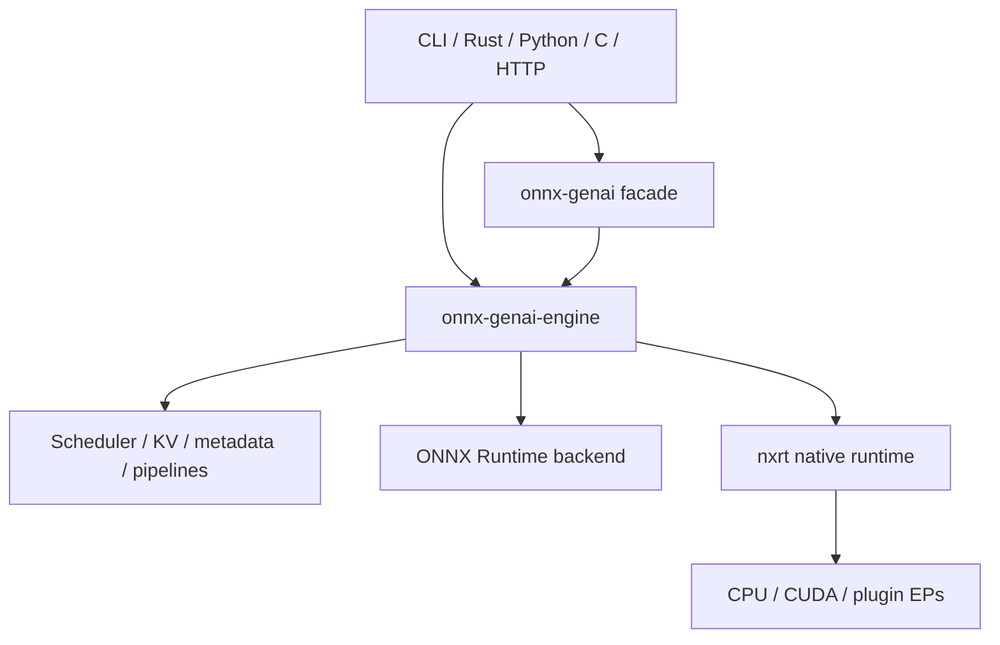

# Repository Map

> [!summary] Question answered
> Where should I start in this large repository, and which area owns the concept I am looking for?

## The shortest useful mental model

`onnx-genai` contains two related systems:

1. A **GenAI product/runtime layer** for prompts, generation, scheduling, KV state,
   pipelines, serving, and language bindings.
2. A **native ONNX runtime layer** (`onnx-runtime-*`, often called **nxrt**) for
   graph IR, loading, optimization, execution providers, memory planning, and
   session execution.

They meet in `onnx-genai-engine`, which can drive either ONNX Runtime or the
native nxrt backend while keeping generation policy above both.

## Top-level areas

| Path | What belongs here |
|---|---|
| `crates/onnx-genai-*` | Generation features, product surfaces, metadata, KV, scheduler, server, CLI and bindings |
| `crates/onnx-runtime-*` | Native ONNX runtime, execution, EPs, memory, ABI and interoperability |
| `crates/onnx-std*` | ONNX standard-library work |
| `docs/` | Formal design, measured status, investigations and benchmark evidence |
| `wiki/` | Explanatory maps and learning notes; never the final authority |
| `scripts/` | Model build, benchmark and operational helpers |
| `models/` | Local/generated model artifacts when present; not the source of runtime contracts |
| `xtask/` | Repository maintenance and developer tasks |

## Find code by task

| You want to change | Start with |
|---|---|
| Public Rust generation API | `crates/onnx-genai` and `crates/onnx-genai-engine` |
| Prompt-to-token generation behavior | `crates/onnx-genai-engine/src/engine` and `decode_loop` |
| Sampling or constraints | `crates/onnx-genai-engine/src/sampling.rs`, `logits/`, `processors/` |
| Speculative decoding | `crates/onnx-genai-engine/src/speculative/` |
| KV pages, prefix reuse, fork or rewind | `crates/onnx-genai-kv` |
| Admission, batching or preemption | `crates/onnx-genai-scheduler` and engine `batched` integration |
| Inference metadata | `crates/onnx-genai-metadata` |
| Image/audio preprocessing | `crates/onnx-genai-preprocess` |
| OpenAI-compatible HTTP behavior | `crates/onnx-genai-server` |
| CLI and REPL | `crates/onnx-genai-cli` |
| ONNX graph representation | `crates/onnx-runtime-ir` |
| Model loading and external weights | `crates/onnx-runtime-loader`, `crates/onnx-model-package` |
| Graph optimization or shape inference | `crates/onnx-runtime-optimizer`, `crates/onnx-runtime-shape-inference` |
| Native session/executor | `crates/onnx-runtime-session` |
| Execution-provider contract | `crates/onnx-runtime-ep-api` |
| CPU or CUDA kernels | `crates/onnx-runtime-ep-cpu`, `crates/onnx-runtime-ep-cuda` |
| Plugin EP interoperability | `crates/onnx-runtime-ep-plugin`, `*-plugin`, `ep-nxrt-*` |
| Memory governance or VMM | `crates/onnx-runtime-memory-*`, then [[memory/Memory Management for Beginners]] |
| Tracing and profiling | `crates/onnx-runtime-tracer` and engine `runtime_trace` |
| Distributed collectives | `crates/onnx-runtime-comm` |
| Python/C/DLPack bindings | `onnx-genai-python`, `onnx-runtime-python`, `*-capi`, `onnx-runtime-dlpack` |

## Find documentation by question

| Question | Start with |
|---|---|
| What is the project trying to be? | [`docs/architecture/DESIGN.md`](../../docs/architecture/DESIGN.md) |
| What works today? | [`docs/status/PROGRESS.md`](../../docs/status/PROGRESS.md) |
| How does nxrt fit together? | [`docs/architecture/ORT2.md`](../../docs/architecture/ORT2.md) |
| How is memory actually behaving? | [`docs/memory/MEMORY_ARCHITECTURE.md`](../../docs/memory/MEMORY_ARCHITECTURE.md) |
| What is the proposed memory contract? | [`docs/memory/MEMORY_MANAGEMENT_MODEL_DESIGN.md`](../../docs/memory/MEMORY_MANAGEMENT_MODEL_DESIGN.md) |
| What is the native CUDA path? | [`docs/execution/NATIVE_CUDA_DECODE.md`](../../docs/execution/NATIVE_CUDA_DECODE.md) |
| How should models declare behavior? | [`docs/genai/MODEL_METADATA.md`](../../docs/genai/MODEL_METADATA.md) |
| Where are benchmark results? | [`docs/benchmarks/README.md`](../../docs/benchmarks/README.md) |

For the full source-precedence-aware index, see [[start/Documentation Guide]].

## Suggested first hour

1. Read the root [`README.md`](../../README.md) for product capability and CLI shape.
2. Read [[architecture/Crate Architecture]].
3. Trace one request through [[architecture/Inference Request Lifecycle]].
4. Compare the two paths in [[execution/Execution Backends]].
5. Use [[start/Documentation Guide]] before trusting an old design note.

> [!warning] Design documents may describe a destination
> Some early documents still describe original goals that implementation has
> since refined. For questions about current behavior, prefer code, reproducible
> measurements, and documents that explicitly identify themselves as current
> authorities.
