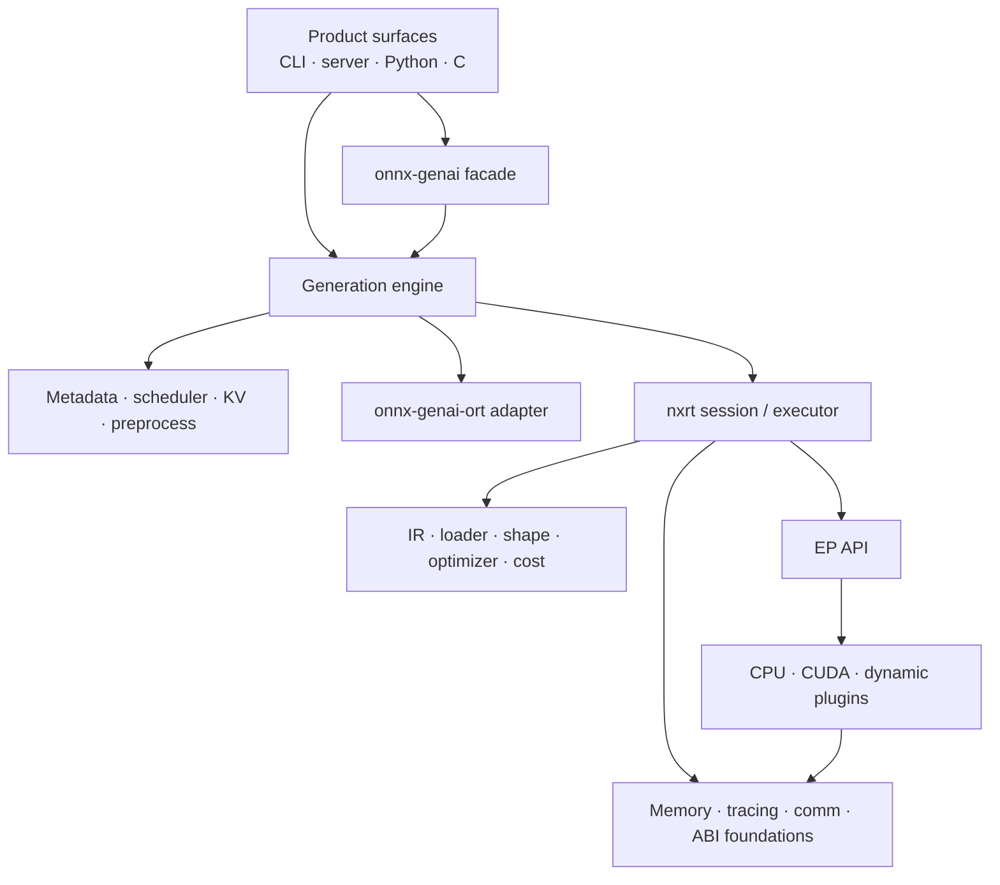

# Crate Architecture

> [!summary] 本篇回答的问题
> 工作区中的 crate 是如何分组的?新代码应遵循哪个依赖方向?

工作区之所以有很多 crate,是因为它把产品策略(product policy)与运行时机制
(runtime mechanism)分离开,并隔离出可选的平台/ABI 表面。真正权威的是 Cargo
的依赖图;本篇提供的是一张概念地图。

## 分层地图

## GenAI 层

### Facade 与公共表面

| Crate | 角色 |
|---|---|
| `onnx-genai` | 小型公共 facade;re-export 引擎、KV、metadata、ORT 与预处理 API |
| `onnx-genai-cli` | 统一的 CLI 与交互式 REPL |
| `onnx-genai-server` | 兼容 OpenAI 的 HTTP/SSE 服务器,含会话、指标与 admin/debug 路由 |
| `onnx-genai-python` | 面向 Python 的 GenAI API |
| `onnx-genai-capi` | 面向 C 的 GenAI API |
| `onnx-genai-router` | 路由/模型选择支持 |

### 生成策略与状态

| Crate | 角色 |
|---|---|
| `onnx-genai-engine` | 主协调器:加载、生成、decode 循环、采样、speculative decoding、pipeline、后端选择 |
| `onnx-genai-scheduler` | 准入、优先级、batching、字节预算、压力与抢占决策 |
| `onnx-genai-kv` | KV page、page table、prefix cache、fork/rewind、分层后备存储与遥测 |
| `onnx-genai-metadata` | 推理 metadata 标准结构与校验 |
| `onnx-genai-runtime-config` | 运行时配置模型 |
| `onnx-genai-genai-config` | GenAI 配置兼容性 |
| `onnx-genai-preprocess` | 图像/音频及模型声明的预处理 |
| `onnx-genai-ort` | 生成引擎使用的 ONNX Runtime 集成 |

生成引擎有意成为连接层(joining layer):它理解生成语义,既能消费 ORT session,
也能消费原生的 nxrt session。

## 原生运行时层

### 图与模型表示

| Crate | 角色 |
|---|---|
| `onnx-runtime-ir` | 带类型的图、节点、值、形状、layout 与设备标注 |
| `onnx-runtime-loader` | ONNX/模型加载与 external-data 处理 |
| `onnx-model-package` | 模型包格式与包操作 |
| `onnx-runtime-shape-inference` | 形状推理 |
| `onnx-runtime-optimizer` | 图优化 pass |
| `onnx-runtime-quantization` | 运行时量化契约与支持 |
| `onnx-runtime-cost-model` | 用于放置/选择的显式成本输入 |
| `onnx-runtime-operator-selection` | 算子/kernel 选择支持 |

### 执行

| Crate | 角色 |
|---|---|
| `onnx-runtime-session` | 原生 session 构造、planning、executor、tensor 所有权与异构执行 |
| `onnx-runtime-eager` | Eager 执行表面 |
| `onnx-runtime-ep-api` | 原生 execution-provider 与 kernel 契约 |
| `onnx-runtime-ep-cpu` | CPU EP 与 kernel |
| `onnx-runtime-ep-cuda` | CUDA EP、kernel、graph capture 与设备执行 |
| `onnx-runtime-ep-plugin` | 对 ORT 风格 plugin EP 的导出/桥接支持 |
| `onnx-runtime-ep-nxrt-abi` | 原生 nxrt 动态 EP ABI 定义 |
| `onnx-runtime-ep-nxrt-host` | 原生 EP ABI 的 host 侧 |

### 基础设施与互操作

| Crate 家族 | 角色 |
|---|---|
| `onnx-runtime-memory*` | 内存规划、虚拟内存、CUDA 内存与治理 |
| `onnx-runtime-tracer` | 运行时追踪与兼容 Perfetto 的 event |
| `onnx-runtime-comm` | 分布式通信与 buffer 所有权 |
| `onnx-runtime-capi` / `python` / `dlpack` | 原生运行时的语言与 tensor 互操作 |
| `onnx-runtime-protocol-trace` | 协议一致性 trace |
| `onnx-runtime-cpuinfo` | CPU 能力探测 |
| `mlas-sys` | CPU 路径使用的 vendored MLAS 绑定 |

## 依赖的经验法则

> [!important] 优先向下依赖
> 机制(mechanism)crate 不应依赖产品策略(product-policy)crate。例如,
> allocator 原语不应依赖生成引擎,graph IR 也不应知道 HTTP 请求。

1. 公共表面可以依赖引擎 API,但不能依赖引擎内部实现。
2. 引擎可以连接 GenAI 策略与后端机制。
3. scheduler 与 KV crate 应保持可独立测试。
4. EP API 不应依赖某个具体的 CPU/CUDA provider。
5. 基础的 memory/ABI 类型不应依赖 session 或引擎策略。
6. 可选的平台/plugin crate 不应把它们的依赖强加到默认的可移植路径上。

## 为什么 `onnx-genai-*` 和 `onnx-runtime-*` 同时存在

原生运行时的用途不止于自回归生成:它能加载并执行 ONNX 图。GenAI 层在其之上加入
有状态的 token 生成语义、KV 生命周期、调度、prompt 处理与服务(serving)。

保持这条边界清晰使得:

- GenAI 策略可以对比 ORT 与原生执行;
- nxrt 可以作为一个通用运行时演进;
- EP 与 kernel 可以在不依赖 prompt/session 策略的情况下被复用;
- memory 与 ABI 契约可以在产品层之下被测试。

## 相关笔记

- [[start/Repository Map]]
- [[architecture/Inference Request Lifecycle]]
- [[execution/Execution Backends]]
- [[memory/Memory Management for Beginners]]
