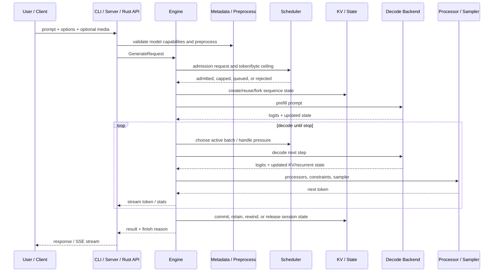

# Inference Request Lifecycle

> [!summary] 回答的问题
> 从收到 prompt 到返回生成的 token 之间发生了什么?

这是一次概念层面的追踪。具体函数会因 CLI/server 模式、模型 pipeline 以及所选
backend 而不同。

## 端到端流程

## 1. 请求构造

入口包括:

- `onnx-genai-cli` 命令与 REPL;
- `onnx-genai-server` 的 OpenAI 兼容路由;
- `onnx-genai` Rust facade;
- Python 与 C 绑定。

它们把用户输入规范化为面向 engine 的请求。server 路由还负责处理 chat template、
工具 schema、响应格式、SSE、持久化会话 ID,以及多模态请求解析。

## 2. 元数据与预处理

model package 和推理元数据决定了:

- 模型组件与 pipeline 各阶段;
- 支持的模态;
- 分词/chat-template 行为;
- KV 形状与 cache 声明;
- 运行时能力与默认值;
- 结构化输出与生成选项。

图像/音频输入由 `onnx-genai-preprocess` 按声明的契约进行变换,而不是依赖对模型名
的条件判断。

## 3. 准入与调度

engine 会询问 scheduler 某个请求是否能安全运行。准入(admission)考量:

- 最大活跃 batch 大小;
- prompt 长度与请求的生成上限;
- 每个 token 的 KV 字节数与可用字节预算;
- 请求优先级;
- 更小的生成上限是否仍能保证推进。

请求可能被准入、被限额、被排队,或以一个可据以行动的容量错误被拒绝。执行期间,
scheduler 决定哪些序列进行 prefill、decode、抢占,或换回内存。

> [!important] 准入关注的是能否完成
> 接纳一份无法到达其下一个释放/完成点的工作会让容量陷入死锁。等待中的工作不应
> 占用稀缺的部分状态。

## 4. 会话与 KV 状态

engine 会创建、恢复、fork 或复用序列状态。视模型/backend 而定,这可能包括:

- KV tensor 或 page;
- recurrent/conv 状态;
- sampler/search 状态;
- 请求进度与 checkpoint 信息;
- prefix-cache 引用。

`onnx-genai-kv` 提供 page/prefix/分层机制,而 engine 负责把这些语义桥接到具体的
ORT 或原生 decode 表示。

## 5. Prefill

prefill 处理 prompt,产生第一个 next-token logits,同时构建持久化的模型状态。

执行 backend 可能是:

- 一个 ONNX Runtime session;
- 一个使用 CPU/CUDA/plugin EP 的原生 nxrt session;
- 一个多组件 pipeline,其中不同的模型/阶段按顺序运行。

参见 [[execution/Execution Backends]]。

## 6. Decode 循环

对每个生成步骤:

1. 构建下一批 backend 输入:token、position、mask 与状态视图。
2. 执行一个或多个图组件。
3. 事务性地更新 KV/recurrent 状态。
4. 应用 logit processor,如 repetition/frequency/presence 惩罚。
5. 若有配置,应用结构化约束。
6. 采样或选择下一个 token。
7. 检查 EOS、stop sequence、取消,以及上下文长度限制。
8. 流式输出该 token 并更新 telemetry。

Speculative decoding 会插入一个 proposer 与一个 target 验证步骤。被拒绝的 token
需要回退状态;被接受的运行则一次推进多个 token。

## 7. 完成与保留

finish reason 可能是 EOS、stop sequence、长度/上下文限制、取消或错误。完成之后,
状态可能被:

- 为持久化对话保留;
- 插入 prefix cache 或被其引用;
- checkpoint 或 fork;
- 在推测之后回退;
- 释放或移至更冷的分层。

## 到哪里调试

| 症状 | 从这里入手 |
|---|---|
| 请求在运行前被拒绝 | scheduler 准入与内存计划诊断 |
| prompt/工具格式错误 | server 路由、chat template、元数据 |
| token 选择错误 | processor、约束、sampler 与 tokenizer |
| 若干 token 后状态发散 | decode backend、KV bridge、recurrent 状态 |
| 吞吐不佳 | batching 决策、backend profiler、kernel/profile 文档 |
| 内存增长 | [[memory/Memory Management for Beginners]] 与内存 telemetry |
| 原生结果与 ORT 不一致 | [[execution/Execution Backends]] 与 parity 测试 |

## 正式来源

- [`README.md`](../../README.md)
- [`onnx-genai-engine`](../../crates/onnx-genai-engine/src/lib.rs)
- [`onnx-genai-scheduler`](../../crates/onnx-genai-scheduler/src/lib.rs)
- [`onnx-genai-kv`](../../crates/onnx-genai-kv/src/lib.rs)
- [`docs/genai/SCHEDULING.md`](../../docs/genai/SCHEDULING.md)
- [`docs/genai/PIPELINE.md`](../../docs/genai/PIPELINE.md)
