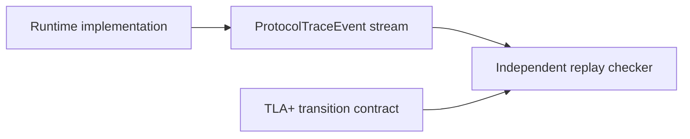

# Formal Verification with TLA+

> [!summary] 回答的问题
> 本仓库中哪些运行时 invariant 经过了 model checking,还有哪些必须在实现里测试?

大多数测试只执行一条具体的序列。而一个 TLA+ 模型会在一个刻意保持很小的抽象系统
内探索每一个状态转移。对那些最难的 bug 由罕见的交错(interleaving)而非算术引起
的协议来说,这非常有用。

这些模型位于 [`specs/tla/`](../../specs/tla/)。它们是对 [[contracts/Runtime Contracts]]
中所述类型、conformance 与运行时检查的补充。

## 建模了什么

| 模型 | 主要问题 |
|---|---|
| `PressureProtocol.tla` | 容量能否被授予、认领、取消或超时,而不发生泄漏或双重占有? |
| `KvAdmission.tla` | KV 准入是否在尊重容量的同时,保留一个仍可推进的状态? |
| `BufferOwnership.tla` | reader 能否安全地别名,同时 writer 保持独占且 lease 始终以 registry 为根? |
| `CoResidency.tla` | 模型/KV 常驻能否避免在需要某模型的请求退出之前就将其驱逐? |
| `NodeFailure.tla` | 失败的节点是否会停止,同时仅存活者的工作被排空,且每个操作都归于稳定? |
| `CollectiveOrdering.tla` | 各参与者观察到的 collective 操作顺序是否相容? |

这些模型把真实对象缩减为某一个契约所需的状态。一个 KV page 可能变成一个标识符加
上占有状态;若与准入无关,CUDA stream 和 tensor 内容可能被完全略去。

## Invariant 与推进性

一个 **invariant** 声明某件坏事永远不会成真:

```text
granted capacity never exceeds the pool
one writable buffer never has two owners
cancelled work does not retain an allocation
```

一个 **progress property(推进性属性)** 则询问协议能否持续前进。若每个参与者都
可能永远等待,那么仅有容量守恒是不够的。例如 `KvAdmission.tla` 同时检查有界容量
和 `ProgressPossible`。

> [!important] safety 与 progress 不是一回事
> 一个系统可以毫无泄漏却依然死锁。反过来,一个系统也可以通过错误地把同一批字节
> 授予两次而始终保持运动。重要的协议两类属性都需要。

## 为什么反向模型也是测试的一部分

该套件包含刻意做错的配置,例如 `KvAdmissionUnguarded.cfg` 和
`CoResidencyUnguarded.cfg`。

预期这项检查会找到一个反例:

```text
guarded model      → invariant holds
unguarded control  → invariant fails
```

这证明该 invariant 与模型确实有能力检测出它们声称要防止的 bug。如果 guarded 与
unguarded 两个变体都通过,那么该验证可能是空洞的(vacuous),或已不再触及那个重要
的转移。

这是形式化方法版本的非空洞回归测试。

## TLC 证明的是模型,而非 Rust 代码

TLC 探索的是 `.tla` 规范。它无法证明生产代码:

- 发出相同的转移;
- 使用相同的 identity 与容量规则;
- 记录了每一个相关事件;
- 保持了模型的原子边界。

refinement 桥接是一条带版本的 `ProtocolTraceEvent` 流。运行时事件包含
contract/topology 修订号,以及足够的 identity/state 数据,供一个独立的 replay
检查器把一次执行与模型层面的协议进行比对。



这个桥接之所以重要,是因为一次通过的 TLC 运行,加上一个未接线的 trace 发射器,
对生产行为什么也说明不了。更广的可观测性架构参见
[[observability/Tracing and Profiling]]。

## 负责任地阅读一个模型

从模型的 README 开始,并追问:

1. 有哪些状态被抽象掉了?
2. 模型中哪些转移是原子的?
3. 检查了哪些 invariant 与 progress property?
4. 是否有一个必须失败的反向对照?
5. 启用了哪些公平性(fairness)假设?
6. 实现层面的证据如何抵达 replay 检查器?

每个模型也都有明确的非目标(non-goals)。例如,一个准入模型可以证明容量与推进
性,却不证明 scheduler 优先级公平性。`NodeFailure.tla` 并不会自动证明故障检测的
延迟。

> [!warning] 不要悄悄扩大结论
> "在被检查的状态空间中没有容量泄漏"并不意味着"这个分布式运行时是正确的"。请
> 连同结果一并报告所用的抽象、配置以及被省略的属性。

## 何时新增或修改一个模型

当一次改动引入以下内容时,TLA+ 是个好选择:

- 跨组件的所有权转移;
- reserve/commit/cancel/timeout 事务;
- 并发的拆除与重试;
- 带 epoch 或 generation 的故障恢复;
- 无锁或异步的协议排序。

一次模型更新通常应包含:

1. 新的状态/转移;
2. 它所影响的 invariant 或 progress property;
3. 在可行时,一个暴露缺失守卫的反向变体;
4. refinement 的 trace/replay 更新;
5. 实现层面的 conformance 测试。

## 相关笔记

- [[contracts/Runtime Contracts]]
- [[memory/Memory Management for Beginners]]
- [[architecture/Inference Request Lifecycle]]
- [[observability/Tracing and Profiling]]
- [[performance/Performance Engineering Playbook]]

## 正式来源

- [TLA+ model index](../../specs/tla/README.md)
- [Refinement contract](../../specs/tla/REFINEMENT.md)
- [TLA+ specifications](../../specs/tla/)
