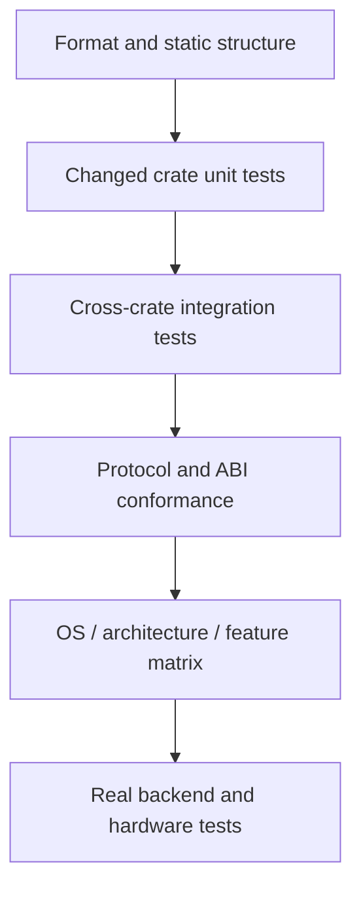

# Testing and Verification

> [!summary] 本文回答的问题
> 对本仓库的一处改动,能证明其正确的最小可信验证路径是什么?

本仓库混合了可移植的 Rust 代码、原生 ONNX Runtime 集成、运行时加载的 CUDA
代码、插件、Python 绑定以及并发协议。没有任何单条 `cargo test` 调用能同时证明
所有这些部分。

请使用一条验证阶梯:从能证伪你这次改动的最窄命令开始,再逐步扩展到受影响的
集成边界和平台边界。

## 验证阶梯



| Layer | Typical evidence |
|---|---|
| 语法与风格 | `cargo fmt`(见下方 Windows 注意事项)、Python 语法、生成文件检查 |
| 类型面 | 定向的 `cargo check --locked -p ...` |
| 行为 | 定向的 `cargo test --locked -p ...` |
| Lint | 定向的 `cargo clippy --locked -p ... --all-targets -- -D warnings` |
| unsafe 边界 | Miri、ABI 测试、所有权/生命周期一致性 |
| 协议 | TLC 加独立的 trace 回放 |
| 平台 | Linux、Windows、macOS 及特定架构的 CI 通道 |
| 后端 | 真实的 ORT/插件/CUDA 执行,以及需要硬件的测试 |

不要直接跳到最慢的一层。一个聚焦的单元测试能给出比整个 workspace 构建更快、
更清晰的失败信息。但当改动的契约跨越了某个边界时,也不要停在最快的一层。

## 从改动的契约出发

按行为而非仅按被编辑的文件名来选择验证范围。

举例:

- 修改一个公开 trait,需要覆盖它所在的 crate 测试、实现方、消费方、rustdoc
  以及兼容性适配层。
- 修改 CUDA 分配,需要覆盖内存记账、EP 分派以及受硬件门控的 release 测试——
  而不仅仅是 CUDA feature 能编译。
- 修改元数据解析,需要覆盖解析器测试,以及消费解析结果决策的运行时路径。
- 修改插件 ABI,需要覆盖宿主、插件、短结构体/版本以及卸载测试。
- 修改一个并发状态转移,需要覆盖它的 TLA+ 模型、负向对照、trace schema
  以及回放检查器。

[[contracts/Runtime Contracts]] 描述了这些契约族。本文关注的是如何收集证据。

## Rust workspace 命令

在验证时使用 lockfile:

```bash
cargo check --locked -p <changed-crate>
cargo test --locked -p <changed-crate>
cargo clippy --locked -p <changed-crate> --all-targets -- -D warnings
```

Add all tightly coupled crates to one invocation when the runner supports it:

```bash
cargo test --locked \
  -p onnx-runtime-memory \
  -p onnx-runtime-memory-governor
```

> [!warning] workspace 不是一套可移植的测试集
> 不要随意用裸的 `cargo test --workspace` 替换 CI 中显式的包选择。部分成员,
> 包括 `onnx-genai-ort-sys`,会拉取或构建原生依赖。权威的离线包集合由
> `.github/scripts/workspace_test_packages.py` 生成。

裸的 `cargo build` 和 `cargo test` 使用 workspace 的 `default-members`。这仍然
比大多数代码改动所需的范围更广。请优先使用定向的包。

CPU EP 默认启用内置(vendored)的 MLAS。在缺少所需 C++/汇编工具链的机器上,
`--no-default-features` 可以运行纯 Rust 的回退路径,但它不能替代随发行版一起
构建的 MLAS。

## 格式化(以及 Windows 上的注意事项)

CI 在 Linux 上运行 `cargo fmt --all -- --check`,那里工作正常。**但这条命令在本
workspace 的 Windows 上无法工作。** `cargo fmt --all` 会把整个 workspace 的所有
文件一次性传给单个 `rustfmt` 调用;本仓库有 54 个成员、约 970 个被跟踪的 `.rs`
文件,参数列表会超出 Windows 约 32 KB 的命令行长度上限,命令随即失败:

```
The filename or extension is too long. (os error 206)
```

Linux CI 不受影响,只是因为它的 `ARG_MAX`(约 2 MB)大得多。

在 Windows 上,请改为**按包**检查格式。`cargo fmt -p <pkg>` 会以每个包各自声明
的 edition 逐包调用一次 `rustfmt`——这一点很关键,因为本 workspace 是混合
edition 的(多数成员是 edition 2024,少数是 2021)。**不要**改用裸的
`rustfmt --edition <E>` 循环:edition 用错时 `rustfmt` 会误解析 2024 专有语法
(例如 `let` 链)并失败(`error: let chains are only allowed in Rust 2024 or
later`)。只有 cargo 知道每个包声明的 edition,因此按包驱动检查是唯一正确的
做法。

```bash
# 只检查你改动过的包(Windows 安全):
cargo fmt -p onnx-runtime-memory -- --check
# 对同一批包应用修复:
cargo fmt -p onnx-runtime-memory
```

本地的 pre-commit 闸门正是把这套流程自动化了。安装一次即可:

```bash
bash scripts/install-hooks.sh
```

`install-hooks.sh` 通过 `git rev-parse --git-common-dir` 解析 hooks 目录,因此
无论从主检出还是任意关联 worktree 都能工作(hooks 在一个仓库的所有 worktree
之间共享)。安装后的 `pre-commit` 会把暂存的 `.rs` 文件映射到其所属的包,并
**仅**对这些包运行 `cargo fmt -p <pkg> -- --check`,因而在 Windows 上安全,且
不会因为树中别处已有的既存格式漂移而阻塞提交。它精确镜像 CI 的范围:属于非
workspace 成员 crate 的文件(例如根目录下的 `bench-*` crate,CI 的
`cargo fmt --all` 同样不覆盖它们)会被跳过并给出警告,而不是被拦截;若
`cargo metadata` 根本无法运行,hook 会给出警告并放行提交,而不是把你锁在仓库
之外。

## feature 门控的代码

一次默认 feature 的绿色测试并不会编译每一种 feature 组合。请验证真正的
feature 边界:

```bash
cargo check --locked \
  -p onnx-runtime-ep-cuda \
  -p onnx-runtime-python \
  --features onnx-runtime-python/cuda
```

本仓库的 CUDA crate 使用动态加载。Linux 和 Windows CI 可以在没有 CUDA
toolkit 或 GPU 的情况下编译 CUDA 集成。这能证明 feature 接线和类型正确性;
但它不会执行设备行为。

真正的 CUDA 集成测试仍然被硬件感知的 feature 或 runner 门控。请分别报告
仅编译(compile-only)和运行时(runtime)证据。

## 测试诚实性检查

一个被 ignore 的测试不是已执行的证据。`.github/scripts/verify_cuda_test_honesty.py`
审计 GPU 测试清单及其跳过条件。它在两条通道上运行:

- **CUDA compile 通道**——权威检查。它构建两次 CUDA 测试目标(一次不带
  `gpu-tests` feature,一次带),并要求两者的目标集合与每个目标的测试名集合
  **完全一致**。这是唯一能证明清单一致性的检查,但它需要两次完整构建。
- **Rust quality 通道**——同一条规则直接读源码,约一秒,不需要 CUDA 工具链
  (`--source-scan`,以及先行的 `--self-test`)。它**补充**而非取代权威检查:
  它看不到宏展开产生的测试,也无法验证两种 feature 配置之间的清单一致性。

之所以两条都要,是因为权威检查只在一条约 20 分钟、且经常已经因别的原因而红
的通道上运行——作者在能够修复的时间点上得不到信号。本类缺陷因此反复出现:
issue #1875 之下先后需要四个 PR 才收干净(#1881、#1911、#1920、#1927)。
**一条没人能及时读到其输出的检查不构成检查。**

受管辖的 CUDA 测试目标由 `is_cuda_test_target()` 定义:文件名以 `_gpu` 结尾,
**或**在 `CUDA_TARGETS_WITHOUT_SUFFIX` 白名单内(目前是
`matmul_nbits_marlin_numerics`——没有 `_gpu` 后缀但同样受管辖),**并且**不在
`ALWAYS_RUN` 内。对这些目标有两条硬性规则:

1. **每个 `#[test]` 都必须被 ignore**,否则它会在没有设备的机器上真正运行:

   ```rust
   #[cfg_attr(not(feature = "gpu-tests"), ignore = "requires CUDA device")]
   #[test]
   fn kernel_matches_cpu() { /* ... */ }
   ```

   唯一的例外是 `ALWAYS_RUN`(目前是 `suite_canary_gpu`):它的测试**故意不加
   ignore**,因为它存在的意义就是在没有设备的运行里也执行。给它加 ignore 会
   把它从它专门用来监视的那些运行中移除。

2. **不要用 `cfg` 把测试从清单里删掉。** `#![cfg(feature = "gpu-tests")]`(整个
   目标)、测试或其所在 `mod` 上的 `#[cfg(feature = "gpu-tests")]`、以及清单里的
   `required-features`,都会让这些测试在基础配置下**根本不存在**。这比规则 1
   更危险:通道是绿的,而它绿是因为测试不在那里。需要 feature 的应当是**辅助
   函数**,用双分支 shim 包起来——两个分支同名同签名,测试本身及其调用点在两种
   配置下都原样保留(取自
   `crates/onnx-runtime-cuda-memory/tests/vmm_release_quarantine_gpu.rs`):

   ```rust
   #[cfg(feature = "gpu-tests")]
   fn install_faults(allocator: &mut CudaVmmAllocator, plan: Arc<DriverFaultPlan>) {
       allocator.install_driver_faults(plan);
   }

   #[cfg(not(feature = "gpu-tests"))]
   fn install_faults(_allocator: &mut CudaVmmAllocator, _plan: Arc<DriverFaultPlan>) {
       unreachable!("driver fault injection is only compiled under the gpu-tests feature");
   }
   ```

   关闭分支在正常运行下不会被执行,因为每个调用点所在的测试都被 ignore 了;
   它写成 `unreachable!()` 正是为了在真被执行到时(例如 `--ignored`)立刻炸掉,
   而不是悄悄跑出一个假结果。它的作用是让这些测试在两份清单中都存在。

   > 一个反复踩到的陷阱:`#[cfg(any(test, feature = "gpu-tests"))]` **并不**覆盖集成
   > 测试。`tests/*.rs` 是独立的 crate,链接的是**不带** `cfg(test)` 构建的库,
   > 所以 `test` 分支在这里不成立。于是在关闭 `gpu-tests` 时该项不存在,用顶层
   > `use` 引用它就是 `E0432`——而这正是有人会用整目标 `#![cfg(...)]` "修好"它的
   > 原因。#1854 就是这样把十三个测试一并删掉的,直到 #1927 换成双分支 shim
   > 才把它们放回清单。

新增一个依赖硬件的测试时:

1. 让硬件需求显式化;
2. 尽可能在可移植的通道中保留编译覆盖;
3. 确保有一条真实硬件通道会选中它;
4. 不要把一个被 ignore 或提前返回的测试标注为通过的运行时证据。

当所验证的性质是语法性的时,静态源码审计可以合理地在无硬件下运行。例如,
CUDA capture-sync 契约会检查 kernel 源码中 capture 不安全的同步,并与 GPU
测试分开执行。

## unsafe Rust 与外部接口

普通测试无法穷举每一种非法别名或指针生命周期。Miri 工作流在 nightly Miri 下
运行选定的、可处理的 crate 以及纯 Rust 的 ABI 面。

Miri 对以下方面很有价值:

- 所有权与别名假设;
- 裸指针生命周期;
- 纯 Rust 路径中的 use-after-free;
- 不需要原生 `dlopen` 的 ABI 包装行为。

Miri 无法执行每一条 C/CUDA/原生加载器路径。请为这些边界保留原生冒烟测试和
平台集成测试。

对于一个新的 unsafe 面,请说明它为何被 Miri、某个原生集成测试、某个有文档的
外部不变量——或多者共同覆盖。

## 形式化协议检查

`specs/tla/` 下的并发协议使用有界的 TLC 模型检查。它们的负向配置必须以预期的
反例失败;这可以防范空洞(vacuous)模型。

TLC 证明的是抽象模型,而非 Rust 实现。改动协议的 PR 还必须产出无损的带版本
trace,并通过 [[contracts/Formal Verification with TLA+]] 中描述的独立回放
检查器。

## CI 通道是含义各异的证据

主 CI 工作流将关注点分离:

- 快速的格式化、构建、测试与 Clippy 通道;
- 显式的离线包集合;
- 覆盖率通道;
- 原生 ORT 与插件集成;
- Linux 与 Windows 的 CUDA feature 编译;
- CUDA 测试清单诚实性。

其他工作流覆盖:

- 针对选定 unsafe crate 的 Miri;
- RustSec 公告审计;
- 基准回归报告;
- 权重缓存与 diff 守卫;
- 包/wheel 的构建与发布路径。

某条通道的失败应归因于确切失败的那个契约。如果 CUDA 编译已通过、而随后的
测试清单审计失败,那么"CUDA CI 失败"的说法就过于笼统了。

### 通道分两层:能拦住合并的,和不能的

`main` 的 ruleset 只要求两个上下文:**`Fast (Linux x86_64)`** 与
**`Rust quality`**。其余通道全部是 advisory——它们红了,合并照样可以进行。
所以"这个包有测试、并且 CI 会跑"并不等于"它的失败拦得住任何东西"。

这不是理论问题。#1982 把一个失败的 `shape_dispatch_gate` 合进了 `main`,两个
required 检查全绿;唯一变红的是 advisory 的 `CLI ORT`。当时
`onnx-genai`、`-capi`、`-cli`、`-engine`、`-ort`、`-server` 这六个 crate 的测试
不被任何 required 通道执行:`Fast` 的包集合按定义是**整个 workspace 减去**这
六个(它们会触发 `onnx-genai-ort-sys` 的 ORT 下载),而 `Rust quality` 原有的
三个 `cargo test` 步骤全是 `-p onnx-runtime-ep-cpu`。见 #2015。

上一节那句话在这里的推论是:**一条不能拦住合并的检查,和一条没人及时读的
检查,失效方式相同**——只是前者更隐蔽,因为它的输出确实存在,只是没有约束力。

因此有两个门:

- `workspace_test_packages.py verify`——每个 workspace 成员要么属于某条测试
  通道,要么在 `DENYLIST` 里写明理由。它回答的是"有没有人跑"。
- `workspace_test_packages.py verify-required-tier`——每个成员必须由
  `REQUIRED_JOB_NAMES` 中的某个 job 真正执行。它回答的是"跑它的那条通道能不能
  拦住合并"。该门直接解析 `ci.yml` 推导包集合,不依赖手抄清单;并且只认
  `cargo test`/`cargo llvm-cov`,不认 `cargo build` 与 `cargo clippy --all-targets`
  ——后两者会编译同一批测试目标却不执行任何断言。

该门判断的是"这条命令**会不会真的跑**",而不只是"文件里有没有这条命令"。
所以它不认以下几种写法:带 `if:`(除 `success()`/`always()` 等恒真形式外)的
步骤——它可能被跳过;带 `continue-on-error: true` 的步骤或 job——它可以红着而
检查照样报绿,跑了也拦不住合并;`cargo test … || true`;以及在 GitHub Linux
**默认 shell**(`bash -e`,**没有 `pipefail`**)下带管道的命令——此时退出码是
管道最后一段的,失败被吞掉(显式写 `shell: bash` 是 `-eo pipefail`,会正常传播,
因此是被认可的)。无法判定的表达式一律**不计入**并在 stderr 点名,即只会让门更严格。

五处曾经的漏判(引号或带尾注释的 job key、`if:`、`continue-on-error`(步骤级与
job 级)、`|| true`、无 `pipefail` 的管道)都属于同一类:门读的是 workflow 的
**文本**,而不是 GitHub 真正会**执行**的东西。这份清单**无法被证明是完整的**;
它只是在"产生了这五处"的那一个性质下封闭,且每一处都有一条会在对应代码被移除时
失败的 self-test 分支。

### 缩进错误会删掉检查,而不是让检查变红

把一个 job key 多缩进两个空格,仍然是**合法 YAML**——那个 job 变成了上一个 job
的一个属性。GitHub 于是**不再产出该 job 的检查**,而不是报错;`gh pr checks` 无法
表达"某个检查不存在",所以 `pending=0 && failed=[]` 这类合并判据,对一个检查已被
删除的 PR 同样成立(见 #2052)。

只有当文件**整体无法解析**时,才会退化成"没有任何检查上报"从而被分支保护挡住;
文件保持合法、只丢掉一个 job 时不会。因此 `parse_jobs()` 枚举了 GitHub 允许直接
写在 job 下的属性名,凡是出现在 job key 缩进层级上、又不在该表里的键一律**致命**
并同时点名容器与该键。新增一个 job 属性会让它**大声**失败,这是可以被注意到的方向。

这条规则有一个具体的守护对象:`CLI ORT` 的 ORT 测试步骤带 `if: runner.os ==
'Windows'`,它是这六个 crate 在 **Windows 上唯一的执行者**,而这件事此前只写在
`ci.yml` 的注释里。`verify-required-tier` 因此额外断言"仍有某个 Windows runner 的
job 执行这六个 crate"。两者的次序很重要:先有 parser 的守卫,Windows 这条断言才
有意义——被吞进上一个 job 的 body 里,步骤文本依然在,只是归属错了。

一个无法关闭的残留:该门本身跑在 `Rust quality` 里面。如果被缩进掉的是**这个**
job,同一处改动会连门带检查一起删掉。`ci.yml` 之所以还有底,是因为它包含 required
检查,分支保护会因这些检查缺失而拦住合并;一个不含任何 required job 的 workflow
文件从仓库内部没有任何兜底。

两个门都属于"看不见东西就通过"的那一类,所以
`workspace_test_packages.py self-test` 会要求它们按需失败,并且**核对它们点名
的包,而不是只看退出码**:`python` 不存在时退出 127,而该脚本里每个
`SystemExit` 都退出 1,单看状态码无法把"判定"和"崩溃"区分开。

`REQUIRED_JOB_NAMES` 是仓库设置在代码里的镜像。job 改名会被 self-test 抓到;
ruleset 里**去掉**一个 required 检查则从仓库内部看不见——这是该门唯一看不到的
漂移方向,已写在源码注释里。

## 当本地证据与托管证据不一致时

先对差异分类:

| 差异 | 示例 |
|---|---|
| 平台 | Windows 的路径/加载器行为 |
| 架构 | ARM64 汇编或 target-feature 选择 |
| 原生依赖 | ORT、MLAS 或插件加载器 |
| feature 集合 | 默认构建对比 `cuda`/`native-backend` |
| 硬件 | 编译成功但设备执行失败 |
| 环境 | 下载的产物、缓存或 runner 容量 |

不要通过削弱或跳过测试来"修复"一个真实的平台失败。如果某条通道被基础设施
阻塞,请保留已成功子步骤的证据,并在等效的 runner 上重跑;不要把整条通道
报告为通过。

## 放进 PR 里的证据

优先使用精确、可复现的陈述:

```text
cargo test --locked -p onnx-runtime-memory-governor
64 passed; 0 failed

cargo check --locked -p onnx-runtime-ep-cuda --features cuda
compile-only; no GPU runtime exercised
```

应包含:

1. 命令及相关 feature;
2. 通过/失败/ignored 计数;
3. 平台与硬件;
4. 原生依赖是真实、mock 还是缺失;
5. 已知的覆盖边界;
6. 当托管通道能提供不同证据时,给出指向它的链接。

当只运行了一个定向子集时,避免使用"所有测试通过"这种说法。

## 一份实用的改动清单

1. 运行 `git diff --check`。
2. 格式化改动过的 Rust。
3. 检查并测试改动的 crate。
4. 当公开契约改变时,测试其直接消费方。
5. 在受影响的目标上以 warnings-denied 运行 Clippy。
6. 运行改动过的 feature 组合。
7. 运行契约专属的验证器、回放、ABI 或生成产物检查。
8. 让托管的 OS/架构/原生/硬件通道补充本地无法获得的证据。
9. 诚实记录局限。

## 这道闸门已知读不到的东西

闸门自身也是仪器,所以它的失效方式必须写下来,而不是留在作者脑子里。

- **作业级 `if:`**。`ci.yml` 里每个作业都带 `if: needs.changes.outputs.docs_only != 'true'`,而**被跳过的必需检查会满足 ruleset**。所以证明某个步骤无条件执行,只证明了"作业跑时它一定跑",没有证明作业会跑。闸门现在把必需作业的条件钉在已知形式上,遇到没推理过的条件就拒绝;它不求值条件,因此不是分类器的第二份实现。
- **续行的 `cargo test`**。用反斜杠跨行写的调用,其 `-p` 参数所在的片段不含 cargo 调用,不会被归属。这是**故意不修**的:合并续行会把归属推向更宽松的一侧,而这道闸门的前提是多读一分是致命的、少读一分只是吵闹。真遇到某个 crate 只有这一处必需通道执行,闸门会拒绝而不是放行,改法是把调用写成一行。
- **必需检查名单**。`REQUIRED_JOB_NAMES` 镜像的是仓库 ruleset,而工作流读不到它。改名会被拦(见变异组 M5),但 ruleset 里删掉一项必需检查,从仓库内部是看不见的。
- **步骤键的列位**。`- ` 后面的空格数不固定,键的列位要取横杠下方**最浅**的一行,不能写死成 `dash+2`;写死会把 `if:` 当成 shell 文本丢掉,从而给一个带守卫的步骤记上覆盖。这条是外部评审发现的,不是自测发现的。

最后一条值得单独说:自测报了 30/30 的那一版里,专门用来区分"作业级 `if:`"和"步骤级 `if:`"的那个 arm **并不能区分**——它的样例同时含有两种 `if:`,而实现取第一个匹配,所以即使正则错误地两种都匹配,这个 arm 也照样通过。把样例改成只含步骤级 `if:` 之后,它才会在正则被放宽时失败。**一个不能失败的 arm 不是对照组,而是把结论重述了一遍。**

## 相关笔记

- [[contracts/Runtime Contracts]]
- [[contracts/Formal Verification with TLA+]]
- [[performance/Performance Engineering Playbook]]
- [[observability/Tracing and Profiling]]
- [[execution/Plugin Execution Providers]]

## 形式化来源

- [主 CI 工作流](../../.github/workflows/ci.yml)
- [Miri 工作流](../../.github/workflows/miri.yml)
- [Rust 安全审计](../../.github/workflows/audit.yml)
- [workspace 清单](../../Cargo.toml)
- [TLA+ 模型索引](../../specs/tla/README.md)
