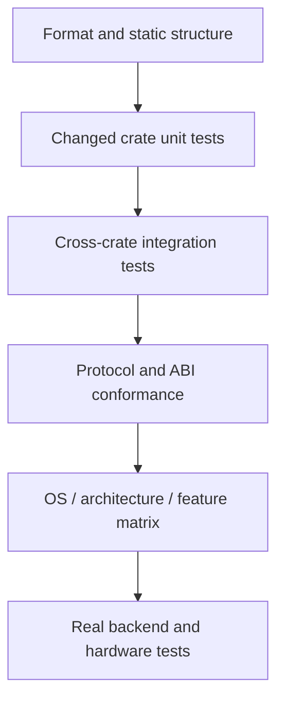

# Testing and Verification

> [!summary] 本文回答的问题
> 对本仓库的一处改动,能证明其正确的最小可信验证路径是什么?

本仓库混合了可移植的 Rust 代码、原生 ONNX Runtime 集成、运行时加载的 CUDA
代码、插件、Python 绑定以及并发协议。没有任何单条 `cargo test` 调用能同时证明
所有这些部分。

请使用一条验证阶梯:从能证伪你这次改动的最窄命令开始,再逐步扩展到受影响的
集成边界和平台边界。

## 验证阶梯



| Layer | Typical evidence |
|---|---|
| 语法与风格 | `cargo fmt`(见下方 Windows 注意事项)、Python 语法、生成文件检查 |
| 类型面 | 定向的 `cargo check --locked -p ...` |
| 行为 | 定向的 `cargo test --locked -p ...` |
| Lint | 定向的 `cargo clippy --locked -p ... --all-targets -- -D warnings` |
| unsafe 边界 | Miri、ABI 测试、所有权/生命周期一致性 |
| 协议 | TLC 加独立的 trace 回放 |
| 平台 | Linux、Windows、macOS 及特定架构的 CI 通道 |
| 后端 | 真实的 ORT/插件/CUDA 执行,以及需要硬件的测试 |

不要直接跳到最慢的一层。一个聚焦的单元测试能给出比整个 workspace 构建更快、
更清晰的失败信息。但当改动的契约跨越了某个边界时,也不要停在最快的一层。

## 从改动的契约出发

按行为而非仅按被编辑的文件名来选择验证范围。

举例:

- 修改一个公开 trait,需要覆盖它所在的 crate 测试、实现方、消费方、rustdoc
  以及兼容性适配层。
- 修改 CUDA 分配,需要覆盖内存记账、EP 分派以及受硬件门控的 release 测试——
  而不仅仅是 CUDA feature 能编译。
- 修改元数据解析,需要覆盖解析器测试,以及消费解析结果决策的运行时路径。
- 修改插件 ABI,需要覆盖宿主、插件、短结构体/版本以及卸载测试。
- 修改一个并发状态转移,需要覆盖它的 TLA+ 模型、负向对照、trace schema
  以及回放检查器。

[[contracts/Runtime Contracts]] 描述了这些契约族。本文关注的是如何收集证据。

## Rust workspace 命令

在验证时使用 lockfile:

```bash
cargo check --locked -p <changed-crate>
cargo test --locked -p <changed-crate>
cargo clippy --locked -p <changed-crate> --all-targets -- -D warnings
```

Add all tightly coupled crates to one invocation when the runner supports it:

```bash
cargo test --locked \
  -p onnx-runtime-memory \
  -p onnx-runtime-memory-governor
```

> [!warning] workspace 不是一套可移植的测试集
> 不要随意用裸的 `cargo test --workspace` 替换 CI 中显式的包选择。部分成员,
> 包括 `onnx-genai-ort-sys`,会拉取或构建原生依赖。权威的离线包集合由
> `.github/scripts/workspace_test_packages.py` 生成。

裸的 `cargo build` 和 `cargo test` 使用 workspace 的 `default-members`。这仍然
比大多数代码改动所需的范围更广。请优先使用定向的包。

CPU EP 默认启用内置(vendored)的 MLAS。在缺少所需 C++/汇编工具链的机器上,
`--no-default-features` 可以运行纯 Rust 的回退路径,但它不能替代随发行版一起
构建的 MLAS。

## 格式化(以及 Windows 上的注意事项)

CI 在 Linux 上运行 `cargo fmt --all -- --check`,那里工作正常。**但这条命令在本
workspace 的 Windows 上无法工作。** `cargo fmt --all` 会把整个 workspace 的所有
文件一次性传给单个 `rustfmt` 调用;本仓库有 54 个成员、约 970 个被跟踪的 `.rs`
文件,参数列表会超出 Windows 约 32 KB 的命令行长度上限,命令随即失败:

```
The filename or extension is too long. (os error 206)
```

Linux CI 不受影响,只是因为它的 `ARG_MAX`(约 2 MB)大得多。

在 Windows 上,请改为**按包**检查格式。`cargo fmt -p <pkg>` 会以每个包各自声明
的 edition 逐包调用一次 `rustfmt`——这一点很关键,因为本 workspace 是混合
edition 的(多数成员是 edition 2024,少数是 2021)。**不要**改用裸的
`rustfmt --edition <E>` 循环:edition 用错时 `rustfmt` 会误解析 2024 专有语法
(例如 `let` 链)并失败(`error: let chains are only allowed in Rust 2024 or
later`)。只有 cargo 知道每个包声明的 edition,因此按包驱动检查是唯一正确的
做法。

<!-- code-parity: allow-divergence -->
```bash
# 只检查你改动过的包(Windows 安全):
cargo fmt -p onnx-runtime-memory -- --check
# 对同一批包应用修复:
cargo fmt -p onnx-runtime-memory
```

本地的 pre-commit 闸门正是把这套流程自动化了。安装一次即可:

```bash
bash scripts/install-hooks.sh
```

`install-hooks.sh` 通过 `git rev-parse --git-common-dir` 解析 hooks 目录,因此
无论从主检出还是任意关联 worktree 都能工作(hooks 在一个仓库的所有 worktree
之间共享)。安装后的 `pre-commit` 会把暂存的 `.rs` 文件映射到其所属的包,并
**仅**对这些包运行 `cargo fmt -p <pkg> -- --check`,因而在 Windows 上安全,且
不会因为树中别处已有的既存格式漂移而阻塞提交。它精确镜像 CI 的范围:属于非
workspace 成员 crate 的文件(例如根目录下的 `bench-*` crate,CI 的
`cargo fmt --all` 同样不覆盖它们)会被跳过并给出警告,而不是被拦截;若
`cargo metadata` 根本无法运行,hook 会给出警告并放行提交,而不是把你锁在仓库
之外。

## feature 门控的代码

一次默认 feature 的绿色测试并不会编译每一种 feature 组合。请验证真正的
feature 边界:

```bash
cargo check --locked \
  -p onnx-runtime-ep-cuda \
  -p onnx-runtime-python \
  --features onnx-runtime-python/cuda
```

本仓库的 CUDA crate 使用动态加载。Linux 和 Windows CI 可以在没有 CUDA
toolkit 或 GPU 的情况下编译 CUDA 集成。这能证明 feature 接线和类型正确性;
但它不会执行设备行为。

真正的 CUDA 集成测试仍然被硬件感知的 feature 或 runner 门控。请分别报告
仅编译(compile-only)和运行时(runtime)证据。

## 测试诚实性检查

一个被 ignore 的测试不是已执行的证据。CUDA CI 会运行
`.github/scripts/verify_cuda_test_honesty.py` 来审计 GPU 测试清单及其跳过条件。

新增一个依赖硬件的测试时:

1. 让硬件需求显式化;
2. 尽可能在可移植的通道中保留编译覆盖;
3. 确保有一条真实硬件通道会选中它;
4. 不要把一个被 ignore 或提前返回的测试标注为通过的运行时证据。

当所验证的性质是语法性的时,静态源码审计可以合理地在无硬件下运行。例如,
CUDA capture-sync 契约会检查 kernel 源码中 capture 不安全的同步,并与 GPU
测试分开执行。

## unsafe Rust 与外部接口

普通测试无法穷举每一种非法别名或指针生命周期。Miri 工作流在 nightly Miri 下
运行选定的、可处理的 crate 以及纯 Rust 的 ABI 面。

Miri 对以下方面很有价值:

- 所有权与别名假设;
- 裸指针生命周期;
- 纯 Rust 路径中的 use-after-free;
- 不需要原生 `dlopen` 的 ABI 包装行为。

Miri 无法执行每一条 C/CUDA/原生加载器路径。请为这些边界保留原生冒烟测试和
平台集成测试。

对于一个新的 unsafe 面,请说明它为何被 Miri、某个原生集成测试、某个有文档的
外部不变量——或多者共同覆盖。

## 形式化协议检查

`specs/tla/` 下的并发协议使用有界的 TLC 模型检查。它们的负向配置必须以预期的
反例失败;这可以防范空洞(vacuous)模型。

TLC 证明的是抽象模型,而非 Rust 实现。改动协议的 PR 还必须产出无损的带版本
trace,并通过 [[contracts/Formal Verification with TLA+]] 中描述的独立回放
检查器。

## CI 通道是含义各异的证据

主 CI 工作流将关注点分离:

- 快速的格式化、构建、测试与 Clippy 通道;
- 显式的离线包集合;
- 覆盖率通道;
- 原生 ORT 与插件集成;
- Linux 与 Windows 的 CUDA feature 编译;
- CUDA 测试清单诚实性。

其他工作流覆盖:

- 针对选定 unsafe crate 的 Miri;
- RustSec 公告审计;
- 基准回归报告;
- 权重缓存与 diff 守卫;
- 包/wheel 的构建与发布路径。

某条通道的失败应归因于确切失败的那个契约。如果 CUDA 编译已通过、而随后的
测试清单审计失败,那么"CUDA CI 失败"的说法就过于笼统了。

## 当本地证据与托管证据不一致时

先对差异分类:

| 差异 | 示例 |
|---|---|
| 平台 | Windows 的路径/加载器行为 |
| 架构 | ARM64 汇编或 target-feature 选择 |
| 原生依赖 | ORT、MLAS 或插件加载器 |
| feature 集合 | 默认构建对比 `cuda`/`native-backend` |
| 硬件 | 编译成功但设备执行失败 |
| 环境 | 下载的产物、缓存或 runner 容量 |

不要通过削弱或跳过测试来"修复"一个真实的平台失败。如果某条通道被基础设施
阻塞,请保留已成功子步骤的证据,并在等效的 runner 上重跑;不要把整条通道
报告为通过。

## 放进 PR 里的证据

优先使用精确、可复现的陈述:

```text
cargo test --locked -p onnx-runtime-memory-governor
64 passed; 0 failed

cargo check --locked -p onnx-runtime-ep-cuda --features cuda
compile-only; no GPU runtime exercised
```

应包含:

1. 命令及相关 feature;
2. 通过/失败/ignored 计数;
3. 平台与硬件;
4. 原生依赖是真实、mock 还是缺失;
5. 已知的覆盖边界;
6. 当托管通道能提供不同证据时,给出指向它的链接。

当只运行了一个定向子集时,避免使用"所有测试通过"这种说法。

## 一份实用的改动清单

1. 运行 `git diff --check`。
2. 格式化改动过的 Rust。
3. 检查并测试改动的 crate。
4. 当公开契约改变时,测试其直接消费方。
5. 在受影响的目标上以 warnings-denied 运行 Clippy。
6. 运行改动过的 feature 组合。
7. 运行契约专属的验证器、回放、ABI 或生成产物检查。
8. 让托管的 OS/架构/原生/硬件通道补充本地无法获得的证据。
9. 诚实记录局限。

## 相关笔记

- [[contracts/Runtime Contracts]]
- [[contracts/Formal Verification with TLA+]]
- [[performance/Performance Engineering Playbook]]
- [[observability/Tracing and Profiling]]
- [[execution/Plugin Execution Providers]]

## 形式化来源

- [主 CI 工作流](../../.github/workflows/ci.yml)
- [Miri 工作流](../../.github/workflows/miri.yml)
- [Rust 安全审计](../../.github/workflows/audit.yml)
- [workspace 清单](../../Cargo.toml)
- [TLA+ 模型索引](../../specs/tla/README.md)
