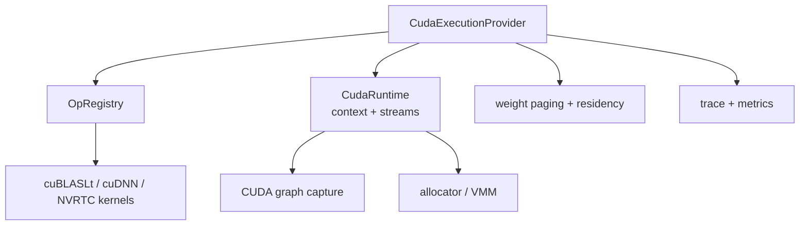

# CUDA Execution Provider

> [!summary] 本文回答的问题
> 原生 CUDA EP 拥有哪些职责,以及 kernel、stream、graph capture、VMM 和权重驻留是如何组合在一起的?

CUDA EP 在 CUDA 驱动 API、cuBLASLt、适用处的 cuDNN 以及运行时编译的 kernel
之上,实现了原生 EP 契约。

## 主要组件

## Kernel 策略

EP 在合适之处优先使用经过验证的库,并针对实测出的差距或融合机会编写自定义
kernel:

- GEMM 系列通过 cuBLASLt 实现,包括受支持的 epilogue;
- 选定的 cuDNN 操作;
- NVRTC 的 elementwise 与 attention kernel;
- 自定义的量化、索引、reduction 以及融合的 decode 路径。

核心 EP 路径在构建期没有 `nvcc` 依赖:CUDA 库是动态加载的,NVRTC 在运行时
编译相关源码。

Kernel 保持与模型无关。head 数量、维度、causal 行为和 scale 都来自图结构/
属性/运行时数据。

## Stream 与 fence

CUDA 操作是异步的。EP 负责管理:

- compute stream 的排序;
- copy-stream 的重叠;
- host-to-device/device-to-host/device-to-device 传输;
- compute/copy fence;
- 在不安全的复用或 unmap 之前进行同步。

这正是为什么裸的 allocator 访问不能替代 EP 执行上下文。当 GPU 上仍有挂起的
使用者时,一个指针可能仍然"有效"。

## CUDA graph capture

capture 通过记录一段稳定的执行区域并回放它,来降低重复的启动开销。是否适用
取决于:

- 稳定的地址与形状;
- capture-safe 的 kernel 与分配;
- 被捕获区域内没有不受支持的 host 决策;
- 对接缝(seam)给出显式的拒绝原因;
- 当状态容量或绑定改变时能正确失效。

一个性能结果必须报告 `captures` 和 `fallbacks`;一个悄悄禁用了 capture 的
"加速"并不是同一份配置。

## 内存与 VMM

EP 可以使用普通的 CUDA 分配,或使用已安装的 VMM arena。VMM 将稳定的虚拟地址
容量与已映射的物理字节分离开,并支持 KV 的增量增长与共享后备存储。

该机制被拆分到 `onnx-runtime-cuda-memory` 中,并为兼容性而重新导出。治理、
映射与 EP 的 stream 排序仍是各自独立的职责。参见
[[memory/Memory Management for Beginners]]。

## 权重驻留

大模型可以根据驻留策略选择保留、streaming 或映射权重。EP 暴露:

- lazy/resident 权重的能力协商;
- 分页与预取;
- pinned staging 的复用;
- 按字节感知的驻留指标;
- 显式的策略与回退报告。

Governor 批准容量;驻留持有者选择淘汰对象。allocator 不决定哪个 tensor 是热的。

## 错误处理与可移植性纪律

- 不受支持的 op/dtype/rank/device 情况返回可操作的错误。
- NVRTC 失败会保留编译器日志。
- 构建期恰好选定一个受支持的 CUDA 绑定版本。
- 运行时 kernel 面向实际设备,而非某一款数据中心 GPU。
- 不得从 Linux/TCC 的测量结果推断消费级 WDDM 行为。

## 形式化来源

- [`onnx-runtime-ep-cuda`](../../crates/onnx-runtime-ep-cuda/src/lib.rs)
- [`CUDA_COVERAGE.md`](../../docs/execution/CUDA_COVERAGE.md)
- [`CUDA_EP_STATUS.md`](../../docs/execution/CUDA_EP_STATUS.md)
- [`CUDA_GRAPH_CAPTURE.md`](../../docs/execution/CUDA_GRAPH_CAPTURE.md)
- [`CUDA_STRATEGY.md`](../../docs/execution/CUDA_STRATEGY.md)
- [`NATIVE_CUDA_DECODE.md`](../../docs/execution/NATIVE_CUDA_DECODE.md)

## 相关笔记

- [[execution/Execution Provider Contract]]
- [[performance/Performance Engineering Playbook]]
- [[observability/Tracing and Profiling]]
- [[memory/Memory Management for Beginners]]
