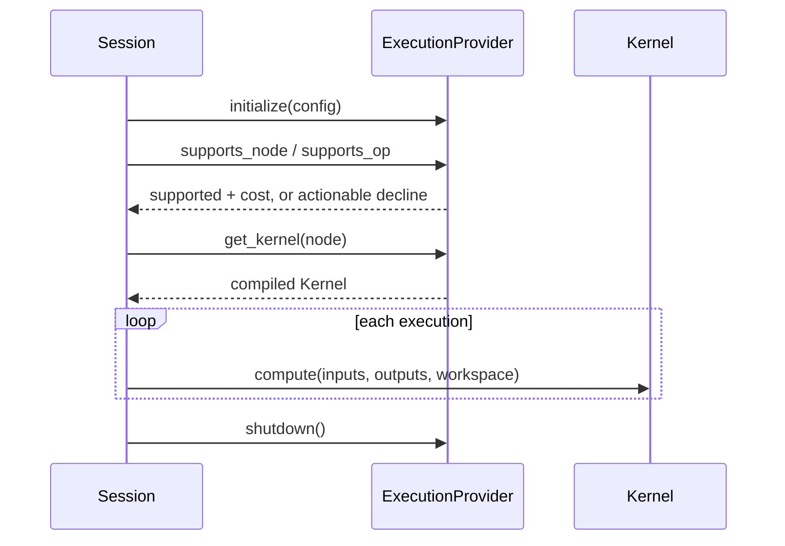

# Execution Provider Contract

> [!summary] 回答的问题
> 一个 execution provider 必须向原生运行时承诺什么?哪些职责应留在 EP 之外?

execution provider(执行提供者,EP)把图节点转化为针对某一类设备的可执行 kernel。
共享契约位于 `onnx-runtime-ep-api`;CPU、CUDA 与动态 provider 的差别在于实现,而不
在于 session 的概念模型。

## 核心生命周期

运行时依赖“认领的诚实性”:EP 不得先认领一个节点,然后在执行开始后才发现普通的、
不受支持的 shape/dtype 情况。

## 契约面

| 契约面 | 用途 |
|---|---|
| Identity | 稳定的名称、`DeviceType` 与 `DeviceId` |
| Capability | 说明某个 node/opset/shape/dtype/layout 是否受支持 |
| Compilation | 产出 session 生命周期的 kernel 或已编译的分区 |
| Tensor views | 借用设备内存,而不假装 host 解引用有效 |
| Allocation | 创建/释放 buffer 以及可选的映射 backing |
| Transfer | 同步/异步拷贝与 fence 顺序 |
| Capture | 声明、开始、结束、中止与重放设备 graph capture |
| Weights | 协商 resident、lazy 或 paged 的权重交付方式 |
| Optimization | 提供 EP 专属的图 pass |
| Diagnostics | 记录某条快路径或某个认领被拒绝的原因 |

## 认领纪律

一个 unsupported 结果应指明:

- node/op/domain/opset;
- 被拒绝的 dtype、shape、layout 或 attribute;
- 选中的设备/EP;
- 该 EP 接受什么;
- 尽可能给出有用的补救建议。

返回 `Unsupported` 是正常的。先认领、后失败则是契约缺陷,除非该失败确实依赖于
真正只在运行时才可知的状态。

> [!important] Capability 是一种证明
> 热执行路径应当消费一个已解析的 capability 或已编译的 kernel,而不是重复宽泛的
> 发现过程并再次遇到迟到的失败。

## 所有权

当前 `DeviceBuffer` 的所有权是显式的:

- 一个 owned buffer 由某个 EP/机制创建;
- 它必须通过匹配的路径恰好释放一次;
- 跨设备或跨 EP 的释放是无效的;
- borrowed view 不拥有 backing 内存;
- 裸指针绝不延长其所有者的生命周期。

当前的 buffer 没有自动 `Drop`,因为 GPU 释放可能需要 context 与 stream 同步。
提议中的演进方向见 [[memory/Memory Management for Beginners]]。

## Kernel 边界

kernel 看到的是带类型的 tensor view、输出/workspace view 与执行 context。
重要的不变量包括:

- shape、dtype 与 layout 与已编译的认领相符;
- 可变输出不发生非法 alias;
- 设备指针在 host 上是不透明的;
- workspace 生命周期与其声明一致;
- 异步工作通过 fence/stream 排序;
- kernel 错误不跨 FFI 边界 panic。

## EP 不拥有什么

EP 不应决定:

- 请求优先级或 batch 准入;
- 应抢占哪个用户的 KV;
- 全局模型 residency 策略;
- prompt、sampling 或 stop 语义;
- 特定模型族的行为。

这些属于 scheduler、holder、generation engine 或元数据契约。

## 一致性

一致性是分层的:

1. 针对 shape/dtype/attribute 行为的聚焦 kernel 测试。
2. 端到端 loader → optimizer → session → EP 与 ONNX 参考实现的对比。
3. 每个 EP 预期的支持/拒绝画像。
4. 插件 trait/C-ABI 对等测试。
5. 真实模型的对齐与后端对比。

覆盖计数并不等于完整的 ONNX 一致性。某个算子名在某一 dtype/opset/shape 下通过,
并不能证明其整个 schema。

## 正式来源

- [`onnx-runtime-ep-api`](../../crates/onnx-runtime-ep-api/src/lib.rs)
- [`ExecutionProvider`](../../crates/onnx-runtime-ep-api/src/provider.rs)
- [`Kernel`](../../crates/onnx-runtime-ep-api/src/kernel.rs)
- [`EP_CONFORMANCE.md`](../../docs/execution/EP_CONFORMANCE.md)
- [`NXRT_ABI.md`](../../docs/architecture/NXRT_ABI.md)

## 相关笔记

- [[execution/CPU Execution Provider]]
- [[execution/CUDA Execution Provider]]
- [[execution/Plugin Execution Providers]]
- [[contracts/Runtime Contracts]]
