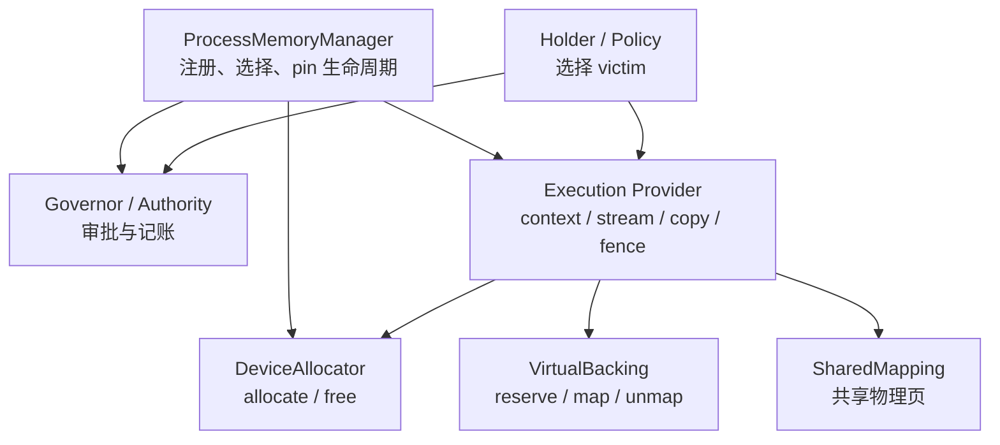
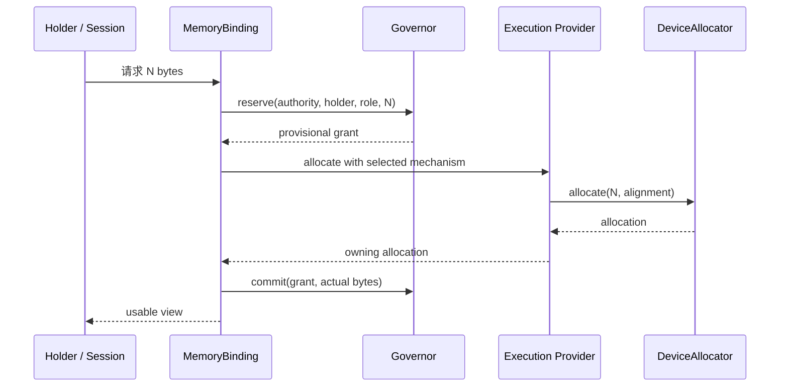
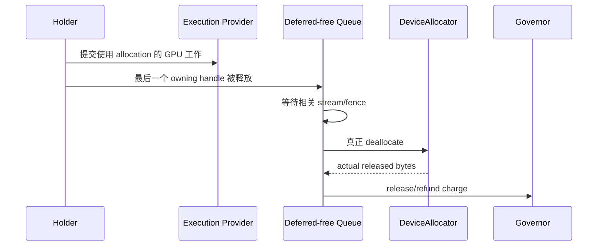

# Memory Management for Beginners

> [!summary] 一句话结论
> `Allocator` 解决“怎么得到普通内存”，`VirtualBacking` 解决“什么时候给地址安装真实内存”，`SharedMapping` 解决“多个地址如何共享物理内存”；Governor 记账，Holder 选择淘汰对象，EP 保证设备操作顺序正确，ProcessMemoryManager 将这些角色安全地连接起来。

## 为什么需要多个角色

“内存管理”听起来像一个组件，但实际包含四个不同问题：

1. **怎么取得和归还内存？**
2. **当前是否还有容量？应该给谁多少预算？**
3. **发生压力时，应该淘汰哪些数据？**
4. **GPU 是否已经使用完这块内存，可以安全释放了吗？**

如果让一个超级 allocator 同时回答这些问题，它既需要理解 CUDA
地址映射，又需要理解 KV、模型权重和请求优先级，还要管理预算和 stream
同步。这样的接口难以替换，也很容易把账本与真实内存状态弄乱。

推荐的职责是：

| 角色 | 负责 | 不负责 |
|---|---|---|
| `ProcessMemoryManager` | 注册、选择机制、authority、provider/context 生命周期 | 决定淘汰哪个权重或 KV page |
| Governor / Authority | 容量审批、reservation、lease、pressure ticket | 直接删除 holder 的数据 |
| Holder / Policy | 理解数据含义并选择安全 victim | 无预算占用容量 |
| Execution Provider（EP） | device context、stream、copy、kernel、fence、释放顺序 | 全局容量政策 |
| `DeviceAllocator` | 普通 allocate/free 机制 | 预算和数据冷热策略 |
| `VirtualBacking` | reserve/map/unmap 物理 backing | 决定应该映射哪些业务数据 |
| `SharedMapping` | 多个虚拟地址共享同一物理 backing | 通用分配或淘汰政策 |



## 从普通内存开始

最简单的 CPU 或 GPU 分配可以理解为：

```text
申请 100 MB
    ↓
系统找到可用物理内存
    ↓
返回一个地址
    ↓
使用完成后释放
```

对应的最小接口大致是：

```rust
trait DeviceAllocator: Send + Sync {
    fn device(&self) -> DeviceKey;
    fn allocate(&self, request: AllocationRequest)
        -> Result<DeviceAllocation>;
}
```

这里的 `DeviceAllocation` 是 owning handle。它必须记住或间接关联：

- 创建它的 allocator；
- 对应 device 和 provider context；
- 安全释放所需的 queue/fence；
- 相关 charge 或 lease identity。

普通 eager allocator 在 allocation 创建时取得完整物理容量：

```text
申请 10 GB ≈ 立即需要 10 GB 物理容量
```

“≈”是因为 OS 和 driver 可能有 demand paging、overcommit 或 shared memory。
账本中的 committed bytes 不能自动证明数据当前物理驻留在哪里。

## VirtualBacking 解决什么问题

VMM 可以把“虚拟地址”与“物理 backing”分开。

例如 KV cache 最终可能需要 10 GB，但当前只用了 100 MB：

```text
10 GB 连续虚拟地址
├── 0..100 MB      → 已映射真实显存
└── 100 MB..10 GB  → 暂时只有地址
```

生成更多 token 后，再逐段安装 backing：

```text
100 MB → 120 MB → 160 MB → …
```

指针保持不变，因此依赖稳定地址的 tensor binding 或 graph capture
不需要因为 KV 增长而重建。

这需要一组与普通 allocate/free 不同的操作：

```rust
trait VirtualBacking: Send + Sync {
    fn reserve(&self, request: ReserveRequest)
        -> Result<VirtualAllocation>;
    fn commit_range(
        &self,
        allocation: &VirtualAllocation,
        range: Range<u64>,
    ) -> Result<CommitResult>;
    fn decommit_range(
        &self,
        allocation: &VirtualAllocation,
        range: Range<u64>,
    ) -> Result<DecommitResult>;
    fn committed_bytes(
        &self,
        allocation: &VirtualAllocation,
    ) -> Result<u64>;
}
```

| 操作 | 含义 |
|---|---|
| `reserve` | 保留虚拟地址，但不一定取得物理内存 |
| `commit/map` | 给一段地址安装物理 backing |
| `decommit/unmap` | 移除 backing，但保留地址 |
| `committed_bytes` | 查询该 allocation 当前安装的物理字节 |

## “拆分 capabilities”是什么意思

Phase 2 已经把这些职责拆开：`DeviceAllocator` 只包含 device identity、
普通 allocation 和整个 allocation 的最终 release。lazy commit/decommit 与
committed-byte 查询属于可选 `VirtualBacking`；shared-prefix 属于独立可选
`SharedMapping`。

大多数普通 allocator 不支持高级功能，只能依赖默认实现。例如：

```rust
fn commit_allocation_range(...) -> Result<()> {
    Ok(())
}
```

这里的 `Ok(())` 可能有两种完全不同的解释：

1. lazy allocator 刚刚成功安装了 backing；
2. eager allocator 在 allocate 时已经分配全部内存，这里什么也没做。

> [!warning] Successful no-op 会隐藏记账错误
> 如果上层误以为 allocator 是 lazy 的，可能只向 Governor 申请 100 MB，实际却在 allocation 时占用了完整 10 GB。

“拆分 capabilities”就是：

- 所有机制只需要实现最小 `DeviceAllocator`；
- 真正支持地址/backing 分离的实现才提供 `VirtualBacking`；
- 真正支持物理页共享的实现才提供 `SharedMapping`；
- 不支持某项能力时明确返回 absence 或 error，而不是成功 no-op。

实际发现入口在已经选中的 allocator reference 上：

```rust
trait DeviceAllocator {
    fn as_virtual_backing(&self) -> Option<&dyn VirtualBacking>;
    fn as_shared_mapping(&self) -> Option<&dyn SharedMapping>;
}
```

调用方必须显式处理 fallback：

```rust
let Some(backing) = allocator.as_virtual_backing() else {
    return use_eager_allocation_path();
};
```

能力 coherence 是 raw-pointer allocator 边界上的 trusted contract：
返回的 capability 必须与该 allocator 使用同一 mechanism/device，整个
allocation 的最终 release 仍走 `DeviceAllocator`/EP。Rust 不会结构性证明
恶意 wrapper 的多个 inner 一致；runtime identity heuristic 不被当成安全证明。

## 为什么 SharedMapping 应再次独立

多个请求可能具有相同 prompt：

```text
请求 A: [共享 system prompt][A 的后续 token]
请求 B: [共享 system prompt][B 的后续 token]
```

对应的 KV 可以让两个虚拟地址共享同一批 prefix 物理页：

```text
A 的虚拟地址 ─┐
               ├── 同一批 prefix physical pages
B 的虚拟地址 ─┘
```

这需要物理 handle、多地址映射、引用计数、只读保护，可能还需要
Copy-on-Write。支持普通 VMM reserve/map 不代表一定支持这些能力，所以
它应是独立的可选 capability。

## Governor 和 Holder 如何配合

Governor 类似预算部门：

```text
总容量：24 GB
已批准：22 GB
请求：500 MB
结果：可以批准
```

它维护 charge、reservation 和 lease。内存紧张时，它只能发送：

```text
pressure ticket:
  请尝试释放 1 GB
  priority = ...
  deadline = ...
```

只有 holder 知道哪些内容可以释放：

```text
ModelResidency:
  两个冷权重可释放 700 MB

KvPageStore:
  当前 page 都被 in-flight kernel 使用，只能释放 0
```

> [!important] Authority never takes bytes directly
> Governor 不得直接 unmap holder 的数据。Holder 可以合法地释放 0 bytes。

## 为什么释放 GPU 内存需要 EP

CPU 不再引用 buffer，不代表 GPU 已经使用完：

```text
CPU 提交 kernel
CPU 最后一个 owning handle 被 Drop
GPU 仍在读取 buffer
```

立即 free 会造成 device use-after-free。安全流程是：

```text
owning handle Drop
    ↓
进入 EP/context 的 deferred-free queue
    ↓
等待相关 stream/fence 完成
    ↓
allocator 真正释放
    ↓
更新 mapped-zone refund 和 Governor charge
```

因此 RAII 是可行的，但 `Drop` 应负责排队，而不是在任意线程上直接
同步整个 GPU 或立即 free。

## CUDA 的内建机制只有 VMM 一种

从 memory refactor 的最后一个阶段（issue #1186 Phase 7）开始，**CUDA EP 内建的
device 内存机制只有 VMM arena**。原先那个 eager 的 `cuMemAlloc` allocator
（`CudaDeviceAllocator`）以及用来在两者之间切换的开关 `ONNX_GENAI_CUDA_VMM`
都已经删除。

### 这意味着什么

- **默认就是 VMM**，不需要设置任何环境变量。
- **没有静默回退**。如果 driver 或设备不支持 VMM，provider 会在*构造时*
  直接报错，并说明失败的 device、driver 的原话，以及支持边界。它不会退回到一个
  不受 ledger 记账的 eager allocator 上继续跑 —— 那种“看起来能跑，但账本是错的”
  才是最难排查的状态。
- **注入外部 allocator 仍然完全支持**。删掉的是内建实现，不是
  `DeviceAllocator` 这个能力。

### 仍然可以注入自己的 allocator

`DeviceAllocator` trait 没有任何变化。想要 eager `cuMemAlloc` 行为的调用方可以
自己实现一个再注入：

```rust
let provider = CudaExecutionProvider::new(0)?
    .with_memory(Arc::new(MyEagerAllocator::new(context)));
```

注入是**权威的**：成功之后内建 arena 会被退役，之后所有 device 内存都来自注入的
allocator。这里有两条规则：

1. allocator 必须服务同一个 device，否则调用直接被拒绝 —— 一个 host 指针在
   kernel 里解引用之前不会有任何征兆。
2. 如果当前机制已经发出过内存，注入会被拒绝。已经发出的指针必须由发出它的机制
   回收，中途换掉会让它变成孤儿。

被拒绝时会返回 `Err`，不会出现“调用成功但被忽略”的情况。

## 内建 VMM arena 的既定约束

这些不是可调参数，而是当前实现的边界，排查问题时值得先知道：

| 项目 | 值 | 说明 |
| --- | --- | --- |
| 虚拟地址预留 | 64 GiB（standalone 路径） | 只占地址空间，不占显存 |
| 物理 granularity | 2 MiB | driver 报告的最小映射单位；所有 commit 向上取整到它。这不是能力探测：driver 拒绝查询或报告 0 时一律回退到 2 MiB，因此不支持 VMM 的设备由 `cuMemAddressReserve` 在构造时检出，而不是由它检出 |
| 保留物理 handle 池 | standalone/plugin 路径与启用动态借还的 governor 路径默认开启，大小 256 MiB；未启用动态借还的 governor 路径仅在 `ONNX_GENAI_CUDA_PHYSICAL_HANDLE_POOL_BYTES` 为正整数字节数时开启 | 该环境变量是覆盖默认值而非开启池，所以在上述两条默认开启的路径上，不设置它也会保留显存。池归 authority 所有；0 或无法解析视为回退到该路径的默认值，而不是"大小为 0 的池" |
| 拆除同步 | 释放 handle 前等待在途 stream 工作完成 | 见 `deferred_release` |
| 设备丢失 | driver 报错向上传播，不重试、不静默丢弃 | |

## 为什么不添加 `ExecutionProvider::allocator()`

### 一个 EP 可能有多个内存域

例如 device、pinned host、unified memory、workspace arena、weight backing
和 KV backing。单数 getter 无法说明调用方拿到的是哪一种。

### 有效 allocator 可能切换

CUDA EP 默认使用内建的 VMM arena，但调用方可以通过
`CudaExecutionProvider::with_memory` 注入自己的 allocator，此时内建 arena 会被
**替换**（见下一节）。外部缓存旧 allocator，再用它释放新 allocator 创建的
pointer，会造成 cross-allocator free。

### 裸 allocator 容易绕过 Governor

上层如果能直接调用：

```rust
allocator.allocate(10_GB)
```

就可能跳过 reservation 和 lease，使账本与真实占用分离。

更安全的方向是由 manager 发放受控 binding：

```rust
struct MemoryBinding {
    mechanism: Arc<dyn DeviceMemoryMechanism>,
    provider_context: Arc<dyn DeviceContext>,
    authority: AuthorityId,
}
```

Binding 将正确的 device、mechanism、context、authority、capabilities
和生命周期绑在一起。它可以负责 allocator 的选择，但 copy、commit、
decommit 和 release ordering 仍应通过 EP/context 执行。

## 一次普通分配的完整生命周期



如果 allocation 失败，provisional grant 必须归还。实际 footprint 与计划
不同时，应根据真实分配字节处理，不能静默保留错误账目。

释放流程：



## KV 按需增长的事务

假设最大上下文需要 10 GB，当前使用 100 MB：

1. `VirtualBacking.reserve(10 GB)`，保留稳定地址；
2. Holder 计算下一次增长需要的物理字节；
3. Governor 为增长量提供 provisional grant；
4. EP/backing 执行 `commit_range`；
5. Holder 更新 KV view 和逻辑状态；
6. 成功后提交 charge。

如果步骤 4 或 5 失败：

- 回滚 provisional mapping；
- 归还 grant；
- 保持旧 KV view 和请求状态；
- 不暴露部分提交的新状态。

## 推荐的目标结构

```text
ProcessMemoryManager
├── device / allocator registry
├── authority / Governor
├── provider/context pinning
└── scoped MemoryBinding
        │
        ▼
Execution Provider
├── kernel / copy / stream / fence
└── deferred-free queue
        │
        ▼
Memory mechanisms
├── DeviceAllocator       必需：普通分配
├── VirtualBacking        可选：按需映射
└── SharedMapping         可选：共享物理页
        ▲
        │
Holders / Policies
├── ModelResidency
├── StateBundle / KvPageStore
├── kernel caches
└── workspace arenas
```

底层契约适合放入低依赖的 `onnx-runtime-memory-api`：

```text
onnx-runtime-memory-api
        ▲
        ├── memory-governor
        ├── ep-api
        ├── ep-cpu / ep-cuda
        └── session / ProcessMemoryManager
```

`memory-api` 只定义共同契约，不拥有 policy 或具体实现。

## 推荐迁移顺序

1. **提取 `onnx-runtime-memory-api`**：纯接口和类型移动，不改变行为。
2. **拆分 capabilities**：最小 allocator、可选 backing、可选 shared mapping。
3. **建立 provider/context pinning**：allocation 存活时 context 不会先销毁。
4. **实现 deferred-free queue**：设备工作完成后才真正释放。
5. **引入 owning allocation**：`Drop` 排队，`DeviceBuffer` 逐步成为 borrowed view。
6. **引入 ProcessMemoryManager / MemoryBinding**：统一选择和 authority。
7. **最后稳定插件 C ABI**：版本化 C vtable，Rust trait 仅用于进程内部。

每个阶段应是可独立验证、可独立回滚的 PR。不要把整套迁移压进
[issue #513](https://github.com/justinchuby/onnx-genai/issues/513)；该 issue
的核心目标——无需重写整个 EP 即可注入 allocator——已经通过
`with_memory(...)` 实现。

## 设计不变量

> [!important] 必须保持
> - allocation 只能由创建它的 mechanism/context 释放；
> - charge 必须在物理 commit 之前获得；
> - capability 查询不能返回过期 allocator 快照；
> - GPU release 必须遵守 stream/fence ordering；
> - unsupported 不能伪装成 successful no-op；
> - Governor 不选择 holder 的 victim；
> - manager 选择 allocator，但不复制 EP 的 stream/context 职责。

## Glossary

| 术语 | 含义 |
|---|---|
| Virtual Address | 程序或设备看到的地址，不保证已有物理 backing |
| Physical Backing | 地址背后实际提供存储的 RAM 或显存 |
| Allocation | 具有明确 ownership 和释放规则的内存资源 |
| Eager Allocation | 创建 allocation 时取得完整物理容量 |
| Commit / Map | 为地址范围安装物理 backing |
| Charge | 账本中某个 holder 承担的容量责任 |
| Lease | 已提交给 holder 的容量所有权记录 |
| Authority | 一个物理池在 accounting scope 内的唯一记账身份 |
| Holder | 理解数据含义并负责选择 victim 的组件 |
| Fence | 表示此前异步设备工作是否完成的同步对象 |
| Deferred Free | 等待设备工作完成后再释放的机制 |
| Capability | 某 mechanism 明确提供的可选能力 |

## Formal sources

- [Memory Architecture](../../docs/memory/MEMORY_ARCHITECTURE.md)
- [Memory Management Model Design](../../docs/memory/MEMORY_MANAGEMENT_MODEL_DESIGN.md)
- [Weight Offload](../../docs/memory/WEIGHT_OFFLOAD.md)
- [`DeviceAllocator` implementation](../../crates/onnx-runtime-memory-api/src/allocator.rs)
- [`ExecutionProvider` and `DeviceBuffer`](../../crates/onnx-runtime-ep-api/src/provider.rs)
