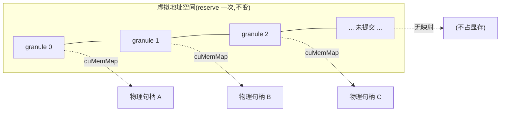
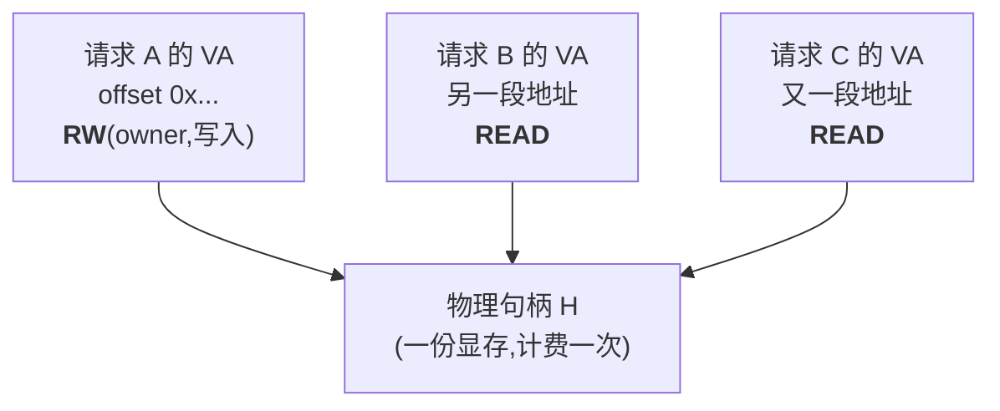
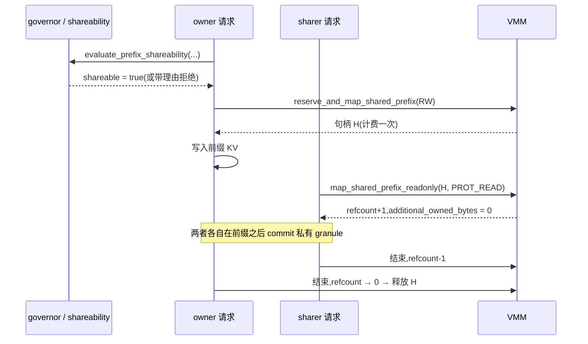
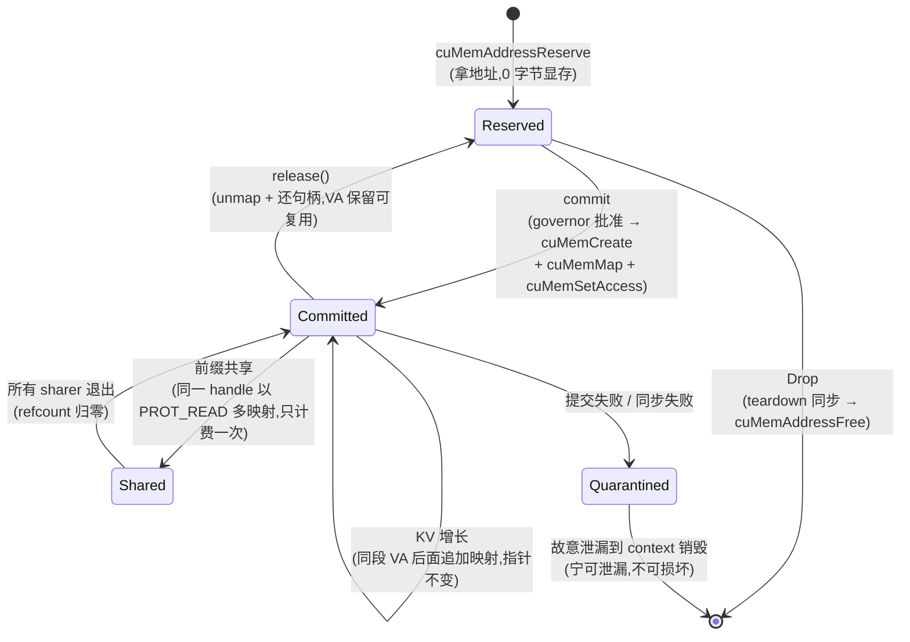

# Virtual Memory for KV Cache

> [!summary] 本文回答的问题
> 显存的虚拟内存管理器,在 KV cache 增长、前缀共享、一份物理内存被多处映射、
> 以及释放和失败回滚这几种情况下,分别是怎么工作的?

> [!important] 本文描述的是 `main` 上已实现的行为
> 涉及尚未合并的设计时会显式标注。与代码不一致的地方以代码为准。

## 一、为什么 KV cache 需要虚拟内存

先看清楚问题的形状。

一次生成请求的 KV cache 有两个讨厌的性质:

1. **它会长。** 每生成一个 token,每一层都要追加一份 K 和 V。
2. **最终有多长,事先不知道。** 用户什么时候停、模型什么时候吐 `eot`,是运行时才知道的。

用最朴素的 `cudaMalloc` 会怎么样?你只有两个坏选项:

- **按最大上下文预分配。** 一个 128K context 的请求,哪怕实际只生成了 200 个 token,
  也占满全部显存。并发数被按最坏情况压死。
- **不够了就重新分配再拷贝。** 每次扩容都要 `cudaMalloc` 新的一大块 + `cudaMemcpy`
  搬运 + 释放旧的。**而且指针会变** —— 所有持有这块地址的 kernel 参数、descriptor、
  外部句柄全部失效。

虚拟内存管理(VMM)给出的是第三个选项,核心是一句话:

> **把"地址"和"内存"分开。**

- **保留(reserve)** 一段很大的**虚拟地址**范围。虚拟地址不要钱,它只是地址空间里
  的一个区间,没有一个字节的物理显存。
- 需要用的时候再**提交(commit)**:申请物理显存句柄,把它**映射**到那段虚拟地址的
  某个位置上。

于是:**地址一开始就是最终地址,永远不变;而物理显存按需增长。**扩容不需要拷贝,
不需要换指针。

CUDA 驱动 API 里对应的就是这几个调用,本仓库在
`crates/onnx-runtime-cuda-memory/src/virtual_memory.rs` 里直接用了它们:

| 阶段 | 驱动调用 | 做什么 |
|---|---|---|
| 保留 | `cuMemAddressReserve` | 拿一段连续虚拟地址,零物理内存 |
| 分配物理 | `cuMemCreate` | 申请一个物理显存句柄 |
| 映射 | `cuMemMap` | 把句柄挂到虚拟地址的某个偏移 |
| 授权 | `cuMemSetAccess` | 声明哪个设备能读/能写 |
| 解映射 | `cuMemUnmap` | 摘掉映射(地址还在) |
| 释放物理 | `cuMemRelease` | 归还物理句柄 |
| 释放地址 | `cuMemAddressFree` | 归还虚拟地址区间 |

自 #755 起,VMM 是原生 CUDA EP 的默认路径。



## 二、第一个关键约束:granularity(粒度)

VMM 不是按字节映射的。`cuMemMap` **只能映射整数个 granule**。

> [!warning] granularity 必须向驱动查询,不能写常量
> 本仓库用 `cuMemGetAllocationGranularity` 查询设备属性(见
> `docs/memory/MEMORY_ARCHITECTURE.md` 的"granularity must be queried as a device
> property")。开发机上实测 `min == recommended == 2 MiB`,但**不同平台差异可达 500×**。
> 把 2 MiB 硬编码进代码,是一个在别的机器上才会爆的 bug。

由此得到一条贯穿全文的核心公式:

```text
已提交字节数 = granule × (至少含 1 个活字节的窗口数)
```

**注意这里的"窗口数",不是"活字节数"。**一个 granule 窗口里哪怕只有 1 个字节是活的,
整个 granule 也得提交。这就是为什么**布局(layout)会直接决定内存下界**。

### 布局如何影响提交下界

KV cache 的物理排布方式决定了"同一段 token 的数据在地址上有多连续":

| 布局 | 说明 | 对提交的影响 |
|---|---|---|
| **head-major BNSH**(当前默认) | 先按 head 分,同一段 token 的数据被打散到各 head 的切片里 | 每个 head 一个小片段 → 涉及的窗口多 → 下界粗 |
| **seq-major BSNH**(#782) | 按序列维度连续 | 一段 token 的数据密集 → 下界约为 `layers × 2` 个窗口 |
| **token-major** | 单 token 全层连续 | 仅做过测量,**未实现** |

这个差别不是理论上的洁癖。它同时决定了下一节的前缀共享**能不能做**。

## 三、情况一:KV cache 增长时怎么办

这是最常见的路径。步骤如下:

1. **一次性 reserve 足够大的虚拟地址范围。**按最大可能上下文来 reserve 都没关系,
   因为虚拟地址不消耗物理显存。这一步之后,KV 缓冲区的地址就**永久固定**了。
2. **初始只 commit 需要的部分。**prefill 阶段有多少 token 就映射多少 granule 窗口。
3. **decode 推进,越过当前已提交范围时,追加 commit。**
   注意:是在**同一段虚拟地址的后面继续映射新句柄**,不是分配一块新的缓冲区。
   - 指针不变。
   - 没有 `cudaMemcpy`。
   - 已有的数据一个字节都不动。
4. **先向 governor 申请预算。**提交不是无条件的,要先拿到额度
   (`MappedGrowthGrant`)。拿不到就不提交。

### 一个重要的实现细节:提交是"事务"

commit 可能在中途失败(比如申请到第 3 个句柄时显存不够了)。这时**不能留下半提交的
状态**。代码里 `rollback_pooled_maps` 就是干这个的:把这次已经映射成功的块**逆序**
逐个 `cuMemUnmap`,并把句柄退回池子;如果 unmap 本身失败,则把这个块**重新记回
reservation**(而不是当作已释放),因为它确实还映射着。

预算侧同样有 `MappedGrowthGrant::rollback()` 来退还已经扣掉的额度。

> [!note] 为什么 `Err` 不等于"什么都没发生"
> 记住这条,它是理解后续几个阶段设计的钥匙:VMM 的操作是**多步骤**的,
> 中间任何一步都可能失败,所以返回 `Err` **不代表状态没变**。
> 谁来保证 exactly-once、谁来隔离失败残留,是 issue #1186 的 Phase 4 在处理的问题。

### 容量真的不够时

服务端不会 OOM 崩掉,也不返回 500。队列/容量准入拒绝时返回
**HTTP 429 + `Retry-After`**(见 `crates/onnx-genai-server/`)。这是一个明确的
设计选择:显存压力是一种**背压**,应该让调用方重试,而不是让进程死。

Windows 上还有一个平台差异:WDDM 在超预算时**默认回退到操作系统共享内存**
(#864/#874),Linux 没有这个行为。所以同一份代码在 Windows 上"没崩但慢得离谱",
在 Linux 上是直接失败 —— 排查性能问题时要意识到这点。

## 四、情况二:一份物理内存映射到多个虚拟地址

这是 VMM 相对于 `cudaMalloc` 最有价值、也最容易讲错的能力。

### 它为什么可能

`cuMemMap(addr, size, offset, handle, flags)` 里的 `handle` 是**物理**句柄。
没有任何规则说一个句柄只能被映射一次。**同一个句柄可以映射到多个虚拟地址**,
甚至可以给每处映射设置**不同的访问权限**。

### 本仓库怎么用它:只读前缀共享

> **保护语义是 fail-stop。** A100 实测中,copy-engine 对只读映射的写入会
> 非粘滞地失败;真实 kernel 的非法 `st.global` 则会触发
> `CUDA_ERROR_ILLEGAL_ADDRESS` 并 poison 当前 CUDA context,与其他 CUDA
> illegal-address bug 一样。正常 decode kernel 只读取共享 prefix;只读映射的
> 作用是避免错误写入静默污染其他请求的 KV,而不是让错误 kernel 可恢复。

场景:多个请求共享同一段 system prompt / 同一段对话前缀。它们的这段 KV 内容
逐字节相同,没有理由各存一份。

- **owner(拥有者)**用 `reserve_and_map_shared_prefix` 以**读写**方式映射并写入数据。
- **sharer(共享者)**用 `map_shared_prefix_readonly` 映射**同一个 handle**,
  访问标志是 `CU_MEM_ACCESS_FLAGS_PROT_READ` —— **只读**。
- `PoolState.shared` 维护这个句柄的引用计数(`note_shared_map` / 相应的解除)。



### 三个必须说清楚的语义

**1. 只计费一次。**这是重点。sharer 的 `additional_owned_bytes` 恒为 0 —— 它没有
新增任何物理字节。重复的只有**各自的虚拟地址、页表项和账本记录**,那些是记账开销,
不是显存开销。

**2. 物理寿命是"并集"。**这块物理内存活到 owner 和**所有** sharer 都不再需要为止。
即使 owner 先结束了,只要还有 sharer 在读,句柄就不能释放。引用计数就是为此存在的。

**3. 失败要干净地退回。**`map_shared_prefix_readonly` 里,如果 `cuMemMap` 成功了但
`cuMemSetAccess` 失败,代码会立刻 `cuMemUnmap` 撤回这处映射并 `note_unmapped()`,
**但句柄仍归共享前缀所有**(不能因为一处映射失败就释放大家共用的物理内存)。
这正是上一节那条"`Err` 不等于状态未变"的具体体现。

### 能不能共享,是一道算术题

这是本仓库一个很有特点的设计:**共享性不靠猜,靠算**。
`crates/onnx-runtime-memory-governor/src/shareability.rs`:

```text
fragment_bytes                  = prefix_len × (该布局下每个片段的连续字节数)
shareable                       = fragment_bytes ≥ granule
shareable_granules_per_fragment = floor(fragment_bytes / granule)
multi_map_ops                   = fragments × shareable_granules_per_fragment
```

直观理解:**只有当至少一个完整的 granule 窗口整个落在前缀内部时,才谈得上共享。**
如果每个连续片段都比一个 granule 还小,那么任何一个窗口都会同时含有"前缀"和"非前缀"
的字节,而映射是按整窗口来的 —— 共享它就等于共享了不该共享的数据。

布局在这里的作用是决定 `fragment_bytes` 和**代价**(要做多少次 multi-map),
**但不决定可能性**。真正的两个硬条件只有:(a) KV 缓冲区必须是 VMM 支持的;
(b) 当前布局下 `fragment_bytes ≥ granule`。

不满足时,系统**显式拒绝并给出原因**(`PrefixShareability::refusal_reason()`),
而不是悄悄退化成复制:

> "prefix not shareable: each contiguous KV fragment is smaller than one mapping
> granule (fragment_bytes < granule), so no whole granule falls entirely inside …"

> [!tip] 这是一种值得学习的 API 姿态
> 把"做不到"变成一个**带理由的返回值**,而不是一个静默的性能塌方。
> 调用方可以据此决定换布局、换 granule 假设,或者干脆放弃共享。

## 五、情况三:处理前缀缓存(Prefix Cache)时

先说一个容易被误解的点。

> [!warning] 本仓库目前**没有**自动的 hash 前缀命中检测
> 今天的共享是**调用方显式声明**的 API:是调用方说"这两个请求共享这段前缀",
> 而不是系统自己去 hash 匹配。而且引擎的生成循环还调用不到它 ——
> `native_decode/cuda.rs` 里的 `persistent_state_shapes` 目前硬编码 BNSH 物理形状。
> 这是一块**已建好的能力,尚未接通的管线**。

在这个前提下,一次前缀共享的完整流程是:

1. **判定。**调用 `evaluate_prefix_shareability(geometry, layout, prefix_len, granule)`。
   不可共享就带理由返回,走普通路径。
2. **owner 建立。**`reserve_and_map_shared_prefix`:reserve 虚拟地址、创建物理句柄、
   以 RW 映射、写入这段前缀的 KV。计费发生在这里,**只此一次**。
3. **sharer 加入。**每个共享者:自己 reserve 一段虚拟地址(地址是各自的,便宜),
   在对应偏移上用 `map_shared_prefix_readonly` 映射同一个句柄,引用计数 +1。
   `additional_owned_bytes = 0`。
4. **各自继续增长。**共享的只是**前缀部分**。每个请求在自己那段虚拟地址上、
   从前缀之后继续 commit 自己的私有 granule,互不影响。
5. **退出。**引用计数减到 0 时物理句柄才归还。



### GPU 侧没有 CoW,这是有意的

一个自然的追问:如果某个 sharer 的对话分叉了,要往共享区域写怎么办?

**答案是:不能写,而且这是设计约定,不是遗漏。**`SharedDevicePrefix` 明确声明它
**不包含** hashing 检测,也**不包含** divergence 触发的 copy-on-write;
共享前缀在整个并集寿命内是**只读**的。这也是为什么 sharer 的映射权限是
`PROT_READ` —— 硬件级地保证了这个约定。

分叉的处理方式是:分叉之后的部分本来就是各自私有的 granule,共享的前缀部分永远
不会改变。前缀之所以是"前缀",就是因为它对所有共享者相同。

### CoW 确实存在,但在主机侧

> [!important] 仓库里有**两套互不相同**的子系统,不要混淆
>
> | | **A:设备 VMM** | **B:主机分页 KV** |
> |---|---|---|
> | 位置 | `onnx-runtime-cuda-memory/{virtual_memory,vmm_allocator}.rs` | `onnx-genai-kv/{page_table,paged_cache}.rs` |
> | 内存 | GPU 显存 | 主机 RAM(`HostPageStore`) |
> | 机制 | 真实的 CUDA 驱动 VMM 调用 | **逻辑**分页 + 引用计数抽象 |
> | 服务对象 | 原生 CUDA EP | CPU EP 的 Tier B paged GQA 解码 |
> | CoW | **无** | **有** |

主机侧的 `PagedKvCache::fork()` 和 `ensure_page_for_write()` 是真正的 copy-on-write:
当 `ref_count > 1` 时写入会先复制该页。这是 B 子系统的能力,和 GPU 的 VMM 共享前缀
是两回事。

还有一个常见误解要澄清:**B 里的 "page" 不是 kernel 可见的 block table。**
它是一个逻辑引用计数抽象。**paged attention / block table 架构在本仓库是被评估过、
但没有采用的替代方案** —— 引擎走的是 flat-VA + VMM 这条路。

## 六、情况四:释放与回收

释放这件事上,VMM 有一个和直觉不同的地方。

### `release()` 不释放虚拟地址

`VirtualMemory::release()` 做的是:

1. `cuMemUnmap` 解除映射(如果要释放的块在地址上连续,会**合并成一次** unmap ——
   权重页常常跨好几个 2 MiB 句柄,合并能省掉每 granule 一次的驱动往返)。
2. 把物理句柄归还池子(`return_after_unmap`)或 `cuMemRelease`。
3. **虚拟地址原样保留。**

这是特意的:地址稳定意味着这段 VA 可以被后续的 commit 直接复用,不需要重新
reserve,也不会让任何持有该地址的东西失效。

### 真正的 VA 释放只发生在 `CudaReservation::Drop`

而且这个 Drop 的实现里藏着一个很值得读的决定:

```rust
if !self.blocks.is_empty()
    && let Some(synchronize) = &self.teardown_synchronizer
    && let Err(error) = synchronize()
{
    eprintln!("cuda_ep: WARNING: reservation teardown synchronization failed; \
               retaining {} mapped block(s) until CUDA context teardown: {error}", ...);
    self.blocks.clear();
    self.len = 0;
    return;   // ← 故意什么都不释放
}
```

即:**在释放之前必须先等 GPU 上的工作做完**(teardown 同步)。如果同步失败,
说明我们**无法确认这块内存还在不在被使用** —— 此时代码选择**故意泄漏**:
不 unmap、不释放句柄、不 `cuMemAddressFree`,把这段 VA 和句柄"忘掉",
留到 CUDA context 销毁时由驱动统一回收。

> [!tip] 为什么泄漏是正确选择
> 备选方案是"释放了再说"。但如果 kernel 还在读这块内存,释放会导致
> **use-after-free 或双重释放**——那是段错误、静默数据损坏、或者更糟的
> 显存被另一个请求复用后读到别人的数据。
>
> **确定的泄漏,好过不确定的损坏。**注释里那句
> "rather than making either reusable or advertising their physical bytes as free"
> 说得很清楚:既不复用,也不对外宣称这些字节是空闲的 —— 账目上也保持诚实。

同步成功时才走正常路径:绑定 context → 逐块 `cuMemUnmap` → 归还/释放句柄 →
最后 `cuMemAddressFree` 释放整段 VA。

## 七、把四种情况放在一张图里



## 八、要点回顾

1. **地址和内存分开**,是解决"长度未知且会增长"的根本手段;代价是你要自己管理映射。
2. **granularity 向驱动查询**,不要硬编码;`已提交字节 = granule × 含活字节的窗口数`。
3. **布局决定提交下界和共享代价**,但不决定共享的可能性;可能性是
   `fragment_bytes ≥ granule` 这道算术题。
4. **一份物理多处映射时只计费一次**,重复的只有地址和账本;寿命是所有使用者的并集。
5. **GPU 共享前缀是只读的,没有 CoW**;CoW 只在主机侧的 `PagedKvCache` 里存在。
6. **`Err` 不代表状态没变。**多步操作的中途失败必须显式回滚或隔离。
7. **`release()` 保留地址**;真正释放 VA 只在 Drop,且同步失败时**故意泄漏**。
8. **容量耗尽返回 429**,把显存压力表达为背压,而不是让进程死。

## 目前尚未实现的部分

诚实地列出来,免得读者以为这些已经能用:

- **自动 hash 前缀缓存命中检测** —— 现在是调用方显式声明的 API。
- **引擎生成循环接通共享前缀** —— `persistent_state_shapes` 仍硬编码 BNSH 物理形状。
- **GPU 侧 copy-on-write / 分叉** —— 设计上明确不做。
- **token-major 布局** —— 只做过测量,未实现。
- **kernel 可见的 block table / paged attention** —— 评估过,未采用。

另外,issue #1186 的七阶段内存架构重构(`ProcessMemoryManager`、`MemoryBinding`、
stream-ordered 延迟释放等)目前仍在**未合并的分支**上,不属于 `main` 的行为。

## 相关笔记

- [[memory/Memory Management for Beginners]] —— 从第一性原理讲 allocator / governor /
  holder / EP 的职责边界,本文可视为其中 KV cache 部分的深入展开
- [[prompting/Chat Templates]] —— 每轮都要重新渲染完整对话,这正是前缀共享的价值来源
- [[execution/CUDA Execution Provider]] —— context、stream 与内存的关系
- [[performance/Performance Engineering Playbook]] —— 测量纪律

## 证据来源

- `crates/onnx-runtime-cuda-memory/src/virtual_memory.rs`
  (`reserve` / `commit` / `release` / `CudaReservation::Drop` /
  `reserve_and_map_shared_prefix` / `map_shared_prefix_readonly` / `rollback_pooled_maps`)
- `crates/onnx-runtime-memory-governor/src/shareability.rs`(共享性算术与拒绝理由)
- `crates/onnx-genai-kv/src/{page_table,paged_cache}.rs`(主机分页 KV 与真正的 CoW)
- `docs/memory/MEMORY_ARCHITECTURE.md`(granularity 作为设备属性、布局与常驻性、
  共享性推导)
- 相关 issue:#755(VMM 成为默认)、#782(seq-major BSNH)、#864/#874(WDDM 回退)、
  #731(HIP)、#1186(内存架构重构 epic)
