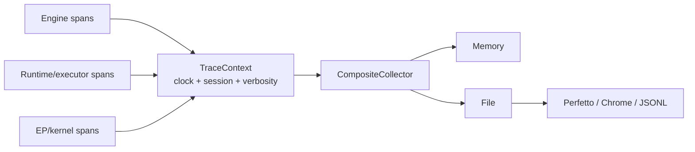

# Tracing and Profiling

> [!summary] 本篇回答的问题
> 仓库如何在引擎、原生运行时与 execution provider 之间构建出一条统一的时间线,
> 同时在追踪被禁用时不引入任何 tracing 成本?

## Collector 架构

代码通过共享的 `TraceContext` 发出事件;输出去向由 collector 决定:

Instrumentation 只写一次。`MemoryCollector`、`FileCollector`、
`CompositeCollector` 以及可选的平台 collector 决定事件流向何处。

## 单一时钟

Host/runtime/plugin 的事件必须共享一个有意义的单调时间基准。各自独立的
process-local epoch 会让跨层 trace 看起来有序,实际上却发生了偏移。tracer 使用
操作系统的单调读数,让各个独立加载的模块能够相互比较。

每条 trace 还携带一个 session 标识以及 thread/process 的 lane 信息。

## 禁用路径的成本

一个被禁用/no-op 的 context 只检查一个 relaxed atomic 标志,并在以下操作之前就
返回:

- 读取时钟;
- 分配参数结构;
- 锁定 collector;
- 转换昂贵的 metadata。

> [!important] 先检查,再格式化
> 一个被禁用的 span 如果仍然构建 shape 字符串或 vector,那么在 hot-path 意义上
> 它并没有被真正禁用。

## Event 与 verbosity

典型的层次包括:

- request 与 generation-loop span;
- 原生 session 与 executor 阶段;
- operator/kernel worker span;
- 被选中的 kernel 变体与被拒绝的原因;
- graph-capture 决策;
- memory/paging event;
- 通过 CUPTI 采集的可选 GPU 活动。

verbosity 让运维者可以选择仅决策、operator 级或完整细节。高细节的 tracing 可能
扰动性能,因此每个 benchmark 都必须记录它当时是否被启用。

## Tracing 与 timing 的区别

一个 timing 计数器只有在其区间明确时才有意义。在异步 GPU 代码中,对一次 enqueue
调用计时测量的是 CPU 提交延迟,而不是传输或 kernel 完成。

对每一个计时器,记录:

- 起点与终点位置;
- host 是否阻塞;
- stream/fence 关系;
- 所代表的字节数/工作量;
- 是否包含嵌套的时间。

对推导出的带宽要对照物理上限做合理性检查。

## Logging 是独立的

运维 logging 使用带结构化字段的 `tracing` event/span。时间线 collector 是一个
运行时性能设施。两者都应避免记录 prompt、凭据、token 流与原始 tensor 内容。

错误应保留可操作的上下文,而不是依赖一条 trace 来解释普通的失败。

## 输出

- Chrome Trace Event JSON;
- JSONL;
- Perfetto protobuf/导出;
- 供 API/测试使用的内存中 event;
- 可选的 ITT 与 CUPTI collector。

服务器可以在被显式启用时暴露 debug trace/profile 端点。

## 正式来源

- [`onnx-runtime-tracer`](../../crates/onnx-runtime-tracer/src/lib.rs)
- [`runtime_trace.rs`](../../crates/onnx-genai-engine/src/runtime_trace.rs)
- [`ERROR_AND_LOGGING_CONVENTIONS.md`](../../docs/architecture/ERROR_AND_LOGGING_CONVENTIONS.md)
- [`README.md` profiling section](../../README.md)

## 相关笔记

- [[performance/Performance Engineering Playbook]]
- [[execution/CUDA Execution Provider]]
- [[api/API Design Principles]]
