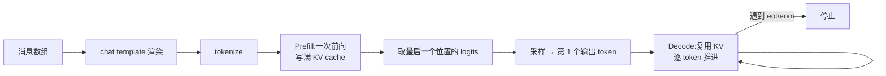
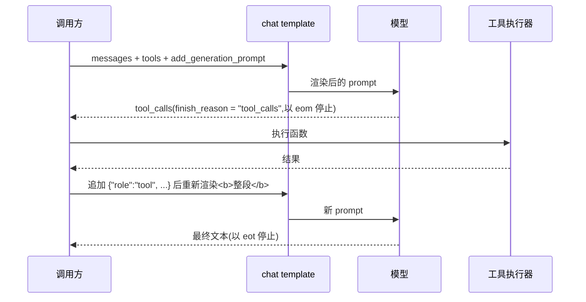

# Chat Templates

> [!summary] 本文回答的问题
> 一段结构化的对话,是怎样变成模型真正看到的那一串 token 的?模板之后发生了什么?
> 多模态和工具调用又在这套机制里占什么位置?

## 一、先把问题摆正:模型其实不认识"对话"

因果语言模型(causal LM)只会做一件事:给定一串 token,预测下一个 token。它没有
"消息"的概念,没有"谁在说话"的概念,更不知道哪一段是系统指令、哪一段是用户提问。

但我们写代码时用的是这样的结构:

```json
[
  {"role": "system",    "content": "You are a helpful assistant."},
  {"role": "user",      "content": "帮我看看这段代码"},
  {"role": "assistant", "content": "好的,你贴一下。"}
]
```

**对话模板就是这两个世界之间的那层翻译**:把一个消息数组,按这个模型训练时用过的
格式,渲染成一整串纯文本(进而是一串 token)。

它渲染出来的东西大致长这样(以 ChatML 风格为例):

```text
<|im_start|>system
You are a helpful assistant.<|im_end|>
<|im_start|>user
帮我看看这段代码<|im_end|>
<|im_start|>assistant
```

注意最后一行:`<|im_start|>assistant` 之后**没有内容**。这是故意的,下一节会讲。

> [!important] 模板不是风格问题,是正确性问题
> 模板必须和这个模型指令微调(SFT)时用的格式**逐字节一致**。Hugging Face 官方文档
> 明确指出,控制 token 对不上会导致质量"drastically worse"。这不是"差一点点",
> 而是模型进入了训练分布之外的状态。所以模板是**模型包自带的数据**,不是运行时可以
> 自由发挥的配置。

### 本仓库里的对应实现

`crates/onnx-genai-ort/src/chat_template.rs` 就是这层翻译:

- `ChatTemplate::from_model_dir()` 从模型目录加载模板,优先级是
  独立的 `chat_template.jinja` > `tokenizer_config.json` 里的 `chat_template` 字段 >
  内置默认模板(与 ORT-GenAI 的优先级一致)。
- `ChatMessage` / `ChatRole` 就是上面那个消息数组的 Rust 形态,角色枚举为
  `System` / `User` / `Assistant` / `Tool` / `Other(String)` —— 保留 `Other` 是因为
  确实有模型定义了第五种角色(比如 Llama 3.1 的 `ipython`)。
- 模板本身是 Jinja2。这些模板是给 Python 上的 Jinja2 写的,会随手调用 Python 的字符串
  方法(`startswith`、`split`、`title`……),所以渲染时挂上了
  `minijinja_contrib::pycompat` 的回调,否则像 qwen3 这类真实模板直接渲染失败。

## 二、模板的结构与约定俗成的写法

虽然每家的特殊 token 都不一样,但结构上高度趋同,基本都是三件事:

### 1. 用一对标记把"角色"和"内容"分开

| 家族 | 开头 | 内容分隔 | 结尾 |
|---|---|---|---|
| ChatML(Qwen 等) | `<\|im_start\|>{role}\n` | 换行 | `<\|im_end\|>\n` |
| Llama 3.x | `<\|start_header_id\|>{role}<\|end_header_id\|>\n\n` | 空行 | `<\|eot_id\|>` |
| Gemma 3 | `<start_of_turn>{role}\n` | 换行 | `<end_of_turn>\n` |
| Mistral | `[INST] ` | —— | ` [/INST]` |
| Muse Glimmer | `<\|start\|>{role}<\|message\|>` | —— | `<\|eot\|>` 或 `<\|eom\|>` |

一个容易被忽略的细节:**Gemma 把 `assistant` 这个角色名渲染成字面量 `model`**
(模板里 ``)。所以"角色名"是 API 层的抽象,渲染成什么字符串
完全由模板决定。

### 2. 开头的 BOS

`<|begin_of_text|>`(Llama)这类 BOS token 是**模板自己写进去的**
(Llama 3.2 Vision 和 Gemma 3 的模板顶部都有字面的 `{{- bos_token }}`),不是模型
"生成"出来的。所以本仓库渲染时把 `bos_token` / `eos_token` 作为变量注入模板上下文。

推论:如果你既让模板渲染 BOS,又让 tokenizer 的 `add_special_tokens=True` 再加一个,
就会出现**双 BOS**——一个很常见、很隐蔽的质量 bug。

### 3. 两种"结束",不要混为一谈

以 Llama 3 为例:

- `<|end_of_text|>` (128001):**基座模型**的停止符。
- `<|eot_id|>` (128009):end **of turn**,指令模型实际的停止符。
- `<|eom_id|>`:end of **message**——"这条消息说完了,但这一轮还没完",典型用途是
  模型发起工具调用后停下来等结果。

Muse Glimmer 用 `<|eot|>` / `<|eom|>` 表达完全相同的一对语义。所以推理栈配置
`eos_token_id` 时,需要把"轮结束"和"消息结束"都算作停止条件,并区别对待:
遇到 `eot` 是本轮结束交还给用户,遇到 `eom` 通常意味着**该执行工具了**。

## 三、"模型是不是从模板后面开始预测第一个字?"

**是的,而且可以说得更精确一点。**你的理解在方向上完全正确,下面是具体机制,以及
一个关于中文的重要修正。

### 第一步:`add_generation_prompt`

渲染时如果传 `add_generation_prompt=True`,模板会在末尾追加**助手轮的开头标记但不带
任何内容**:

```jinja

    {{- '<|start|>assistant' -}}

```

(上面这段就是 Muse Glimmer 模板的最后三行,一字未改。)

这一步的意义是:把序列停在一个"轮到助手说话、但一个字都还没说"的位置。
推理时用 `True`;而当你是在把一段**完整的历史对话**渲染出来做日志或训练回放时用
`False`,因为那时最后一条助手消息已经有内容了,不需要再挂一个空的开头。

### 第二步:Prefill,一次前向

整串渲染结果(system + 全部历史 + 那个空的助手开头)被 tokenize 后,**一次性**送进
模型做一次前向传播。每个位置在因果掩码下注意到自己和之前所有位置,模型为每一层、每个
位置算出 Key/Value 张量并缓存起来 —— 这就是 KV cache。

### 第三步:只取最后一个位置的 logits

关键点在这里:虽然 prefill 为**每个** prompt 位置都算出了 logits,但推理时
**只有最后一个位置的 logits 被使用**。也就是那个"刚写完 `<|start|>assistant`、
下一个该输出什么"的位置。它经过 LM head 投影成词表大小的向量,再 softmax 采样
(或贪心 argmax),得到第一个输出 token。

其余位置的 logits 在推理时是被丢弃的(它们只在训练算 loss 时有用)。

### 第四步:Decode,逐 token 推进

之后每一步只计算新 token 的 Query,复用 KV cache 里所有历史位置的 K/V,再把新的 K/V
追加进去。这把本来 O(n²) 的重算变成每步 O(n)。



### 一个必须澄清的地方:是"token",不是"字"

你说的"预测第一个字",严格讲是**预测第一个 token**。对中文来说这两者差别很大:

现代 tokenizer(BPE / SentencePiece / tiktoken 系)主要在 UTF-8 **字节序列**上训练,
一个汉字**经常被切成 2–3 个子字符级 token**,而不是直觉上的"1 个汉字 = 1 个 token"。

两个直接后果:

1. 最后一个位置输出的那个 token,**可能只是某个汉字的一部分**,要再走一两步 decode
   才能拼出一个完整的汉字。
2. 流式输出的 UI **必须缓冲不完整的多字节 UTF-8 序列**,等到字符边界完整了再显示,
   否则会渲染出乱码。这是所有中文流式服务都要处理的工程细节。

> [!note] 这一点没有单一权威引用
> 分词对 CJK 的这个性质属于通用的 tokenizer 工程常识(BPE/tiktoken 的字节级设计的
> 直接结果),不是某个模型的特殊行为。

## 四、多模态:模板只放"占位符",不放像素

多模态模板的第一个变化是 `content` 从字符串变成**分段数组**:

```json
{"role": "user", "content": [
  {"type": "image"},
  {"type": "text", "text": "这张图里有什么?"}
]}
```

第二个、也是更本质的变化是**职责拆分**:

> [!important] tokenizer 只写占位符,processor 才产生视觉特征
> 模板(在 tokenizer 层)做的事情仅仅是把 `{"type": "image"}` 渲染成一个占位字符串。
> 真正把图片变成向量、并把这些向量替换进模型输入 embedding 的,是另一个类
> (`AutoProcessor`,如 `Gemma3Processor`、`Qwen2_5_VLProcessor`),它工作在比纯文本
> 分词更低的层次。

三个真实模型的占位符写法(均取自线上 `chat_template.json` / `tokenizer_config.json`):

| 模型 | 图片占位符 | 视频占位符 | 备注 |
|---|---|---|---|
| Llama 3.2 Vision | `<\|image\|>`(id 128256) | —— | 见下方的硬性限制 |
| Qwen2.5-VL | `<\|vision_start\|><\|image_pad\|><\|vision_end\|>` | `<\|vision_start\|><\|video_pad\|><\|vision_end\|>` | 支持 `add_vision_id`,自动加 "Picture 1: " 编号 |
| Gemma 3 / PaliGemma | `<start_of_image>` | —— | 另有 `<image_soft_token>`,由 processor 展开成定长 patch 序列 |
| Muse Glimmer | `<\|patch\|>` | `<\|video\|>` | 模板内以 `render_content` 宏统一处理 |

### 变体之间真正的差异在哪

1. **占位符是 1 个 token 还是一段序列。** Llama 3.2 用单个 `<|image|>`;Gemma 用
   `<start_of_image>` 让 processor 后续展开成固定长度的 soft token 序列。这直接影响
   你怎么估算一张图占多少 KV cache。
2. **能不能交错(interleave)。** Qwen2.5-VL 明确支持多图/视频/文本交错,并用编号
   标签消歧;有的模型只支持"图片全在开头"。
3. **有没有硬限制。** Llama 3.2 Vision 的模板里写着:

   ```jinja
   
       {{- raise_exception("Prompting with images is incompatible with system messages.") }}
   ```

   也就是**官方模板直接禁止"系统消息 + 图片"同时出现**。这类约束是写在模板里、由渲染
   时抛异常来强制的 —— 所以本仓库的渲染器专门注册了 `raise_exception` 函数,让这些
   约束能够真正生效而不是被静默忽略。

## 五、案例精读:Muse Glimmer 的 channel(收件人)设计

你提到"看到一个模型的模板里有 ToSelf、ToUser 这类 channel"。先澄清两件事,再讲设计。

> [!warning] 名字的澄清
> 这个模型是 **Muse Glimmer**(Meta Superintelligence Labs,2026 年 8 月,30B,
> Apache 2.0,开放权重),不是 "Llama 3-V"。顺带一提,`Llama3-V` 是 2024 年一个
> 斯坦福学生项目、后被证实大量抄袭 MiniCPM-Llama3-V 2.5,与 Meta 无关,不要混淆。
>
> 另外,模板里的实际写法**不是** `ToSelf`/`ToUser` 这样的驼峰名,而是 `to=` 收件人
> 语法:`to=self`、`to=user`、`to=<工具名>`。下面所有代码均逐字引自
> `meta-models/Muse-Glimmer-30B` 的 `chat_template.jinja`。

### 核心思想:助手的每条消息都有一个"收件人"

普通模板里,`assistant` 就是 `assistant`,一个角色对应一种输出。Muse Glimmer 把
**角色**和**收件人**拆开了:同样是 assistant 在说话,但它可以说给三种不同的对象听。

系统块里甚至会显式列出合法收件人清单:

```jinja
{{- '# Valid recipients: ' + rns.recipients | join(', ') + '.' -}}
```

渲染出来就是 `# Valid recipients: "self", "web.*", "user".` 这样一行 —— 相当于在
prompt 里给模型声明了一份"你可以往哪些 channel 写"的类型签名。

### 三种 channel

**(a) `to=self` —— 内部推理,不给用户看**

```jinja

    {{- '<|start|>assistant to=self<|message|>' + message['reasoning_content'] + '<|eom|>' -}}

```

注意它以 `<|eom|>` 结尾:想完了这一轮还没结束。这条 channel 里的内容是模型的思考过程,
运行时**绝不能当作最终答案返回给用户**。

**(b) `to=<工具名>` —— 工具调用**

```jinja

    {{- '<|start|>assistant to=' + tc.function.name + '<|message|>' -}}
    {{- render_atem(tc) -}}
    {{- end_token -}}{{- '<|eom|>' -}}

```

**每个工具是一个独立的 channel**,不是"往一个通用 tool channel 里塞一个函数名"。
而且这里用 `for` 循环 + `<|eom|>` 串联,意味着它**原生支持一轮里发多个工具调用**
(对比之下,Llama 3.2 的模板在 `tool_calls` 超过一个时直接抛异常)。

**(c) `to=user` —— 用户可见的回复**

```jinja



    

```

这段逻辑很值得读:**收件人默认是 `user`**;而"这一轮是否结束"默认由收件人推导 ——
发给 user 就用 `<|eot|>`(结束),发给别人就用 `<|eom|>`(还有后续)。语义耦合得很干净。

```mermaid
flowchart TD
    S["system<br/>(工具定义 + Valid recipients)"] --> U["user"]
    U --> A1["assistant <b>to=self</b><br/>规划/推理 · &lt;&#124;eom&#124;&gt;"]
    A1 --> A2["assistant <b>to=web.search</b><br/>ATEM 调用 · &lt;&#124;eom&#124;&gt;"]
    A2 --> T["tool web.search<br/>&lt;tool_output&gt; · &lt;&#124;eot&#124;&gt;"]
    T --> A3["assistant <b>to=self</b><br/>解读结果 · &lt;&#124;eom&#124;&gt;"]
    A3 --> A4["assistant <b>to=user</b><br/>最终回答 · &lt;&#124;eot&#124;&gt;"]
```



### 为什么这个设计值得学

把"思考""动作""回答"放进**同一个自回归序列的不同 channel**,而不是三套独立机制,
带来几个好处:

1. **模型自己决定下一步说给谁听。** 是继续想、去调工具、还是直接回答,变成了一次普通的
   token 预测,而不是外部调度器的判断。
2. **运行时的路由规则是明确的、可解析的。** 拿到 `to=` 就知道该怎么处理:`self` 折叠成
   "思考中"、`工具名` 去执行、`user` 才流式吐给用户。
3. **推理内容天然可裁剪。** 因为它是独立 channel,多轮时把历史的 `to=self` 段丢掉是
   结构化操作,而不是正则猜测。

> [!note] 这不是孤例
> OpenAI 的 Harmony 格式(`gpt-oss` 系列)用的是几乎同构的思路,只是关键字不同:
> `<|start|>assistant<|channel|>analysis<|message|>...`,三个 channel 分别是
> `analysis`(隐藏思维链)、`commentary`(工具调用前言)、`final`(用户可见答案)。
> 可以认为"隐藏推理 channel vs 用户可见 channel"正在成为 agentic 模型的一种通用范式。

### 本仓库怎么处理"隐藏推理"

`crates/onnx-genai/src/reasoning.rs` 已经实现了通用的推理段识别,并且守着一条重要原则:

> 分隔符**绝不从模型名或厂商名猜测**,只从这个模型包自带的 chat template 里检测。
> 模板里写了 `<think>`,就是这个模型在告诉运行时它用什么标记推理。

它同时明确了多轮的处理策略:推理段**不能回填进后续轮次**——这些模型训练时历史轮的
thinking 就是被移除的,回放会掉质量,还会让 context 被自己的思考撑爆。

注意 `reasoning.rs` 当前识别的是 `<think>` 这类**成对分隔符**,而 Muse Glimmer 用的是
`to=self` **收件人**机制,两者是不同的表达形式;要支持后者需要在解析层识别 `<|start|>`
后面的收件人。这是当前实现与该模板之间一个真实的差距,不是已完成的能力。

## 六、工具调用在模板里是怎么处理的

工具调用在模板里其实是**三段独立的渲染逻辑**,常被混为一谈:

### 第 1 段:把工具定义注入 prompt(通常在 system 块)

调用方传 `tools=[...]`(JSON Schema),模板负责把它渲染成模型认识的形式:

```json
{"type": "function", "function": {
  "name": "multiply", "description": "...",
  "parameters": {"type": "object", "properties": {...}, "required": ["a","b"]}}}
```

本仓库的 `render()` 把它作为 `tools` 变量暴露给模板,并且**要求它是合法 JSON**
(解析失败直接报 `invalid tools JSON for chat template`),不做静默降级。

各家渲染方式差别很大:Muse Glimmer 会写一大段自然语言说明 + namespace 列表 + 全部函数
schema + 一个示例调用;Llama 3.1 则靠 system 里的 `Environment: ipython` 一行开关。

### 第 2 段:助手发起调用的语法

| 模型 | 语法 |
|---|---|
| Llama 3.1/3.2 | `<\|python_tag\|>{"type":"function","name":...,"parameters":{...}}<\|eom_id\|>` |
| Qwen / Hermes 系 | `<tool_call>\n{"name": ..., "arguments": {...}}\n</tool_call>` |
| Muse Glimmer | `<atem:function_calls><atem:invoke name="..."><atem:parameter name="...">…` |

Muse Glimmer 这套 XML 式的 ATEM 语法有个有意思的工程细节:模板显式拒绝字符串形式的
参数:

```jinja

    {{- raise_exception('Muse Glimmer ATEM chat template requires tool_call.function.arguments
        to be a dict (mapping); a JSON string cannot be parsed in the HF jinja sandbox.') -}}
```

原因说得很清楚:HF 的 Jinja 沙箱里没有 JSON 解析器,所以**必须**由调用方传 dict。
这也正是 HF 约定与 OpenAI wire format 的一个经典差异 —— OpenAI 的
`function.arguments` 是 JSON **字符串**,HF 模板期待的是 **dict**。转接层如果不做这层
转换,就会撞上这个异常。

### 第 3 段:工具结果如何回填

工具执行完,结果作为一条新消息追加,`role` 为 `tool`(Llama 3.1 叫 `ipython`,语义相同,
其文档原话是 *"Semantically, this role means 'tool'"*)。

这里有个真实的坑:**结果消息怎么知道自己回答的是哪个调用?** Muse Glimmer 的模板把
三层回退写得很完整:

```jinja


    
    ... 遍历历史 messages,按 tc.id == tcid 反查 tc.function.name ...

{{- '<|start|>tool ' + tname + '<|message|><tool_output name="' + tname + '">\n' -}}
```

即:先看 `name`,没有就用 `tool_call_id` 回溯历史消息里的 `tool_calls` 找函数名。
本仓库的 `ChatMessage::with_tool_result(name, tool_call_id)` 正是为了让调用方能同时
提供这两个字段而存在 —— 结构体上的注释直接说明了这一点。

### 完整的运行时循环



要点:每一轮都是**把完整对话重新渲染一遍**再送进模型,不是"在上次的 prompt 后面接一段"。
这正是前缀缓存(prefix cache)有价值的原因 —— 每轮的前缀大部分是重复的。
参见 [[memory/Virtual Memory for KV Cache]]。

### 并行调用没有统一约定

HF 文档明确警告:多数模型一次只发一个调用;支持并行的模型需要靠 tool call ID 消歧,
而**这是 model-specific 的,不是通用规则**。实际情况也确实分裂:

- Llama 3.1 文档原话:*"Only single tool calls are supported as of now."*
  Llama 3.2 模板在 `tool_calls` 多于一个时直接 `raise_exception`。
- Muse Glimmer 用 `for` 循环 + `<|eom|>` 串联,原生支持多个。

所以写转接层时,"能不能并行"必须按模型查,不能想当然。

## 七、给实现者的一份检查清单

1. **不要自己拼 prompt 字符串。** 用模型自带的模板渲染。
2. **不要双 BOS。** 模板已经渲染 BOS 时,tokenizer 不要再加。
3. **停止符要区分 `eot` 和 `eom`。** 前者交还用户,后者通常意味着该执行工具。
4. **`arguments` 的 dict / JSON 字符串之争。** OpenAI wire format 是字符串,HF 模板要 dict。
5. **推理段不要回填进后续轮。** 会掉质量、撑爆 context。
6. **中文流式必须缓冲到 UTF-8 字符边界。** 否则乱码。
7. **模板抛的异常要当真。** 那些 `raise_exception` 是模型在声明它的硬约束。
8. **多模态时,模板只给占位符。** 视觉张量由 processor 产生,两条路径要对齐。

## 参考与出处

- Hugging Face 官方文档:`huggingface/transformers:docs/source/en/chat_templating.md`、
  `huggingface.co/docs/transformers/en/chat_extras`(工具调用)
- Muse Glimmer 模板与模型卡:`meta-models/Muse-Glimmer-30B`
  (`chat_template.jinja`,本文所有 Muse Glimmer 代码块逐字引自该文件)
- Llama 3.1 prompt 格式:`meta-llama/llama-models:models/llama3_1/prompt_format.md`
- 各模型模板/特殊 token:Llama 3.2 Vision、Qwen2.5-VL、Gemma 3 的线上
  `tokenizer_config.json` / `chat_template.json`
- OpenAI Harmony 格式:`github.com/openai/harmony/blob/main/docs/format.md`
- 本仓库实现:`crates/onnx-genai-ort/src/chat_template.rs`、
  `crates/onnx-genai/src/reasoning.rs`

## 相关笔记

- [[memory/Virtual Memory for KV Cache]] —— 渲染出来的这串 token 在显存里是怎么被安置的
- [[memory/Memory Management for Beginners]] —— 内存管理的第一性原理介绍
- [[architecture/Inference Request Lifecycle]] —— 一个请求从进入到产出的完整路径
