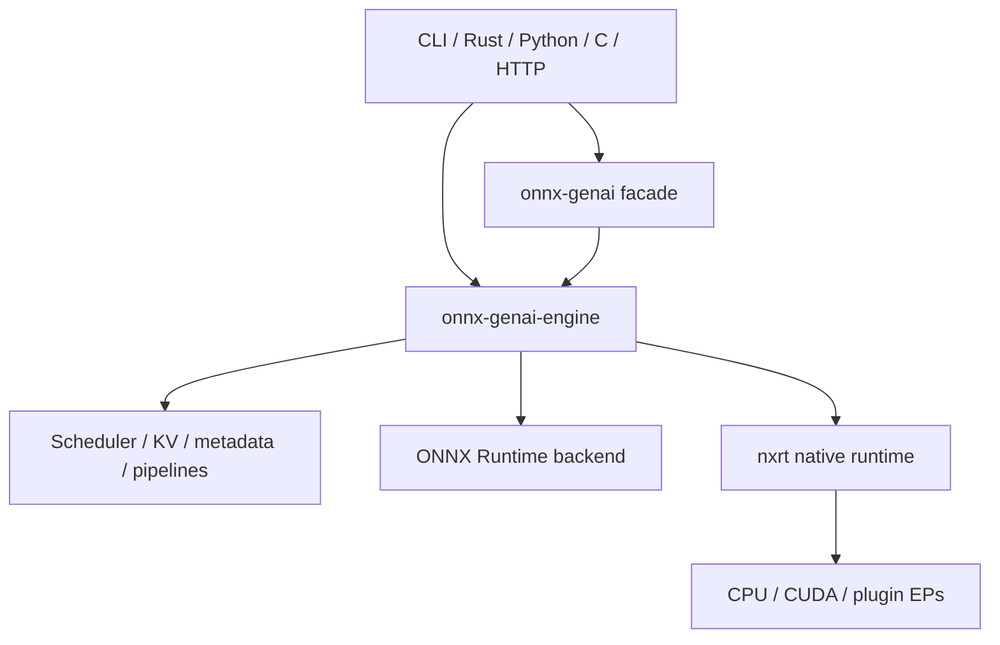

# Repository Map

> [!summary] 回答的问题
> 在这个庞大的仓库里我该从哪儿开始,以及我要找的概念归属于哪个区域?

## 最短而有用的心智模型

`onnx-genai` 包含两个相关的系统:

1. 一个 **GenAI 产品/运行时层**,负责 prompt、生成、调度、KV 状态、pipeline、
   serving,以及语言绑定。
2. 一个 **原生 ONNX 运行时层**(`onnx-runtime-*`,常称 **nxrt**),负责图 IR、
   加载、优化、execution provider、内存规划,以及 session 执行。

它们在 `onnx-genai-engine` 中交汇:后者既可驱动 ONNX Runtime,也可驱动原生 nxrt
backend,同时把生成策略置于两者之上。

## 顶层区域

| 路径 | 归属内容 |
|---|---|
| `crates/onnx-genai-*` | 生成特性、产品表面、元数据、KV、scheduler、server、CLI 与绑定 |
| `crates/onnx-runtime-*` | 原生 ONNX 运行时、执行、EP、内存、ABI 与互操作 |
| `crates/onnx-std*` | ONNX 标准库相关工作 |
| `docs/` | 正式设计、实测状态、调查与 benchmark 证据 |
| `wiki/` | 解释性地图与学习笔记;绝非最终权威 |
| `scripts/` | 模型构建、benchmark 与运维辅助脚本 |
| `models/` | 存在时为本地/生成的模型产物;不是运行时契约的来源 |
| `xtask/` | 仓库维护与开发者任务 |

## 按任务查找代码

| 你想修改 | 从这里入手 |
|---|---|
| 公开的 Rust 生成 API | `crates/onnx-genai` 与 `crates/onnx-genai-engine` |
| prompt-to-token 生成行为 | `crates/onnx-genai-engine/src/engine` 与 `decode_loop` |
| 采样或约束 | `crates/onnx-genai-engine/src/sampling.rs`、`logits/`、`processors/` |
| Speculative decoding | `crates/onnx-genai-engine/src/speculative/` |
| KV page、prefix 复用、fork 或 rewind | `crates/onnx-genai-kv` |
| 准入、batching 或抢占 | `crates/onnx-genai-scheduler` 与 engine 的 `batched` 集成 |
| 推理元数据 | `crates/onnx-genai-metadata` |
| 图像/音频预处理 | `crates/onnx-genai-preprocess` |
| OpenAI 兼容的 HTTP 行为 | `crates/onnx-genai-server` |
| CLI 与 REPL | `crates/onnx-genai-cli` |
| ONNX 图表示 | `crates/onnx-runtime-ir` |
| 模型加载与外部权重 | `crates/onnx-runtime-loader`、`crates/onnx-model-package` |
| 图优化或形状推断 | `crates/onnx-runtime-optimizer`、`crates/onnx-runtime-shape-inference` |
| 原生 session/executor | `crates/onnx-runtime-session` |
| execution-provider 契约 | `crates/onnx-runtime-ep-api` |
| CPU 或 CUDA kernel | `crates/onnx-runtime-ep-cpu`、`crates/onnx-runtime-ep-cuda` |
| plugin EP 互操作 | `crates/onnx-runtime-ep-plugin`、`*-plugin`、`ep-nxrt-*` |
| 内存治理或 VMM | `crates/onnx-runtime-memory-*`,再看 [[memory/Memory Management for Beginners]] |
| 追踪与性能分析 | `crates/onnx-runtime-tracer` 与 engine 的 `runtime_trace` |
| 分布式 collective | `crates/onnx-runtime-comm` |
| Python/C/DLPack 绑定 | `onnx-genai-python`、`onnx-runtime-python`、`*-capi`、`onnx-runtime-dlpack` |

## 按问题查找文档

| 问题 | 从这里入手 |
|---|---|
| 这个项目想成为什么? | [`docs/architecture/DESIGN.md`](../../docs/architecture/DESIGN.md) |
| nxrt 如何拼接在一起? | [`docs/architecture/ORT2.md`](../../docs/architecture/ORT2.md) |
| 内存实际表现如何? | [`docs/memory/MEMORY_ARCHITECTURE.md`](../../docs/memory/MEMORY_ARCHITECTURE.md) |
| 提议中的内存契约是什么? | [`docs/memory/MEMORY_MANAGEMENT_MODEL_DESIGN.md`](../../docs/memory/MEMORY_MANAGEMENT_MODEL_DESIGN.md) |
| 原生 CUDA 路径是什么? | [`docs/execution/NATIVE_CUDA_DECODE.md`](../../docs/execution/NATIVE_CUDA_DECODE.md) |
| 模型应如何声明行为? | [`docs/genai/MODEL_METADATA.md`](../../docs/genai/MODEL_METADATA.md) |
| benchmark 结果在哪里? | [`docs/benchmarks/README.md`](../../docs/benchmarks/README.md) |

完整的、带来源优先级的索引,参见 [[start/Documentation Guide]]。

## 建议的第一个小时

1. 阅读根目录的 [`README.md`](../../README.md),了解产品能力与 CLI 形态。
2. 阅读 [[architecture/Crate Architecture]]。
3. 用 [[architecture/Inference Request Lifecycle]] 追踪一次请求。
4. 在 [[execution/Execution Backends]] 中对比两条路径。
5. 在信任一份旧的设计笔记之前,先看 [[start/Documentation Guide]]。

> [!warning] 设计文档描述的可能是终点而非现状
> 有些早期文档仍在描述那些实现此后已经细化过的最初目标。对于当前行为的问题,
> 优先采信代码、可复现的实测数据,以及明确自证为当前权威的文档。
